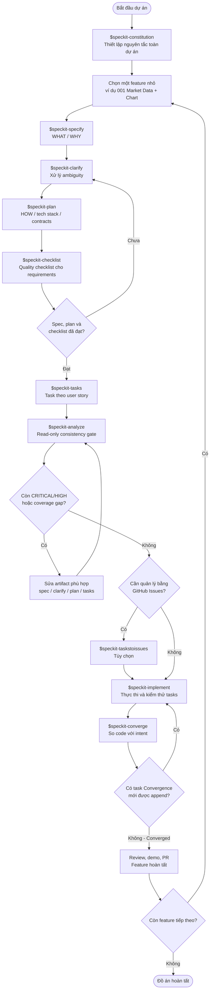

# Crypto Strategy Lab

Nền tảng phân tích dữ liệu thị trường, xây dựng strategy, backtest, đánh giá và xếp hạng các chiến lược giao dịch crypto. Dự án được triển khai theo **Spec-Driven Development** bằng bộ skill GitHub Spec Kit dành cho Codex.

## Tài liệu dự án

- [Yêu cầu đồ án](docs/REQUIREMENT.md)
- [Tech stack, skeleton và Spec Kit flow](docs/TECH_STACK_SKELETON_SPECKIT_FLOW.md)

## Quy ước sử dụng Spec Kit

- Gọi skill trong Codex bằng cú pháp `$speckit-<tên>`.
- `constitution` áp dụng cho toàn dự án; các skill còn lại được chạy cho **từng feature**.
- Feature đang hoạt động được xác định bởi `.specify/feature.json`, không mặc định dựa vào Git branch.
- Mỗi lần `$speckit-specify` chỉ tạo một feature trong `specs/<feature-id>-<short-name>/`.
- `spec.md` mô tả **WHAT/WHY**; tech stack và cách triển khai chỉ xuất hiện từ `plan.md`.
- Không chạy `$speckit-implement` trước khi spec, plan, checklist, tasks và analyze đã đạt quality gate.

## Danh sách Spec Kit skills

| Tên skill | Description / chức năng | Input | Output |
|---|---|---|---|
| `$speckit-constitution` | Tạo hoặc cập nhật các nguyên tắc quản trị bất biến của toàn dự án: ranh giới kiến trúc, testing, reliability, observability, security và quy trình sửa đổi. Chỉ được ghi constitution, không triển khai feature. | Các principle hoặc yêu cầu quản trị; context hiện có trong repository; constitution cũ nếu có. | Ghi/cập nhật `.specify/memory/constitution.md`, gồm version semantic, ngày sửa đổi và Sync Impact Report. Trả về version mới, lý do bump và commit message gợi ý. |
| `$speckit-specify` | Chuyển mô tả tự nhiên của **một feature** thành specification hướng người dùng, có user stories, requirements, edge cases, entities và success criteria đo được; không chứa chi tiết công nghệ. | Mô tả WHAT/WHY của feature, actor, giá trị, phạm vi, constraint và kết quả mong muốn. | Tạo `specs/<id>-<short-name>/spec.md`, `checklists/requirements.md`; cập nhật `.specify/feature.json`. Có thể để tối đa 3 marker cần làm rõ và báo mức sẵn sàng cho `clarify`/`plan`. |
| `$speckit-clarify` | Quét ambiguity/gap trong feature spec, hỏi tuần tự tối đa 5 câu có tác động cao và tích hợp từng câu trả lời trở lại spec. Nên chạy trước `plan`. | Feature hiện hành có `spec.md`; tùy chọn focus area sau tên skill; câu trả lời ngắn hoặc lựa chọn của người dùng. | Cập nhật `spec.md` với `Clarifications` và các requirement/edge case/success criteria liên quan; cập nhật lại trạng thái `checklists/requirements.md` nếu tồn tại; trả coverage summary. |
| `$speckit-plan` | Dịch specification sang thiết kế kỹ thuật, kiểm tra tuân thủ constitution, nghiên cứu các quyết định và thiết kế contract/data model. Dừng sau design, chưa viết application code. | `spec.md`, constitution và prompt về tech stack, kiến trúc, dependency, deployment/testing constraint. | Tạo/cập nhật `plan.md`, `research.md`, `data-model.md`, `contracts/`, `quickstart.md`; trả đường dẫn plan và danh sách artifact. |
| `$speckit-checklist` | Sinh “unit tests for requirements”: checklist đánh giá độ đầy đủ, rõ ràng, nhất quán, đo được và coverage của tài liệu yêu cầu. Không phải test implementation. | Feature artifacts hiện có và focus mong muốn như API, security, UX, performance; có thể kèm độ sâu và đối tượng review. | Tạo hoặc append `checklists/<domain>.md` với các mục `CHK###`; giữ nguyên checklist cũ; trả đường dẫn, số item, focus và mức độ review. |
| `$speckit-tasks` | Chuyển spec và design artifacts thành danh sách task có thứ tự dependency, tổ chức theo user story và đánh dấu cơ hội chạy song song. | Bắt buộc `spec.md`, `plan.md`; tùy chọn `data-model.md`, `contracts/`, `research.md`, `quickstart.md`; constitution nếu có. | Tạo `tasks.md` với task dạng `- [ ] T### [P?] [US?] ... <file-path>`, các phase Setup/Foundation/User Stories/Polish, dependency graph, parallel examples và MVP scope. |
| `$speckit-analyze` | Quality gate **read-only** sau khi sinh tasks: tìm mâu thuẫn, trùng lặp, ambiguity, constitution violation và requirement không có task giữa `spec.md`, `plan.md`, `tasks.md`. | Feature hiện hành phải có `spec.md`, `plan.md`, `tasks.md`; tùy chọn focus phân tích. | Không sửa file. Trả Specification Analysis Report, coverage mapping, unmapped tasks, constitution issues, severity, metrics và remediation đề xuất. |
| `$speckit-taskstoissues` | Chuyển các task chưa có issue thành GitHub Issues, bảo toàn Task ID và tránh tạo trùng. Đây là bước tracking tùy chọn, có external side effect. | `tasks.md`; Git remote bắt buộc là GitHub; GitHub connector/MCP có quyền đọc và tạo issue. | Tạo issue có title dạng `T001: <description>` trong đúng repository; bỏ qua Task ID đã có issue và báo kết quả. Không chạy nếu remote không phải GitHub. |
| `$speckit-implement` | Thực thi `tasks.md` theo phase và dependency; kiểm tra checklist trước khi chạy, tôn trọng TDD/parallel marker, kiểm thử từng checkpoint và cập nhật tiến độ. | Feature artifacts đầy đủ, đặc biệt `tasks.md` và `plan.md`; source code hiện tại; xác nhận của người dùng nếu checklist còn mục chưa hoàn tất. | Tạo/sửa source, test, config và documentation theo tasks; đánh dấu task hoàn thành thành `[X]`; trả trạng thái implementation và validation. |
| `$speckit-converge` | Sau implement, đối chiếu trạng thái code hiện tại với spec/plan/tasks/constitution để tìm phần còn thiếu. Chỉ append remediation task, không tự sửa code hay rewrite artifact. | `spec.md`, `plan.md`, `tasks.md`, constitution và codebase sau ít nhất một lượt implement. | Nếu còn gap: chỉ append một `## Phase N: Convergence` cùng task traceable mới vào cuối `tasks.md`. Nếu không còn gap: không thay đổi file và trả kết quả `Converged`. |

## Flow sử dụng skills để thực hiện đồ án



### Cách chọn skill để sửa artifact sau `$speckit-analyze`

| Loại vấn đề | Skill hoặc hành động phù hợp |
|---|---|
| Thiếu/sai nhu cầu người dùng, scope, acceptance criteria | Chạy lại `$speckit-specify` với refinement hoặc sửa `spec.md` có kiểm soát |
| Requirement còn mơ hồ | `$speckit-clarify` |
| Sai tech stack, data model, contract hoặc architecture | `$speckit-plan` |
| Requirement/design đúng nhưng thiếu task | `$speckit-tasks` hoặc bổ sung task theo remediation report |
| Constitution không phù hợp | Cập nhật riêng bằng `$speckit-constitution`; không hạ chuẩn constitution trong analyze |

## Flow đề xuất cho từng feature Crypto Strategy Lab

Không tạo một specification khổng lồ cho toàn bộ hệ thống. Thực hiện lần lượt các vertical slice:

1. `001-market-data-chart`: historical candles và một chart.
2. `002-realtime-multi-timeframe`: WebSocket và tối đa bốn chart.
3. `003-strategy-plugin`: Strategy contract, registry, MA và RSI.
4. `004-backtest-evaluation`: deterministic backtest, trades và metrics.
5. `005-leaderboard-visualization`: Top-K, signal và trade overlay.
6. `006-composite-strategy`: majority vote và weighted combination.
7. `007-queued-random-search`: generator, queue, worker, retry và idempotency.
8. `008-continuous-loop`: start/stop/resume, progress và observability.
9. `009-news-provider`: chuẩn hóa tin tức qua provider abstraction.
10. `010-sentiment-strategy`: sentiment pipeline và sentiment như một strategy.

Với mỗi feature, chạy lại từ `$speckit-specify` đến `$speckit-converge`. Chỉ `constitution` được dùng chung và thường chỉ thiết lập một lần ở đầu dự án.

## Ví dụ lệnh cho feature đầu tiên

```text
$speckit-constitution Thiết lập các nguyên tắc domain độc lập framework, test-first, deterministic backtest, provider/strategy replaceability, idempotent jobs, observability và modular monolith trước microservices.

$speckit-specify Người dùng chọn BTCUSDT, timeframe và khoảng thời gian để tải dữ liệu nến lịch sử, xem candlestick chart và tái sử dụng cùng dataset cho backtest. Frontend không phụ thuộc schema Binance. Loại trừ realtime, strategy, news và live trading.

$speckit-clarify Tập trung vào timeframe hỗ trợ, timezone, duplicate candle, data gap, rate limit và error states.

$speckit-plan Dùng Python 3.12, FastAPI, Pydantic, SQLAlchemy, Alembic, PostgreSQL; React TypeScript Vite và Lightweight Charts; Binance nằm sau MarketDataProvider; pytest/Vitest và Docker Compose.

$speckit-checklist Tạo checklist formal PR gate tập trung vào data integrity, provider isolation, failure handling, observability và acceptance criteria.

$speckit-tasks Yêu cầu test-first và mỗi task có file path cụ thể.

$speckit-analyze

$speckit-implement

$speckit-converge
```

## Definition of Done cho một feature

- `spec.md` không còn ambiguity ảnh hưởng implementation hoặc validation.
- Mọi requirement và success criterion có acceptance scenario rõ ràng.
- `plan.md`, data model và contracts tuân thủ constitution.
- Checklist requirements đã được review và không còn mục blocking.
- Mọi requirement buildable có ít nhất một task.
- `$speckit-analyze` không còn CRITICAL/HIGH issue chưa xử lý.
- Toàn bộ task bắt buộc đã được `$speckit-implement` hoàn thành và đánh dấu `[X]`.
- Test, lint, migration và quickstart validation đều thành công.
- `$speckit-converge` trả kết quả `Converged` và không append task mới.
