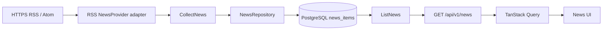

# ADR-007: Provider-Neutral News Collection Pipeline

**Status:** Accepted
**Date:** 2026-08-30
**Owners:** News Pipeline Team
**Requirements:** [REQUIREMENT.md §§27–30](../REQUIREMENT.md#27-module-10--news-crawler)
**Extends:** [ADR-001](ADR-001-modular-monolith-and-workers.md), [ADR-002](ADR-002-layered-boundaries.md)

## Context

`REQUIREMENT.md` §§27–28 yêu cầu thu thập tin liên quan đến coin/pair nhưng không gắn hệ thống với một crawler cụ thể. News còn là đầu vào tương lai của Sentiment Analysis và `NewsSentimentStrategy` (§§29–30). Nếu crawler, persistence, API và model sentiment nằm trong cùng một flow, việc đổi nguồn tin hoặc model sẽ làm thay đổi nhiều module, lỗi provider/model có thể ảnh hưởng Market/Backtest, và kết quả lịch sử khó tái tạo.

Task 3 chỉ chịu trách nhiệm cho News đã chuẩn hóa và lưu bền vững. Task 4 Sentiment vẫn chưa hoàn thành; không có model, label hoặc score nào được phép dựng giả để lấp khoảng trống này.

## Decision

### 1. Mọi nguồn tin đi qua `NewsProvider`

Application định nghĩa port `NewsProvider`; RSS/Atom là adapter đầu tiên, không phải contract của hệ thống. API, repository, frontend, Sentiment và Strategy không import RSS DTO hoặc phụ thuộc một website cụ thể. Có thể thêm News API hoặc crawler adapter sau này nếu cùng trả `CollectedNewsItem` chuẩn và vượt provider contract test.

Adapter RSS chỉ lấy title và summary/content có trong feed, chuẩn hóa plain text, UTC, HTTPS canonical URL và related coin. Task 3 không scrape toàn văn bài báo.

### 2. Tách collect, store và read delivery

Flow Task 3 là:



- `NewsProvider` thu thập và map dữ liệu ngoài; không truy cập database hoặc chạy model.
- `CollectNews` điều phối nhiều provider và lưu qua `NewsRepository`.
- `NewsRepository` sở hữu idempotent upsert và query đã phân trang.
- `GET /api/v1/news` chỉ đọc dữ liệu đã lưu; frontend không gọi RSS trực tiếp.
- UI dùng TanStack Query và public API contract; không fallback sang `NEWS` mock.

### 3. Identity, deduplication và index là contract persistence

`news_items` giữ hai lớp identity:

1. `(provider, provider_item_id)` là identity ổn định của item trong một provider.
2. `canonical_url` là unique để cùng một bài xuất hiện ở nhiều feed không tạo dòng thứ hai.

`content_fingerprint` là SHA-256 của title, content và canonical URL đã chuẩn hóa. Fingerprint dùng phát hiện nội dung thay đổi và làm provenance cho Sentiment Task 4; nó không thay thế provider identity. Thu thập lại cùng feed là idempotent. Cùng provider identity có nội dung mới có thể cập nhật nội dung mutable nhưng giữ `id`; duplicate canonical URL từ provider khác không được viết lại source attribution.

Các index bắt buộc:

- unique `(provider, provider_item_id)`;
- unique `canonical_url`;
- GIN `related_coins` cho exact array membership;
- B-tree `(published_at DESC, id)` cho thứ tự mới nhất và pagination xác định.

Không có cột sentiment/model/score trong `news_items`.

### 4. Runtime được cấu hình và lỗi provider bị cô lập

Các setting server-side:

```dotenv
CSL_NEWS_COLLECTION_ENABLED=false
CSL_NEWS_COLLECTION_INTERVAL_SECONDS=900
CSL_NEWS_FEEDS=[{"source":"Cointelegraph","url":"https://cointelegraph.com/rss"}]
```

Khi bật, collection loop chạy một lần ngay rồi chờ interval. Lỗi transport, XML hoặc một provider được ghi log và cô lập; provider khác và chu kỳ sau vẫn có thể chạy. News failure không được làm API lifecycle, Market chart, Strategy hoặc technical Backtest dừng. Dữ liệu News đã lưu vẫn đọc được khi nguồn ngoài unavailable.

Operator có thể chạy một lần bằng normal composition/use case, không nhân đôi crawler logic:

```powershell
backend\.venv\Scripts\python.exe backend\scripts\collect_news_once.py
```

One-shot trả non-zero chỉ khi mọi provider đã cấu hình đều thất bại.

### 5. Task 3 cố ý chưa phân tích sentiment

Public item giữ field ổn định:

```json
{
  "sentiment": null
}
```

Frontend hiển thị `Pending analysis`. `null` là trạng thái trung thực của Task 3, không phải dữ liệu thiếu cần thay bằng model/label/score giả.

Task 4 phải đọc News đã lưu qua boundary riêng, chạy `SentimentAnalyzer`, và lưu kết quả vào bảng `news_sentiment_analyses` bất biến/có version. API read mapper có thể join latest completed analysis để điền object `sentiment`; collector không thay đổi. `NewsSentimentStrategy` chỉ nhận aggregate qua `SentimentContextReader`/`StrategyContext`, không đọc database trực tiếp.

## Alternatives considered

- **Gắn code với một RSS website:** nhanh hơn ban đầu nhưng vi phạm §28 và làm source-specific DTO rò xuống application/UI.
- **Frontend đọc RSS trực tiếp:** bỏ qua validation/persistence, gặp CORS, không có deduplication và không giữ dữ liệu khi provider lỗi.
- **Crawler gọi model sentiment ngay:** coupling collection uptime với model uptime, khó retry độc lập và khó version kết quả.
- **Thêm cột `sentiment`, `score`, `model` mutable vào `news_items`:** làm mất lịch sử khi đổi model hoặc content và phá reproducibility.
- **Hiển thị sentiment giả đến khi có model:** bị loại vì tạo dữ liệu không có provenance và khiến người dùng hiểu sai Task 4 đã hoàn thành.
- **Tách microservice/queue ngay:** chưa cần cho MVP; modular monolith và loop cô lập đáp ứng scope hiện tại.

## Consequences

### Positive

- Có thể thêm nguồn News mới mà không sửa API/UI/Sentiment/Strategy.
- Collect lại an toàn và query theo coin/time ổn định.
- Provider outage không xóa dữ liệu đã lưu hoặc kéo sập Market/Backtest.
- Task 4 có boundary versioned để giữ model/content provenance.
- UI thể hiện đúng trạng thái chưa phân tích thay vì dựng dữ liệu giả.

### Negative

- Cần mapper và contract test cho từng adapter.
- Canonical URL và provider conflict policy phải được duy trì nhất quán.
- RSS summary có thể ngắn/không đồng nhất và không phải full article.
- Background loop cần log/monitor riêng; Task 3 chưa cung cấp sentiment health.

## Validation

ADR này được kiểm chứng khi các gate sau có output thực tế; danh sách không phải tuyên bố rằng lệnh đã được chạy:

- RSS và fake provider cùng vượt `NewsProvider` contract test.
- Collect hai lần không tăng số item logical; provider failure không làm health/Market/stored News unavailable.
- Migration có một head `20260830_010_news`, đúng unique constraints và indexes đã nêu.
- `GET /api/v1/news` filter coin/time và pagination xác định; Task 3 luôn trả `sentiment: null`.
- News UI lấy dữ liệu qua TanStack Query, giữ item sau F5 và không hiển thị model/score giả.
- Manual operator smoke checklist trong root `README.md` được chạy và lưu evidence trước khi đánh dấu Task 3 hoàn thành.

## Revisit when

- Cần provider API/crawler có authentication hoặc full-text ingestion với policy riêng.
- Sản lượng/latency yêu cầu queue hoặc worker độc lập thay collection loop.
- Task 4 chọn sentiment model/runtime và cần ADR riêng cho model revision, resource/failure policy.
- Canonical URL không còn đủ cho cross-provider story grouping và cần story/entity identity mới.
