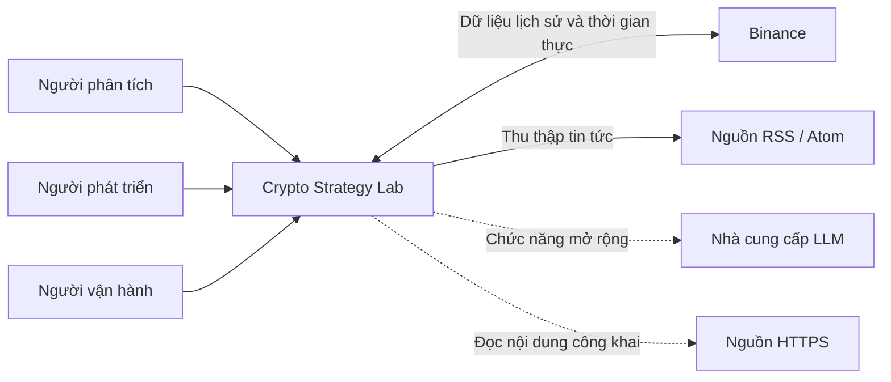
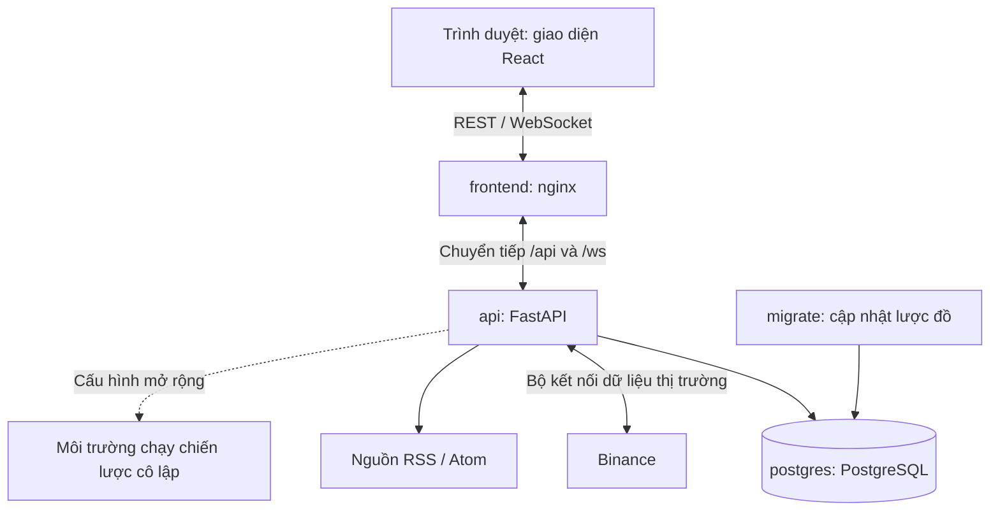
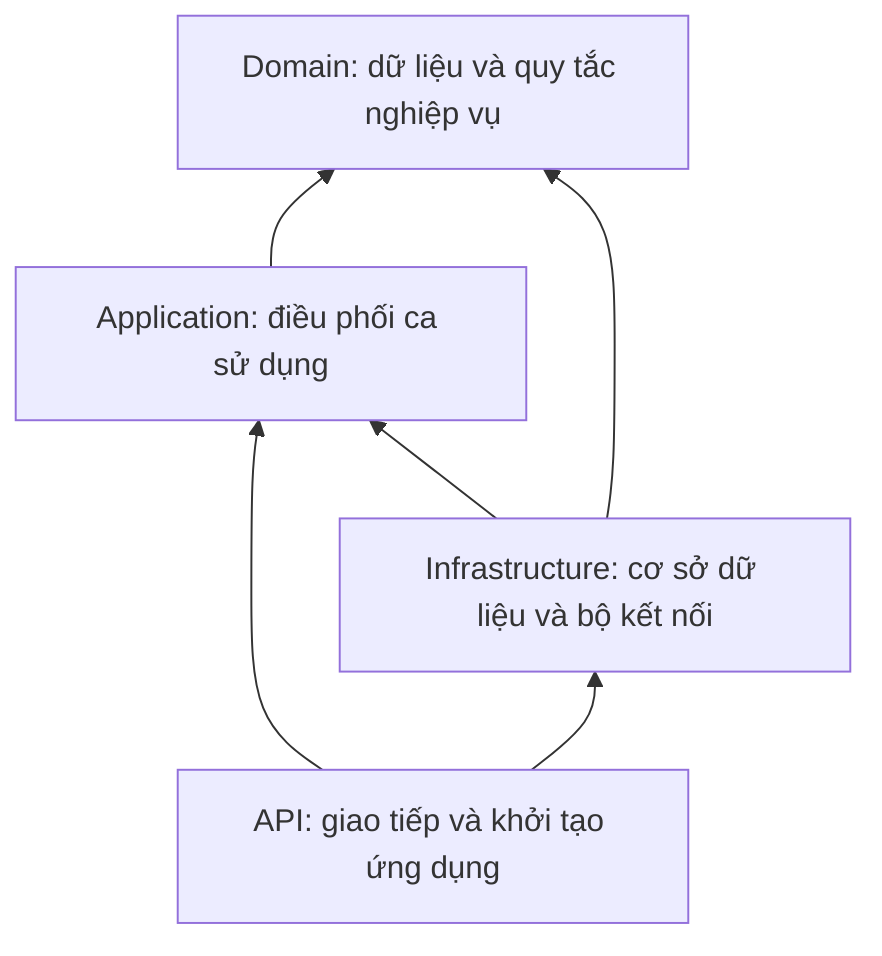
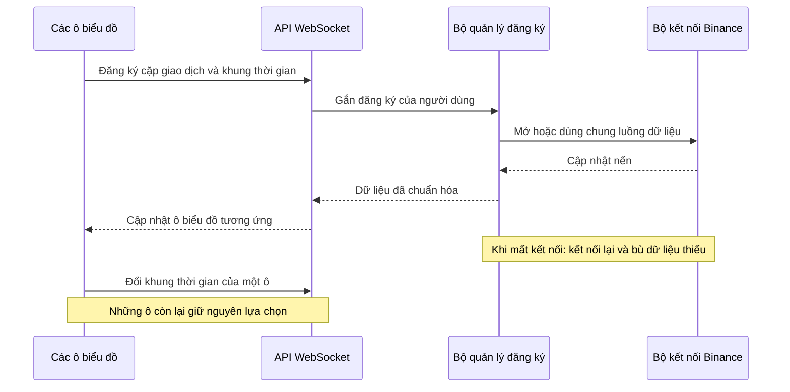
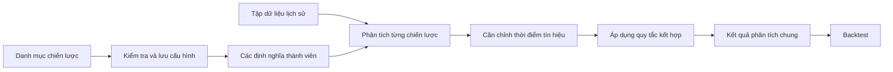
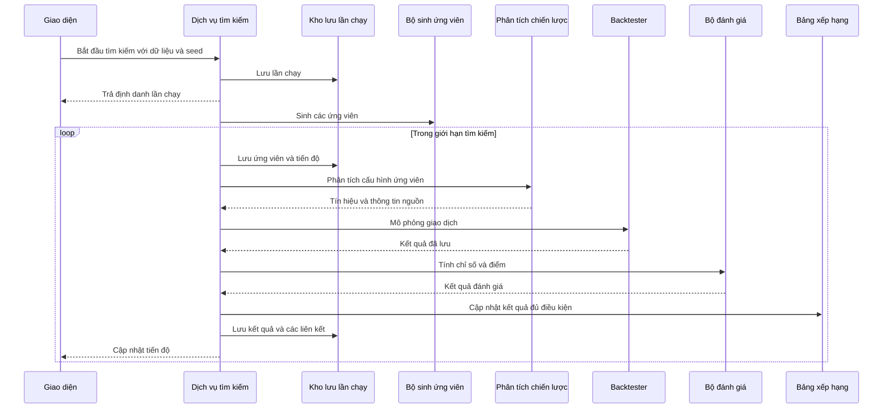
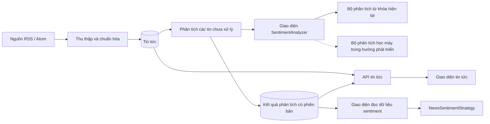
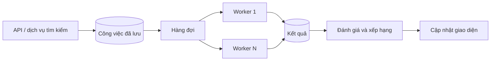

# Crypto Strategy Lab

## Báo cáo kiến trúc phần mềm

**Ngày cập nhật:** 03/09/2026

## 1. Giới thiệu

Crypto Strategy Lab là nền tảng hỗ trợ xây dựng và thử nghiệm các chiến lược giao dịch tiền mã hóa. Người dùng có thể theo dõi giá theo thời gian thực, lựa chọn các phương pháp phân tích kỹ thuật, kết hợp chúng thành chiến lược tổng hợp và đánh giá kết quả trên dữ liệu lịch sử. Những kết quả phù hợp được đưa lên bảng xếp hạng, đi kèm biểu đồ tín hiệu và danh sách giao dịch để người dùng tìm hiểu nguyên nhân phía sau các chỉ số.

Trọng tâm của hệ thống không phải là tìm ra một chiến lược luôn có lợi nhuận. Bài toán chính là tổ chức phần mềm sao cho có thể bổ sung chiến lược, thay đổi thuật toán tìm kiếm hoặc thay nguồn dữ liệu mà không phải xây dựng lại toàn bộ quy trình phân tích. Hệ thống chỉ thực hiện phân tích và mô phỏng; không gửi lệnh giao dịch thật.

Báo cáo trình bày kiến trúc của phiên bản hiện tại, từ bối cảnh sử dụng đến các thành phần triển khai, luồng xử lý và cách quản lý dữ liệu. Những khả năng chưa được triển khai, như hàng đợi phân tán và nhóm tiến trình xử lý độc lập, được trình bày riêng trong phần hướng phát triển.

## 2. Bối cảnh và phạm vi hệ thống

### 2.1. Người sử dụng và các hệ thống bên ngoài

Hệ thống phục vụ ba nhóm người sử dụng. Người phân tích làm việc với biểu đồ, chiến lược và kết quả thử nghiệm. Người phát triển bổ sung các chiến lược hoặc bộ kết nối mới. Người vận hành chuẩn bị môi trường, cấu hình nguồn dữ liệu và theo dõi hoạt động của ứng dụng.

Binance là nguồn dữ liệu thị trường đầu tiên. Tin tức được thu thập từ các nguồn RSS/Atom thông qua một giao diện chung. Ngoài các chức năng cốt lõi, hệ thống có phần mở rộng sử dụng mô hình ngôn ngữ lớn (LLM) để hỗ trợ tạo chiến lược từ nội dung do người dùng cung cấp hoặc từ nguồn HTTPS công khai.

*Hình 1. Bối cảnh sử dụng của Crypto Strategy Lab. Nét đứt biểu thị các kết nối thuộc phần mở rộng.*

Trong các luồng nghiệp vụ đã kết nối, trình duyệt giao tiếp với backend thay vì gọi trực tiếp Binance hoặc nguồn tin. Cách tổ chức này giữ cho giao diện độc lập với định dạng dữ liệu của từng nhà cung cấp, đồng thời tập trung việc kiểm tra dữ liệu tại một nơi.

### 2.2. Phạm vi chức năng

Các chức năng cốt lõi gồm biểu đồ nến thời gian thực với tối đa bốn khung thời gian, bốn chiến lược phân tích kỹ thuật, chiến lược tổng hợp, kiểm thử trên dữ liệu lịch sử, đánh giá hiệu quả, tìm kiếm ngẫu nhiên và bảng xếp hạng Top-K. Người dùng có thể xem lại các tín hiệu mua/bán, điểm vào/ra và giao dịch tương ứng với từng kết quả.

Hệ thống cũng có quy trình thu thập, lưu trữ và phân tích sắc thái tin tức. Bộ phân tích hiện tại sử dụng từ điển từ khóa, chưa phải mô hình học máy đã được huấn luyện. Phạm vi và hạn chế của lựa chọn này được giải thích ở mục 8 và mục 12.

## 3. Kiến trúc tổng thể

### 3.1. Mô hình triển khai

Backend được tổ chức theo mô hình **modular monolith**: các mô-đun có trách nhiệm riêng nhưng được triển khai trong cùng một ứng dụng. Giao diện và cơ sở dữ liệu chạy ở các container riêng, còn Docker Compose mô tả cách khởi động và kết nối các thành phần.

*Hình 2. Các thành phần triển khai của hệ thống.*

| Thành phần | Vai trò |
| --- | --- |
| frontend | Phục vụ ứng dụng React và chuyển tiếp các yêu cầu REST/WebSocket đến backend |
| api | Tiếp nhận yêu cầu, điều phối nghiệp vụ và quản lý các tác vụ nền |
| postgres | Lưu dữ liệu thị trường, cấu hình chiến lược, lịch sử thực thi, kết quả và tin tức |
| migrate | Chạy Alembic để cập nhật lược đồ trước khi API khởi động |
| Môi trường chạy chiến lược cô lập | Kiểm tra và thực thi mã chiến lược được sinh tự động; sử dụng cấu hình triển khai riêng |

Trong phiên bản hiện tại, tìm kiếm chiến lược và các vòng lặp nền chạy bằng tác vụ bất đồng bộ trong tiến trình API. Các container mặc định chưa bao gồm một hàng đợi công việc hoặc nhóm worker độc lập. Đây là cách triển khai gọn cho môi trường đồ án, nhưng cũng giới hạn khả năng mở rộng xử lý và khôi phục công việc sau khi tiến trình bị dừng.

### 3.2. Tổ chức mã nguồn

Mã nguồn backend được chia thành bốn lớp:

- **Domain:** mô tả dữ liệu nghiệp vụ và các quy tắc tạo tín hiệu, mô phỏng, đánh giá, xếp hạng.
- **Application:** điều phối các bước của một ca sử dụng và định nghĩa các giao diện cần thiết để làm việc với dữ liệu hoặc dịch vụ ngoài.
- **Infrastructure:** triển khai truy cập PostgreSQL, kết nối Binance, đọc RSS và các bộ phân tích bên ngoài.
- **API:** tiếp nhận yêu cầu, kiểm tra dữ liệu ở ranh giới HTTP/WebSocket và kết nối các thành phần khi ứng dụng khởi động.

*Hình 3. Hướng phụ thuộc chủ đạo giữa các lớp.*

Nguyên tắc là để quy tắc nghiệp vụ ít phụ thuộc nhất vào framework và dịch vụ ngoài. Chẳng hạn, một chiến lược RSI không cần biết dữ liệu được lấy từ Binance hay một nguồn khác. Chiến lược chỉ cần nhận dữ liệu đã được chuẩn hóa qua giao diện phù hợp.

Cách phân lớp này là định hướng chung của mã nguồn. Một số chi tiết còn cần hoàn thiện, như vị trí đặt giao diện đọc sentiment và kiểu phụ thuộc của dịch vụ tìm kiếm; các điểm này được nêu tại mục 12.

### 3.3. Trách nhiệm các mô-đun

Tên trong dấu backtick là đường dẫn mô-đun tương đối trong package `crypto_lab`.

| Mô-đun | Trách nhiệm chính |
| --- | --- |
| Dữ liệu thị trường (`application.market_data`) | Lấy, chuẩn hóa và lưu nến; tạo tập dữ liệu lịch sử có kiểm tra tính đầy đủ |
| Phân phối dữ liệu biểu đồ (`application.chart_delivery`) | Quản lý đăng ký theo cặp giao dịch và khung thời gian; truyền cập nhật và phục hồi dữ liệu thiếu |
| Danh mục chiến lược (`domain.strategy.registry`, `application.strategies.discover_strategies`) | Quản lý chiến lược khả dụng, phiên bản và mô tả tham số |
| Phân tích chiến lược (`application.strategies.analyze_strategy`, `domain.strategy.implementations`) | Chuyển dữ liệu đầu vào thành tín hiệu BUY, SELL hoặc HOLD |
| Chiến lược tổng hợp (`application.strategies.combine_configuration`) | Kết hợp các tín hiệu thành viên theo quy tắc bỏ phiếu hoặc trọng số |
| Tìm kiếm (`domain.search`, `application.search_service`) | Sinh các cấu hình ứng viên và điều phối việc thử nghiệm chúng |
| Backtest (`domain.backtest`, `application.backtests`) | Mô phỏng giao dịch và biến động tài sản trên dữ liệu lịch sử |
| Đánh giá (`domain.evaluation`, `application.evaluations`) | Tính chỉ số hiệu quả và điểm số theo chính sách đánh giá |
| Bảng xếp hạng (`application.leaderboard`) | Chọn Top-K, cung cấp thông tin chi tiết và dữ liệu trực quan hóa |
| Tin tức (`application.news`) | Thu thập, chuẩn hóa, loại trùng, lưu trữ và truy vấn tin |
| Phân tích sentiment (`application.sentiment`) | Phân loại tin đã lưu và cung cấp dữ liệu phân tích cho chiến lược |
| Sinh chiến lược bằng LLM (`application.strategies.generate_strategies`, `application.strategies.activate_generated_strategy`) | Quản lý nguồn nội dung, bản nháp, kiểm tra an toàn và kích hoạt chiến lược |

Sự phân chia này giúp tránh một dịch vụ duy nhất vừa lấy dữ liệu, vừa tính chỉ báo, vừa mô phỏng và cập nhật giao diện. Dịch vụ tìm kiếm có thể điều phối nhiều mô-đun, nhưng công thức của từng bước vẫn thuộc mô-đun chuyên trách.

## 4. Dữ liệu và khả năng truy vết kết quả

PostgreSQL lưu trạng thái lâu dài của hệ thống. Các mô-đun dùng chung cơ sở dữ liệu nhưng truy cập thông qua các thành phần chuyên trách, thay vì để chiến lược tự thực hiện truy vấn SQL.

| Nhóm dữ liệu | Thông tin được lưu |
| --- | --- |
| Nến và tập dữ liệu | Nguồn, cặp giao dịch, khung thời gian, thời điểm, OHLCV, phạm vi dữ liệu và mã kiểm tra nội dung |
| Định nghĩa và cấu hình chiến lược | Định danh, phiên bản, tham số; các thành viên và quy tắc của chiến lược tổng hợp |
| Lần chạy backtest | Tập dữ liệu, chiến lược, vốn ban đầu, phí, trượt giá, seed và chính sách thực thi |
| Kết quả và đánh giá | Tín hiệu, giao dịch, biến động tài sản, chỉ số hiệu quả và phiên bản chính sách chấm điểm |
| Lần tìm kiếm và ứng viên | Thuật toán, seed, giới hạn chạy, tiến độ và liên kết đến kết quả backtest/đánh giá |
| Bảng xếp hạng | Phạm vi so sánh, thứ tự Top-K, phiên bản và các bản ghi cập nhật |
| Tin tức và sentiment | Nguồn, thời gian xuất bản, đồng tiền liên quan; nhãn, điểm, phiên bản bộ phân tích và thời điểm phân tích |
| Chiến lược được sinh tự động | Nội dung có định danh, kết quả kiểm tra và thông tin kích hoạt |

Một kết quả có ý nghĩa khi xác định được nó được tạo ra từ dữ liệu và cấu hình nào. Vì vậy, hệ thống lưu mã kiểm tra nội dung của tập dữ liệu, phiên bản chiến lược, bộ tham số và các chính sách thực thi/đánh giá. Khi người dùng thay tham số, hệ thống tạo định nghĩa hoặc cấu hình mới. Khi thuật toán của chiến lược thay đổi, cần một phiên bản triển khai mới.

Đối với dữ liệu tin tức, chỉ lưu phiên bản bộ phân tích chưa đủ để bảo đảm tái tạo toàn bộ thử nghiệm. Việc cố định tập tin đã được sử dụng cho từng lần chạy vẫn là một nội dung cần hoàn thiện, nhất là khi nguồn tin được bổ sung hoặc phân tích lại.

## 5. Luồng dữ liệu thị trường

### 5.1. Dữ liệu lịch sử

Khi người dùng chọn cặp giao dịch, khung thời gian và khoảng ngày, giao diện gửi yêu cầu đến backend. Mô-đun dữ liệu thị trường kiểm tra phần dữ liệu đã lưu, lấy phần còn thiếu qua bộ kết nối nhà cung cấp, sau đó chuẩn hóa và lưu lại các nến hợp lệ.

Mỗi nến được nhận dạng bằng nguồn dữ liệu, cặp giao dịch, khung thời gian và thời điểm mở nến. Thời gian được quy về UTC. Việc nhập lại cùng khoảng dữ liệu không được tạo thêm một bản sao của cùng nến.

Dữ liệu trả về cho biểu đồ và dữ liệu dùng cho backtest có cùng cấu trúc chuẩn hóa. Tuy nhiên, backtest chỉ sử dụng tập dữ liệu đủ điều kiện, đã được kiểm tra tính đầy đủ và mã kiểm tra nội dung. Điều này giúp tách việc quan sát thị trường đang diễn ra khỏi việc thử nghiệm trên một tập dữ liệu xác định.

### 5.2. Cập nhật thời gian thực

*Hình 4. Đăng ký và cập nhật dữ liệu cho nhiều biểu đồ.*

Mỗi ô biểu đồ quản lý lựa chọn và vòng đời kết nối riêng. Khi người dùng đổi một khung thời gian, chỉ đăng ký của ô tương ứng được thay đổi. Backend có thể dùng chung một luồng dữ liệu phía Binance cho nhiều người dùng có cùng lựa chọn, giảm số kết nối không cần thiết.

Khi kết nối bị gián đoạn, giao diện thể hiện trạng thái dữ liệu cũ hoặc đang kết nối lại. Backend sử dụng dữ liệu lịch sử để bù khoảng trống trước khi tiếp tục luồng cập nhật. Các bản tin trùng hoặc đến sai thứ tự được xử lý để tránh tạo nến trùng và làm chuỗi thời gian đi lùi.

## 6. Luồng phân tích và kết hợp chiến lược

Danh mục chiến lược cung cấp tên, phiên bản và mô tả tham số cho giao diện. Người dùng lựa chọn chiến lược và nhập cấu hình; backend kiểm tra tham số trước khi lưu định nghĩa.

Bốn chiến lược kỹ thuật có trong hệ thống là Moving Average, RSI, Bollinger Bands và Support/Resistance. Mỗi chiến lược tạo tín hiệu BUY, SELL hoặc HOLD trên dữ liệu đầu vào. Khi chưa đủ lịch sử để tính toán, kết quả được đánh dấu đang tích lũy dữ liệu, còn gọi là giai đoạn warmup.

*Hình 5. Chiến lược đơn lẻ và chiến lược tổng hợp sử dụng chung đầu ra cho backtest.*

Hệ thống hỗ trợ hai cách kết hợp. Với cách **bỏ phiếu**, tín hiệu có nhiều phiếu nhất được chọn; trường hợp bằng phiếu sử dụng hành động đã cấu hình. Với cách **trọng số**, BUY, HOLD và SELL được quy đổi lần lượt thành 1, 0 và -1. Tổng có trọng số được so với ngưỡng mua và ngưỡng bán để xác định kết quả.

Trước khi kết hợp, các tín hiệu thành viên phải cùng thời điểm. Nếu một thành viên còn trong giai đoạn warmup, chiến lược tổng hợp giữ trạng thái HOLD/WARMUP. Đầu ra sau cùng vẫn tuân theo cấu trúc kết quả phân tích chung, nên Backtester không cần biết tín hiệu đến từ một chiến lược đơn lẻ hay từ nhiều chiến lược kết hợp.

## 7. Luồng tìm kiếm, backtest và xếp hạng

### 7.1. Tìm kiếm chiến lược

Tìm kiếm bắt đầu từ tập dữ liệu, danh sách chiến lược được phép sử dụng, kích thước tổ hợp và giới hạn chạy. Thuật toán Random Search chọn các thành viên và bộ tham số hợp lệ để tạo ứng viên. Giá trị khởi tạo ngẫu nhiên (seed) được lưu cùng lần tìm kiếm để kiểm soát phần ngẫu nhiên.

*Hình 6. Quy trình thử nghiệm một tập ứng viên chiến lược.*

Trong phiên bản hiện tại, mỗi ứng viên gồm từ hai đến bốn chiến lược và sử dụng quy tắc bỏ phiếu. Tính năng kết hợp theo trọng số có ở cấu hình chiến lược, nhưng chưa được đưa vào không gian Random Search.

Vòng tìm kiếm dừng khi đạt giới hạn ứng viên, hết thời gian, không cải thiện sau số lần quy định, hết khả năng sinh ứng viên hoặc nhận yêu cầu hủy. Thời gian được kiểm tra giữa các ứng viên, nên không phải thời hạn cưỡng chế ngắt ngay một ứng viên đang chạy. Lỗi của một ứng viên được ghi nhận riêng để quá trình có thể tiếp tục với các ứng viên khác.

Các lần chạy và kết quả được lưu vào PostgreSQL; phần thực thi và phân phối tiến độ hiện nằm trong tiến trình API. Vì vậy, việc lưu lịch sử không đồng nghĩa với khả năng tự khôi phục mọi công việc đang chạy sau khi API khởi động lại.

### 7.2. Mô phỏng và đánh giá

Backtester nhận tập dữ liệu và cấu hình thực thi đã xác định, mô phỏng các giao dịch rồi ghi lại kết quả. Cấu hình gồm vốn ban đầu, phí giao dịch, trượt giá, seed và phiên bản chính sách thực thi. Bộ đánh giá sử dụng kết quả này để tính các chỉ số, thay vì tự chạy lại chiến lược.

Bốn chỉ số cốt lõi là tỷ suất sinh lời, tỷ lệ thắng, mức sụt giảm tối đa và số lượng giao dịch. Các chỉ số bổ sung như Sharpe hỗ trợ việc so sánh nhiều khía cạnh của hiệu quả. Một tỷ suất sinh lời cao không tự động đồng nghĩa với một chiến lược tốt nếu đi kèm rủi ro lớn hoặc quá ít giao dịch.

Chính sách Balanced v1 hiện sử dụng các trọng số sau:

| Chỉ số | Trọng số | Chiều đánh giá |
| --- | ---: | --- |
| Return | 35% | Cao hơn tốt hơn |
| Win Rate | 25% | Cao hơn tốt hơn |
| Max Drawdown | 25% | Thấp hơn tốt hơn |
| Sharpe Ratio | 15% | Cao hơn tốt hơn |

Giá trị được giới hạn và chuẩn hóa theo chính sách trước khi cộng có trọng số. Cách này tránh cộng trực tiếp những đại lượng khác đơn vị. Các trường hợp chỉ số không xác định được xử lý theo quy tắc đánh giá, không tự thay bằng một giá trị có lợi cho xếp hạng.

### 7.3. Bảng xếp hạng và trực quan hóa

Bảng xếp hạng đọc những kết quả đánh giá đã lưu, lựa chọn các kết quả đủ điều kiện và giữ lại Top-K. Phạm vi so sánh, phiên bản chính sách, chỉ số dùng để xếp hạng và K cùng xác định một bảng xếp hạng. Khi điểm bằng nhau, hệ thống sử dụng các tiêu chí phụ và thứ tự xác định để kết quả không thay đổi tùy ý.

Khi bảng xếp hạng thay đổi, backend phát sự kiện `LEADERBOARD_UPDATED` qua WebSocket. Các bản ghi cập nhật được lưu bền vững; giao diện có thể tải lại trạng thái bằng REST. Ngược lại, kênh thông báo tiến độ tìm kiếm hiện sử dụng bộ nhớ của tiến trình. Hai cơ chế này phục vụ hai mục đích khác nhau và có mức bảo đảm khôi phục khác nhau.

Người dùng chọn một kết quả để xem chiến lược, dữ liệu đầu vào, tín hiệu mua/bán, điểm vào/ra và danh sách giao dịch. Biểu đồ sử dụng dữ liệu đã gắn với kết quả đó, không dùng phiên bản mới nhất của chiến lược để diễn giải lại một lần chạy cũ.

## 8. Luồng tin tức và phân tích sentiment

Tin tức và phân tích sentiment được tách thành hai bước. Bộ thu thập chỉ đọc nguồn tin, chuẩn hóa nội dung, loại trùng và lưu lại. Bộ phân tích đọc các tin đã lưu rồi tạo kết quả phân loại riêng. Nhờ vậy, thay bộ phân tích không đòi hỏi sửa bộ thu thập.

*Hình 7. Quy trình tin tức và phân tích sentiment.*

Mỗi kết quả lưu nhãn, điểm, định danh và phiên bản bộ phân tích, dấu vân tay nội dung cùng thời điểm phân tích. Lỗi được ghi nhận theo từng tin. Khi chưa có kết quả hoàn tất, API trả trạng thái chưa phân tích để giao diện hiển thị tương ứng.

`NewsSentimentStrategy` tổng hợp dữ liệu sentiment trong một khoảng thời gian và tạo tín hiệu theo các ngưỡng được cấu hình. Chỉ những tin đã xuất bản và đã được phân tích trước hoặc đúng thời điểm đóng nến mới được sử dụng. Khi chưa đủ dữ liệu, chiến lược trả HOLD/WARMUP. Quy tắc này tránh sử dụng thông tin mà một người giao dịch tại thời điểm quá khứ chưa thể biết.

Bộ phân tích hiện tại dựa trên từ điển từ khóa. Nó phù hợp để minh họa cấu trúc của quy trình và kiểm thử tính nhất quán, nhưng chưa đáp ứng phần yêu cầu sử dụng mô hình học máy. Việc bổ sung mô hình đã huấn luyện cần đi kèm quản lý phiên bản, đánh giá trên dữ liệu có nhãn và kiểm tra chi phí xử lý.

## 9. An toàn và vận hành

### 9.1. Chiến lược được sinh tự động

Phần mở rộng sử dụng LLM coi nội dung nguồn và mã được sinh ra là dữ liệu chưa đáng tin cậy. Kết quả ban đầu được lưu dưới dạng bản nháp, phải trải qua kiểm tra và được người dùng xác nhận trước khi kích hoạt.

Mã chiến lược được thực thi qua môi trường cô lập thay vì được nhập trực tiếp vào tiến trình ứng dụng. Thiết kế giới hạn quyền, tài nguyên và khả năng truy cập mạng; thông tin bí mật không được đưa vào trình duyệt hoặc môi trường thực thi chiến lược. Phần mở rộng này yêu cầu cấu hình riêng và không được kích hoạt khi thiếu điều kiện an toàn.

Mô hình sử dụng hiện tại phù hợp với một không gian làm việc tin cậy. Phân quyền nhiều người dùng và triển khai công khai cần được thiết kế bổ sung.

### 9.2. Theo dõi và cấu hình hoạt động

Hệ thống có mã định danh yêu cầu, nhật ký xử lý, trạng thái lần chạy và các điểm kiểm tra sức khỏe. Liveness cho biết API còn phục vụ được yêu cầu; readiness kiểm tra kết nối cơ sở dữ liệu. Hai trạng thái này không thay thế việc theo dõi riêng Binance, nguồn tin hoặc bộ phân tích.

Các tác vụ nền được bật theo cấu hình. Compose mặc định bật tự động đánh giá và tắt thu thập tin tức; phân tích sentiment và vòng tìm kiếm nền cũng bị tắt trong cấu hình mặc định của ứng dụng. Để bật các chức năng này trong container, các biến tương ứng cần được truyền vào môi trường API qua Compose hoặc cấu hình bổ sung.

Màn hình Operations còn sử dụng một số dữ liệu mô phỏng. Do đó, nhật ký và trạng thái thực tế từ backend mới là cơ sở để đánh giá hoạt động của hệ thống ở phiên bản này.

## 10. Các thuộc tính chất lượng

| Thuộc tính | Cách kiến trúc hỗ trợ |
| --- | --- |
| Khả năng thay đổi | Danh mục chiến lược và các giao diện chung giúp khoanh vùng phần cần sửa khi thêm thuật toán hoặc nguồn dữ liệu |
| Khả năng bảo trì | Tách phân tích, mô phỏng, đánh giá và trình bày để tránh lặp lại quy tắc nghiệp vụ |
| Tính thời gian thực | WebSocket và đăng ký riêng cho từng biểu đồ; dùng chung kết nối nguồn khi phù hợp |
| Độ tin cậy | Lưu kết quả lâu dài, ghi lỗi theo ứng viên/tin và bù dữ liệu sau khi kết nối thị trường bị gián đoạn |
| Khả năng giải thích | Liên kết kết quả xếp hạng với cấu hình, phiên bản, tín hiệu và giao dịch cụ thể |
| Hiệu năng | Giới hạn số ứng viên và kích thước xử lý; tách sẵn các trách nhiệm để có thể chuyển công việc nặng sang worker |
| Khả năng quan sát | Nhật ký, mã yêu cầu, trạng thái lần chạy và lịch sử cập nhật bảng xếp hạng |

Các cơ chế trên giảm ảnh hưởng của lỗi ở từng ca sử dụng, nhưng chưa tạo ra sự cô lập hạ tầng hoàn toàn. Các tác vụ vẫn dùng chung tiến trình API và cơ sở dữ liệu; sự cố của những thành phần dùng chung có thể ảnh hưởng đến nhiều chức năng.

## 11. Các tình huống thay đổi và mở rộng

### 11.1. Bổ sung một chiến lược mới

Để thêm MACD, người phát triển tạo lớp thực hiện giao diện chiến lược, khai báo tham số và phiên bản, đăng ký vào danh mục rồi bổ sung kiểm thử. Backtester, bộ đánh giá và bảng xếp hạng tiếp tục sử dụng cấu trúc kết quả chung. Giao diện có thể đọc mô tả tham số từ danh mục thay vì chứa công thức MACD.

### 11.2. Thay thuật toán tìm kiếm

Một thuật toán mới thực hiện giao diện `StrategyGenerator` và trả về `StrategyCandidate`. Các ứng viên tiếp tục đi qua cùng quy trình phân tích, backtest và đánh giá. Hiện dịch vụ tìm kiếm vẫn khai báo kiểu phụ thuộc cụ thể vào `RandomSearchGenerator`, nên việc tích hợp thuật toán mới cần chỉnh kiểu này và cấu hình khởi tạo, nhưng không cần viết lại phần mô phỏng hay chấm điểm.

### 11.3. Bổ sung nguồn dữ liệu thị trường

Một nguồn như OKX cần các bộ kết nối cho dữ liệu lịch sử và thời gian thực, chuyển đầu ra về cấu trúc Candle chung. Bộ vẽ biểu đồ không cần hiểu định dạng riêng của OKX. Phần lựa chọn nhà cung cấp và danh sách khả năng hỗ trợ trên giao diện có thể cần bổ sung để người dùng truy cập được nguồn mới.

### 11.4. Tăng quy mô lên 100.000 backtests

Ở quy mô này, công việc mô phỏng cần được đưa ra khỏi tiến trình API. Hướng phát triển là lưu công việc bền vững, phân phối qua hàng đợi và thực thi bằng nhiều worker độc lập.

*Hình 8. Kiến trúc mở rộng đề xuất cho khối lượng backtest lớn; chưa thuộc cấu hình triển khai hiện tại.*

Thiết kế này cần bổ sung cơ chế nhận việc, phát hiện worker ngừng hoạt động, thử lại, hủy và chống tạo kết quả trùng. Kênh cập nhật tiến độ cũng cần hoạt động giữa nhiều tiến trình. Lựa chọn công nghệ hàng đợi sẽ dựa trên yêu cầu vận hành và kết quả đo tải, thay vì được ấn định chỉ vì công nghệ phổ biến.

### 11.5. Nguồn tin tức gặp lỗi

Luồng biểu đồ không gọi trực tiếp mô-đun tin tức. Lỗi từ một nguồn tin hoặc một lần phân tích được xử lý trong luồng tương ứng, trong khi dữ liệu tin đã lưu vẫn có thể được đọc. Tuy vậy, sự cố cơ sở dữ liệu hoặc tiến trình API vẫn có thể ảnh hưởng đến cả hai chức năng.

### 11.6. Thay bộ phân tích sentiment

Bộ phân tích mới được kết nối qua `SentimentAnalyzer` và tạo kết quả với phiên bản mới. Bộ thu thập tin không cần thay đổi. Chiến lược tiếp tục đọc nhãn và điểm theo cấu trúc chung; phiên bản bộ phân tích dùng cho chiến lược được xác định trong cấu hình khởi tạo. Để thử nghiệm cũ có thể tái tạo, cần giữ cả phiên bản đó và tập dữ liệu sentiment đã sử dụng.

### 11.7. Binance WebSocket mất kết nối

Backend phát hiện gián đoạn, thực hiện kết nối lại và lấy dữ liệu lịch sử để bù khoảng thiếu. Giao diện thể hiện trạng thái kết nối thay vì tiếp tục hiển thị dữ liệu như thể vẫn đang cập nhật. Việc lọc trùng và kiểm tra thứ tự thời gian được áp dụng trước khi tiếp tục phân phối nến.

### 11.8. Truy vết một kết quả trên bảng xếp hạng

Từ định danh kết quả đánh giá, hệ thống lần theo kết quả backtest, lần chạy và định nghĩa chiến lược. Đối với tổ hợp, cấu hình lưu các thành viên và phiên bản tương ứng. Thông tin về tập dữ liệu, phí, trượt giá, seed và chính sách chấm điểm giải thích thêm điều kiện tạo ra kết quả. Vì vậy, tên hiển thị của chiến lược không phải là thông tin duy nhất được lưu.

## 12. Hạn chế và hướng phát triển

Phiên bản hiện tại ưu tiên một quy trình thử nghiệm thống nhất và môi trường triển khai gọn. Các nội dung còn cần hoàn thiện gồm:

- **Mô hình học máy cho sentiment:** quy trình xử lý đã có, nhưng bộ phân loại hiện dùng từ khóa. Yêu cầu về mô hình học máy chưa được hoàn tất.
- **Khôi phục công việc và mở rộng xử lý:** lịch sử tìm kiếm được lưu, nhưng tác vụ đang chạy chưa có cơ chế tự nhận lại sau khi API khởi động lại. Hàng đợi bền vững và worker độc lập là bước phát triển tiếp theo.
- **Tái tạo dữ liệu sentiment:** cần cố định tập tin và phiên bản phân tích gắn với từng thử nghiệm, không chỉ truy vấn dữ liệu hiện có tại thời điểm chạy lại.
- **Hoàn thiện ranh giới phụ thuộc:** cần chuyển kiểu phụ thuộc của dịch vụ tìm kiếm sang giao diện chung và bố trí lại giao diện đọc sentiment để phù hợp hơn với hướng phân lớp.
- **Vận hành và kiểm thử tích hợp:** cần hoàn thiện cấu hình các vòng lặp trong Compose, kết nối dữ liệu thực cho Operations và kiểm chứng các tình huống mất kết nối, khởi động lại, lỗi nguồn tin trên môi trường triển khai.

Các phép đo tải và kết quả kiểm thử tích hợp phải được ghi nhận trên một phiên bản triển khai cụ thể. Báo cáo kiến trúc mô tả thiết kế và hành vi của mã nguồn, không thay thế báo cáo thực nghiệm.
