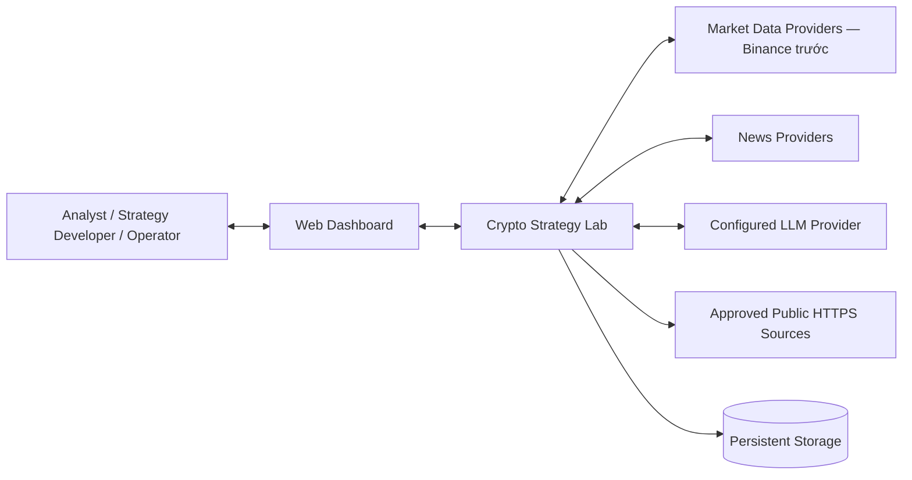
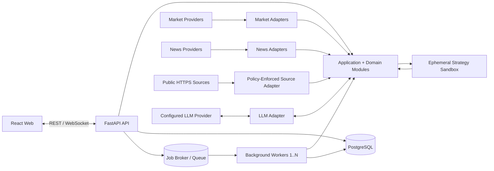
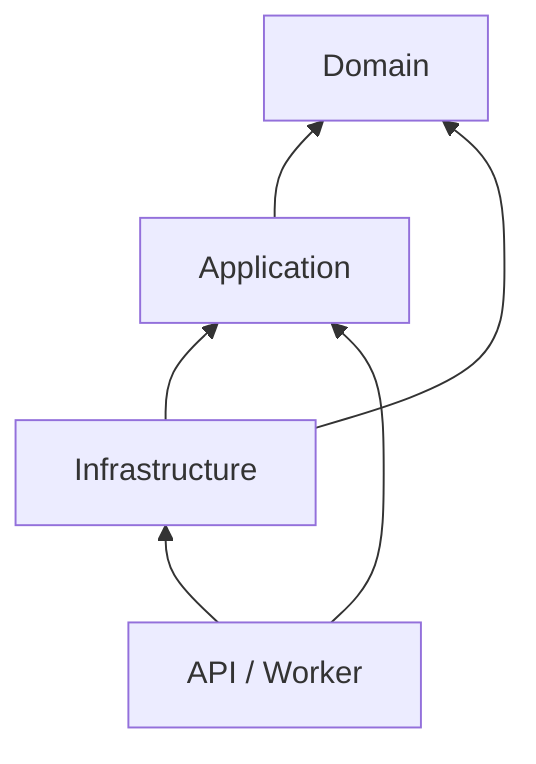
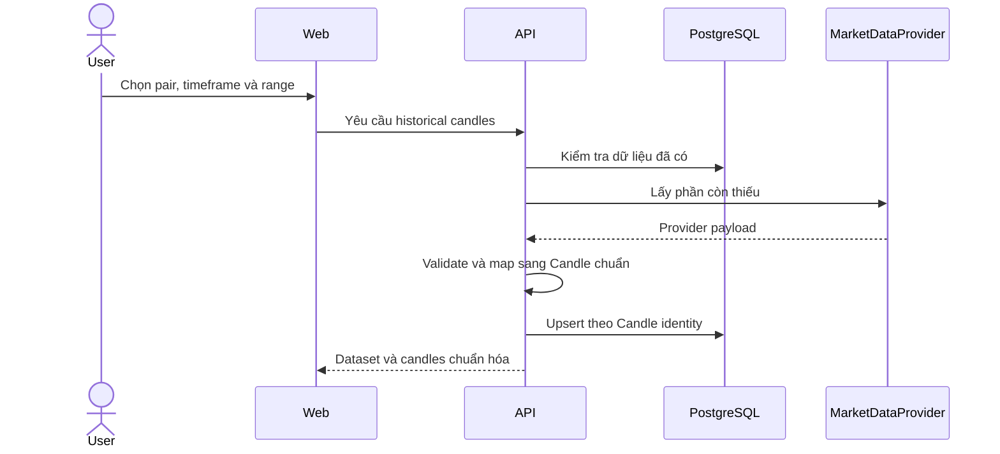
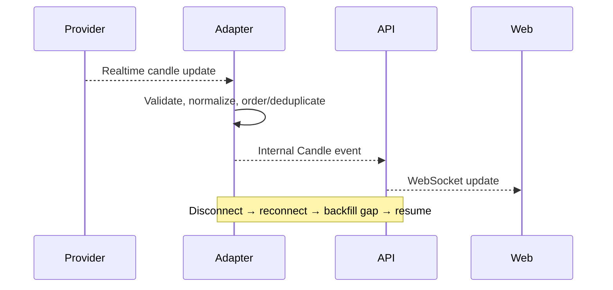
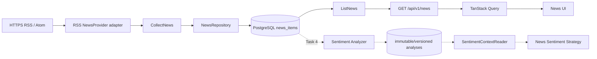
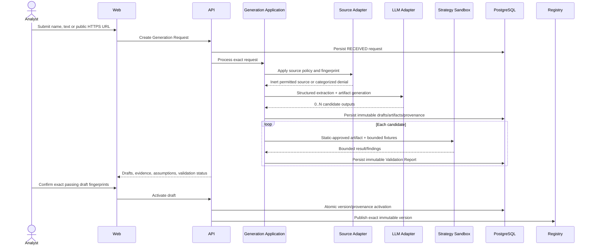

# Crypto Strategy Lab — Architecture

**Status:** Accepted  
**Date:** 2026-08-23  
**Last reviewed:** 2026-08-30
**Review owner:** Crypto Strategy Lab Team  
**Related documents:** [Requirement](REQUIREMENT.md), [SRS](SRS.md), [Constitution](../.specify/memory/constitution.md), [ADR Index](ADR/README.md)

**Acceptance record:** The team confirmed this baseline for Feature 002 implementation on 2026-08-19. Market Data and Chart Delivery follow ADR-002/ADR-003, with TV1 owning Candle/history and TV2 owning realtime subscription/chart lifecycle.

Tài liệu này mô tả kiến trúc chung để các feature plan dùng cùng boundary và data flow. Các chi tiết chỉ thuộc một feature được quyết định trong `specs/<feature>/plan.md`, `research.md` và ADR của feature đó.

## 1. System Context

Crypto Strategy Lab giúp người dùng theo dõi giá crypto, thử strategy trên dữ liệu quá khứ, so sánh kết quả và xem tin tức/sentiment. Hệ thống chỉ phân tích và mô phỏng; không gửi lệnh giao dịch thật.



### External actors

| Actor/System | Vai trò |
|---|---|
| Analyst | Chọn pair/timeframe, chạy strategy/backtest/search và xem kết quả |
| Strategy Developer | Thêm strategy theo contract chung |
| Operator | Theo dõi stream, worker, lỗi và tiến độ |
| Market Data Provider | Cung cấp historical và realtime candle |
| News Provider | Cung cấp tin liên quan đến coin/pair |
| Configured LLM Provider | Extract structured strategy và generate candidate artifact qua provider-neutral port |
| Public Strategy Source | Cung cấp permitted public text; không có authenticated/browser-session access |

Frontend không gọi provider, database hoặc job queue trực tiếp. Backend chịu trách nhiệm validate và chuẩn hóa mọi dữ liệu ngoài.

## 2. Container View



| Container | Trách nhiệm chính |
|---|---|
| React Web | Chart, cấu hình strategy, backtest progress, leaderboard, news và sentiment UI |
| FastAPI API | REST/WebSocket, boundary validation và gọi application use case |
| Background Worker | Chạy công việc nền như backtest/search và sentiment analysis |
| PostgreSQL | Lưu dữ liệu bền vững và provenance của experiment |
| Job Broker/Queue | Phân phối công việc nền và hỗ trợ retry; công nghệ chốt ở feature liên quan |
| Strategy Sandbox | Validate và execute generated Python trong ephemeral deny-by-default isolation; không có network/secret/host mount |

API và worker là các process riêng nhưng dùng chung domain/application code. Backend bắt đầu dưới dạng modular monolith; chưa tách microservices.

## 3. Module Responsibilities

| Module | Chịu trách nhiệm | Không chịu trách nhiệm |
|---|---|---|
| Market Data | Lấy, chuẩn hóa, lưu và phát candle | Strategy, backtest, ranking |
| Chart Delivery | Cung cấp historical/realtime data cho UI | Gọi provider trực tiếp hoặc tính strategy |
| Strategy | Validate parameters và tạo BUY/SELL/HOLD | Database, HTTP, queue, ranking |
| Strategy Registry | Đăng ký và cung cấp metadata của strategy | Chứa logic của từng strategy |
| Strategy Generation | Điều phối request, source, LLM, draft, validation, confirmation và activation | Tin LLM/source, execute Python hoặc tự bypass policy |
| Source Ingestion | Validate public HTTPS destination/redirect/content và tạo inert source snapshot | Dùng browser session, cookie/credential hoặc quyết định trading rules |
| Generated Artifact Validation | Static policy + gọi sandbox + tạo immutable Validation Report | Publish registry entry hoặc chạy trong application process |
| Generated Artifact Runtime | Verify digest và gọi sandbox cho exact activated artifact | Network/DB/queue/provider access hoặc mutate artifact |
| Composite | Kết hợp member signals theo policy | Chạy backtest hoặc tính leaderboard |
| Search | Sinh Candidate Strategy | Mô phỏng trade hoặc tính metrics |
| Backtest | Mô phỏng trade trên dataset cố định | Quyết định thứ hạng |
| Evaluation | Tính Return, Win Rate, MDD và các metrics | Hiển thị UI hoặc sinh candidate |
| Leaderboard | Xếp hạng và cung cấp Top-K | Chạy strategy/backtest |
| News | Thu thập qua `NewsProvider`, chuẩn hóa, deduplicate, lưu và cung cấp NewsItem | Phân loại sentiment, gọi model hoặc tính strategy |
| Sentiment (Task 4 — incomplete) | Đọc stored News và tạo immutable/versioned SentimentResult | Crawl news, sửa News identity hoặc đặt lệnh thật |
| API/WebSocket | Xác thực boundary, mapping và delivery | Chứa business rules |
| Persistence/Queue/LLM/Source/Sandbox Adapters | Cài đặt external ports | Quyết định signal, score, policy hoặc business state |

## 4. Dependency Rules



1. `domain` không import FastAPI, SQLAlchemy, queue client hoặc provider SDK.
2. `application` điều phối use case và phụ thuộc vào protocol/interface.
3. `infrastructure` cài đặt database, queue, market/news provider và sentiment analyzer ports.
4. `api` và `worker` là composition roots; chúng không chứa indicator, backtest accounting hoặc scoring rules.
5. Provider DTO, API DTO, queue message, persistence model và domain object là các contract riêng; mapper phải explicit.
6. Frontend chỉ dùng public REST/WebSocket contracts và không tính strategy, backtest hoặc ranking.
7. Contract dùng qua nhiều feature phải có owner, schema version và compatibility rule.
8. LLM/source/sandbox là infrastructure adapters sau application ports; domain không import provider, parser, container hoặc sandbox client.
9. Retrieved content và model output là untrusted DTO. Chúng chỉ trở thành domain draft/artifact sau explicit mapping và validation.
10. API/domain/normal worker không execute generated source. Chỉ `GeneratedStrategyRuntime` adapter gọi ADR-006 sandbox.
11. Sandbox chỉ nhận bounded exact artifact + immutable Strategy Context và trả versioned result/error; không nhận repository/provider/queue handle.
12. News adapter cài `NewsProvider`; RSS DTO không đi qua application boundary. `CollectNews` không import hoặc gọi Sentiment analyzer.
13. `NewsSentimentStrategy` tương lai chỉ đọc aggregate qua `SentimentContextReader`/`StrategyContext`, không truy cập News/Sentiment repository trực tiếp.

## 5. Market Data Flow

### Historical data



### Realtime data



Các rule nền:

- Candle identity: `(provider, pair, timeframe, open_time)`; trường SRS `openTime` ánh xạ sang backend `open_time`.
- Timestamp dùng UTC; OHLCV được validate trước persistence.
- Phân biệt candle đang mở và đã đóng.
- Duplicate/out-of-order delivery không tạo duplicate hoặc time regression.
- Chart, Strategy và Backtest không phụ thuộc schema Binance.

## 6. Backtest and Search Flow

```mermaid
flowchart LR
    USER["User starts bounded search"] --> SEARCH["Strategy Generator"]
    SEARCH --> CANDIDATE["Candidate Strategy"]
    CANDIDATE --> JOB["Backtest Job"]
    JOB --> QUEUE[("Job Queue")]
    QUEUE --> WORKER["Worker Pool"]
    WORKER --> RESULT["Backtest Result"]
    RESULT --> EVAL["Evaluation"]
    EVAL --> RANK["Ranking"]
    RANK --> LB["Top-K Leaderboard"]
    LB --> WEB["REST / WebSocket Update"]
```



High-level rules:

- Search chỉ sinh candidate; không tự backtest hoặc ranking.
- Backtest đọc dataset và immutable strategy version.
- Cùng complete input và seed phải tạo kết quả tương đương.
- Backtest không được đọc candle/news ở tương lai so với decision time.
- Result giữ dataset, strategy, execution config và checksum/provenance.
- Evaluation đọc BacktestResult; Leaderboard đọc EvaluationResult.
- Queue technology, retry policy chi tiết và scoring formula được chốt bằng ADR khi đến feature tương ứng.

## 7. News and Sentiment Flow



Task 3 rules:

- Mọi nguồn cài `NewsProvider` và trả cùng normalized contract. RSS/Atom là adapter đầu tiên, không phải provider duy nhất hoặc public DTO.
- `CollectNews` điều phối provider; `NewsRepository` upsert theo `(provider, provider_item_id)` và unique `canonical_url`, giữ source attribution và `content_fingerprint`.
- Query theo exact `related_coins` dùng GIN index; thứ tự/pagination dùng `(published_at DESC, id)`.
- `GET /api/v1/news` chỉ đọc PostgreSQL. Frontend dùng TanStack Query và không gọi RSS hoặc mock News trực tiếp.
- Collection loop được điều khiển bằng `CSL_NEWS_COLLECTION_ENABLED`, `CSL_NEWS_COLLECTION_INTERVAL_SECONDS`, `CSL_NEWS_FEEDS`; one-shot dùng `backend/scripts/collect_news_once.py`.
- Lỗi một provider được cô lập; stored News, Market, Strategy và technical Backtest vẫn hoạt động độc lập.
- Task 3 luôn project `sentiment: null`; UI hiển thị `Pending analysis`. Không model/label/score nào được dựng giả.

Task 4 hiện **incomplete** và phải tuân theo các rule sau:

- Sentiment Service consume stored News; crawler/`CollectNews` không invoke model.
- Mỗi analysis nằm trong bảng riêng, bất biến và versioned theo model + content fingerprint; không thêm mutable sentiment columns vào `news_items`.
- API read mapper có thể join latest completed analysis vào field `sentiment` đã reserve mà không đổi collector.
- `NewsSentimentStrategy` dùng Strategy contract chung và `SentimentContextReader`; provenance phải giữ model version và không look ahead.
- News/Sentiment lỗi không dừng chart hoặc technical backtest. Candidate cần sentiment phải failed/deferred rõ ràng, không dùng dữ liệu giả.
- Model/runtime và integration chi tiết được chốt trong ADR của Task 4.

## 8. LLM-Assisted Strategy Generation and Reuse Flow



### Trust boundaries and rules

- Source retrieval follows `docs/GENERATED_STRATEGY_SECURITY_POLICY.md`: public HTTPS/443 only, DNS
  and every redirect revalidated, no cookies/auth/session/proxy, permitted text only, bounded time and
  size, minimal attribution/evidence retention.
- Source content is inert data. Prompt injection cannot change policy, system instructions, tools,
  validation or activation.
- LLM provider is replaceable through a port. Credentials remain inside its adapter; live generation
  is disabled unless provider data is excluded from training and uses minimum available retention.
- Model output is persisted as non-active draft/artifact data. It is never imported by API/domain or
  normal workers.
- ADR-006 sandbox is ephemeral, non-root, read-only, networkless, secretless, capability-dropped and
  resource-limited. Sandbox image and validation-policy fingerprints are recorded.
- Activation requires exact matching draft/artifact digests, current passing report and requester
  confirmation in one transaction. Equivalent content resolves the existing executable version.
- Later workflow execution verifies the stored digest and calls the sandbox without source/LLM access.
  Built-in and generated origins share the Strategy result contract.
- A stricter policy may suspend new execution pending revalidation but cannot mutate the artifact or
  historical provenance.

### Ownership baseline

The trusted single-workspace MVP uses one global strategy catalog and requester confirmation only.
This is not an authorization role model. Multi-user ownership, shared marketplace publication,
moderation and second-reviewer approval require a separate access-control amendment.

## 9. Docker Compose Deployment

```text
Docker Compose
├── frontend
├── api
├── worker (1..N)
├── strategy-sandbox (ephemeral per validation/execution)
├── postgres
└── job-broker (được chọn ở feature queued workers)
```

### Deployment rules

- `frontend` chỉ giao tiếp với `api` qua public REST/WebSocket.
- `api` và `worker` dùng cùng application/domain packages nhưng chạy process riêng.
- `strategy-sandbox` không dùng application environment, database, broker hoặc provider credentials; không expose public port và không mount Docker socket/host source.
- Sandbox deployment enforces ADR-006 network, filesystem, privilege, seccomp/profile, CPU, memory, PID, temporary-storage, timeout and output limits.
- `worker` scale bằng số replica/process; không sửa producer hoặc consumer contracts.
- PostgreSQL là nguồn dữ liệu bền vững.
- Job broker không phải nguồn sự thật cho durable business state.
- Secrets truyền qua environment/secret configuration và không commit vào repository.
- Mỗi container có health check phù hợp; API tách liveness và readiness.
- Local setup phải chạy được từ clone sạch theo quickstart của feature.

## 10. Accepted Foundation ADRs

| ADR | Phạm vi | Trạng thái |
|---|---|---|
| [ADR-001](ADR/ADR-001-modular-monolith-and-workers.md) | Modular monolith và worker tách process | Accepted |
| [ADR-002](ADR/ADR-002-layered-boundaries.md) | Layer và dependency boundaries | Accepted |
| [ADR-003](ADR/ADR-003-normalized-market-data.md) | Provider-neutral market data | Accepted |
| [ADR-004](ADR/ADR-004-strategy-plugin-and-versioning.md) | Strategy contract, registry và version | Accepted |
| [ADR-005](ADR/ADR-005-reproducible-backtesting.md) | Deterministic/reproducible backtesting | Accepted |
| [ADR-006](ADR/ADR-006-llm-generated-strategy-isolation.md) | Isolated validation/execution, immutable generated artifacts và activation trust boundary | Accepted |
| [ADR-007](ADR/ADR-007-news-provider-pipeline.md) | Provider-neutral RSS-first News collect/store/read pipeline và Sentiment boundary | Accepted |

ADRs 001–007 are Accepted and binding. Các ADR về Redis/Celery, scoring policy/formula và sentiment model/runtime của Task 4 được tạo khi nhóm làm feature tương ứng; proposal tương lai chưa binding trước Accepted review.

## 11. Team Review Checklist

- [x] System Context thể hiện đúng actor và external systems.
- [x] Container boundaries đủ để chia frontend, API, worker và storage.
- [x] Mỗi module có một trách nhiệm rõ và không trùng ownership.
- [x] Dependency rules khớp Constitution.
- [x] Ba flow cấp cao khớp SRS và feature roadmap.
- [x] Docker Compose topology đủ cho local demo và worker scaling.
- [x] Các quyết định chưa đến thời điểm đã được ghi rõ là deferred.
- [x] Feature plan liên kết ADR liên quan và không tự định nghĩa contract trái nhau.
- [x] LLM/source/sandbox boundaries khớp ADR-006 và security policy; không generated source nào execute trong API/domain/normal worker.
- [x] Restart/reuse flow không gọi lại source hoặc LLM và exact artifact digest/provenance được giữ.
