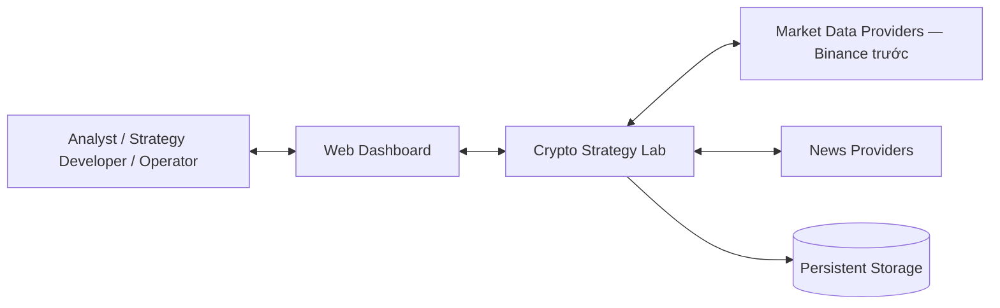
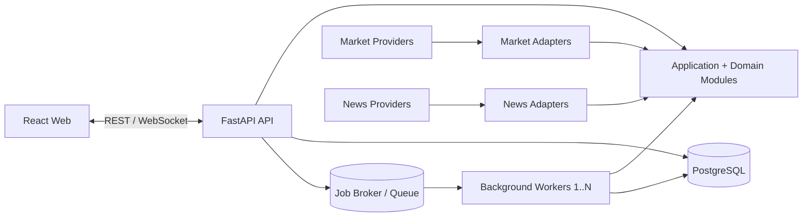
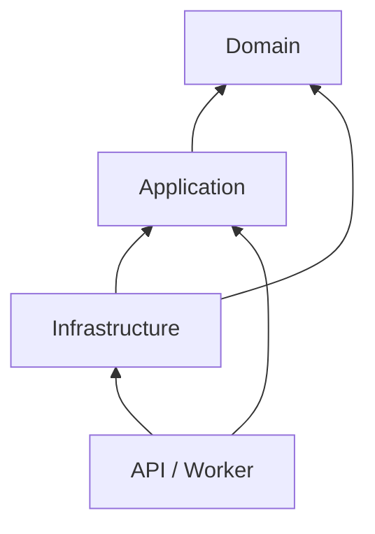
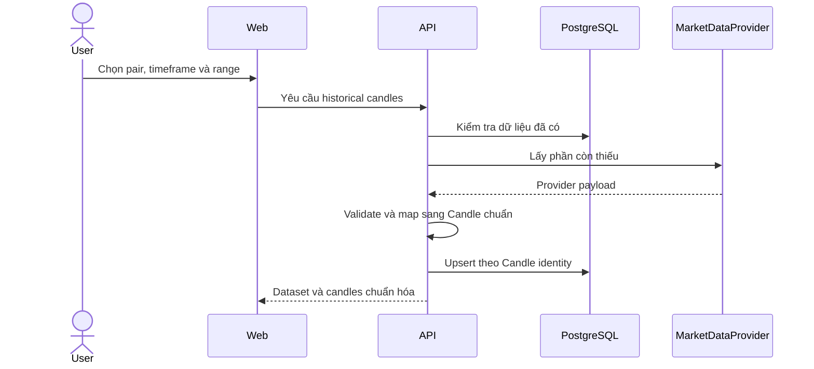
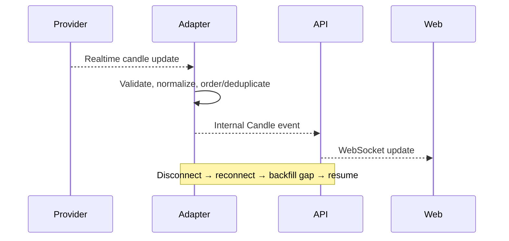
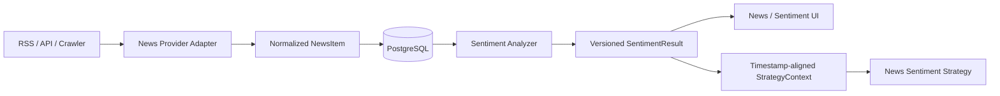

# Crypto Strategy Lab — Architecture

**Status:** Accepted  
**Date:** 2026-08-13  
**Last reviewed:** 2026-08-19
**Review owner:** Crypto Strategy Lab Team  
**Related documents:** [Requirement](REQUIREMENT.md), [SRS](SRS.md), [Constitution](../.specify/memory/constitution.md), [ADR Index](ADR/README.md)

**Acceptance record:** The team confirmed this baseline for Feature 002 implementation on 2026-08-19. Market Data and Chart Delivery follow ADR-002/ADR-003, with TV1 owning Candle/history and TV2 owning realtime subscription/chart lifecycle.

Tài liệu này mô tả kiến trúc chung để các feature plan dùng cùng boundary và data flow. Các chi tiết chỉ thuộc một feature được quyết định trong `specs/<feature>/plan.md`, `research.md` và ADR của feature đó.

## 1. System Context

Crypto Strategy Lab giúp người dùng theo dõi giá crypto, thử strategy trên dữ liệu quá khứ, so sánh kết quả và xem tin tức/sentiment. Hệ thống chỉ phân tích và mô phỏng; không gửi lệnh giao dịch thật.



### External actors

| Actor/System | Vai trò |
|---|---|
| Analyst | Chọn pair/timeframe, chạy strategy/backtest/search và xem kết quả |
| Strategy Developer | Thêm strategy theo contract chung |
| Operator | Theo dõi stream, worker, lỗi và tiến độ |
| Market Data Provider | Cung cấp historical và realtime candle |
| News Provider | Cung cấp tin liên quan đến coin/pair |

Frontend không gọi provider, database hoặc job queue trực tiếp. Backend chịu trách nhiệm validate và chuẩn hóa mọi dữ liệu ngoài.

## 2. Container View



| Container | Trách nhiệm chính |
|---|---|
| React Web | Chart, cấu hình strategy, backtest progress, leaderboard, news và sentiment UI |
| FastAPI API | REST/WebSocket, boundary validation và gọi application use case |
| Background Worker | Chạy công việc nền như backtest/search và sentiment analysis |
| PostgreSQL | Lưu dữ liệu bền vững và provenance của experiment |
| Job Broker/Queue | Phân phối công việc nền và hỗ trợ retry; công nghệ chốt ở feature liên quan |

API và worker là các process riêng nhưng dùng chung domain/application code. Backend bắt đầu dưới dạng modular monolith; chưa tách microservices.

## 3. Module Responsibilities

| Module | Chịu trách nhiệm | Không chịu trách nhiệm |
|---|---|---|
| Market Data | Lấy, chuẩn hóa, lưu và phát candle | Strategy, backtest, ranking |
| Chart Delivery | Cung cấp historical/realtime data cho UI | Gọi provider trực tiếp hoặc tính strategy |
| Strategy | Validate parameters và tạo BUY/SELL/HOLD | Database, HTTP, queue, ranking |
| Strategy Registry | Đăng ký và cung cấp metadata của strategy | Chứa logic của từng strategy |
| Composite | Kết hợp member signals theo policy | Chạy backtest hoặc tính leaderboard |
| Search | Sinh Candidate Strategy | Mô phỏng trade hoặc tính metrics |
| Backtest | Mô phỏng trade trên dataset cố định | Quyết định thứ hạng |
| Evaluation | Tính Return, Win Rate, MDD và các metrics | Hiển thị UI hoặc sinh candidate |
| Leaderboard | Xếp hạng và cung cấp Top-K | Chạy strategy/backtest |
| News | Thu thập, chuẩn hóa và lưu NewsItem | Phân loại sentiment |
| Sentiment | Phân tích NewsItem và tạo SentimentResult có version | Crawl news hoặc đặt lệnh thật |
| API/WebSocket | Xác thực boundary, mapping và delivery | Chứa business rules |
| Persistence/Queue Adapters | Cài đặt external ports | Quyết định signal, score hoặc business state |

## 4. Dependency Rules



1. `domain` không import FastAPI, SQLAlchemy, queue client hoặc provider SDK.
2. `application` điều phối use case và phụ thuộc vào protocol/interface.
3. `infrastructure` cài đặt database, queue, market/news provider và sentiment analyzer ports.
4. `api` và `worker` là composition roots; chúng không chứa indicator, backtest accounting hoặc scoring rules.
5. Provider DTO, API DTO, queue message, persistence model và domain object là các contract riêng; mapper phải explicit.
6. Frontend chỉ dùng public REST/WebSocket contracts và không tính strategy, backtest hoặc ranking.
7. Contract dùng qua nhiều feature phải có owner, schema version và compatibility rule.

## 5. Market Data Flow

### Historical data



### Realtime data



Các rule nền:

- Candle identity: `(provider, pair, timeframe, open_time)`; trường SRS `openTime` ánh xạ sang backend `open_time`.
- Timestamp dùng UTC; OHLCV được validate trước persistence.
- Phân biệt candle đang mở và đã đóng.
- Duplicate/out-of-order delivery không tạo duplicate hoặc time regression.
- Chart, Strategy và Backtest không phụ thuộc schema Binance.

## 6. Backtest and Search Flow

```mermaid
flowchart LR
    USER["User starts bounded search"] --> SEARCH["Strategy Generator"]
    SEARCH --> CANDIDATE["Candidate Strategy"]
    CANDIDATE --> JOB["Backtest Job"]
    JOB --> QUEUE[("Job Queue")]
    QUEUE --> WORKER["Worker Pool"]
    WORKER --> RESULT["Backtest Result"]
    RESULT --> EVAL["Evaluation"]
    EVAL --> RANK["Ranking"]
    RANK --> LB["Top-K Leaderboard"]
    LB --> WEB["REST / WebSocket Update"]
```



High-level rules:

- Search chỉ sinh candidate; không tự backtest hoặc ranking.
- Backtest đọc dataset và immutable strategy version.
- Cùng complete input và seed phải tạo kết quả tương đương.
- Backtest không được đọc candle/news ở tương lai so với decision time.
- Result giữ dataset, strategy, execution config và checksum/provenance.
- Evaluation đọc BacktestResult; Leaderboard đọc EvaluationResult.
- Queue technology, retry policy chi tiết và scoring formula được chốt bằng ADR khi đến feature tương ứng.

## 7. News and Sentiment Flow



High-level rules:

- News Provider trả cùng `NewsItem` contract bất kể nguồn RSS/API/crawler.
- News được deduplicate và giữ source attribution.
- SentimentResult giữ analyzer/model version và không overwrite kết quả cũ.
- News Sentiment Strategy dùng Strategy contract chung.
- News/Sentiment lỗi không dừng chart hoặc technical backtest.
- Candidate cần sentiment phải failed/deferred rõ ràng, không dùng dữ liệu giả.
- Model/runtime và integration chi tiết được chốt trong ADR của sentiment feature.

## 8. Docker Compose Deployment

```text
Docker Compose
├── frontend
├── api
├── worker (1..N)
├── postgres
└── job-broker (được chọn ở feature queued workers)
```

### Deployment rules

- `frontend` chỉ giao tiếp với `api` qua public REST/WebSocket.
- `api` và `worker` dùng cùng application/domain packages nhưng chạy process riêng.
- `worker` scale bằng số replica/process; không sửa producer hoặc consumer contracts.
- PostgreSQL là nguồn dữ liệu bền vững.
- Job broker không phải nguồn sự thật cho durable business state.
- Secrets truyền qua environment/secret configuration và không commit vào repository.
- Mỗi container có health check phù hợp; API tách liveness và readiness.
- Local setup phải chạy được từ clone sạch theo quickstart của feature.

## 9. Accepted Foundation ADRs

| ADR | Phạm vi | Trạng thái |
|---|---|---|
| [ADR-001](ADR/ADR-001-modular-monolith-and-workers.md) | Modular monolith và worker tách process | Accepted |
| [ADR-002](ADR/ADR-002-layered-boundaries.md) | Layer và dependency boundaries | Accepted |
| [ADR-003](ADR/ADR-003-normalized-market-data.md) | Provider-neutral market data | Accepted |
| [ADR-004](ADR/ADR-004-strategy-plugin-and-versioning.md) | Strategy contract, registry và version | Accepted |
| [ADR-005](ADR/ADR-005-reproducible-backtesting.md) | Deterministic/reproducible backtesting | Accepted |

Các ADR về Redis/Celery, scoring policy/formula và sentiment model/runtime được tạo khi nhóm làm feature tương ứng. Trước khi review, chúng vẫn là `Proposed` và chưa phải quyết định cuối.

## 10. Team Review Checklist

- [x] System Context thể hiện đúng actor và external systems.
- [x] Container boundaries đủ để chia frontend, API, worker và storage.
- [x] Mỗi module có một trách nhiệm rõ và không trùng ownership.
- [x] Dependency rules khớp Constitution.
- [x] Ba flow cấp cao khớp SRS và feature roadmap.
- [x] Docker Compose topology đủ cho local demo và worker scaling.
- [x] Các quyết định chưa đến thời điểm đã được ghi rõ là deferred.
- [x] Feature plan liên kết ADR liên quan và không tự định nghĩa contract trái nhau.
