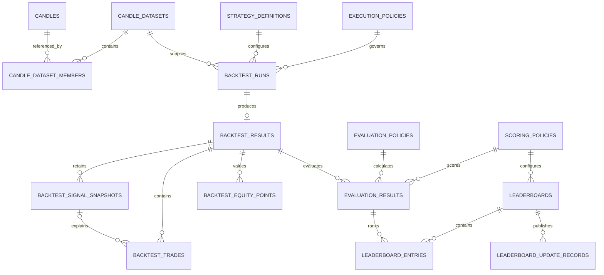

# Crypto Strategy Lab — Database Schema Contract

**Status**: Integration baseline for Features 001–005  
**Database**: PostgreSQL 16  
**Last reviewed**: 2026-08-16  
**Physical source of truth**: Alembic migrations in `backend/migrations/versions/`

## 1. Purpose

This document is the shared database contract for parallel feature work. It
defines table ownership, cross-feature relationships, stable naming and type
conventions, and the difference between the target design and the schema that
is already deployable.

It does not replace Alembic. A table marked `PLANNED` must not be assumed to
exist until its owning migration is merged and `alembic upgrade head` creates
it successfully. Detailed business semantics remain in each feature's
`data-model.md`.

## 2. Authority and status

When artifacts disagree, use this precedence order:

1. Merged Alembic migrations define the physical database.
2. This document defines approved ownership and cross-feature integration.
3. The owning feature's `data-model.md` defines business semantics.
4. SQLAlchemy mappings implement the merged physical schema.
5. API schemas describe transport only and never define database structure.

| Status | Meaning |
|---|---|
| `IMPLEMENTED` | A merged migration creates the table. |
| `PLANNED` | Approved target shape; the owning feature must still supply a migration. |
| `EPHEMERAL` | Runtime/client state that must not be persisted in PostgreSQL. |

## 3. Global conventions

| Concern | Contract |
|---|---|
| Names | Tables and columns use `snake_case`; table names are plural. |
| Primary IDs | Use PostgreSQL `UUID`; generate application-side unless a migration explicitly installs a database default. |
| Time | Use `TIMESTAMPTZ`, store UTC, and expose ISO-8601 UTC. |
| Ranges | Time ranges are half-open: `[start_time, end_time)`. |
| Market numbers | Use `NUMERIC(38,18)` for price, quantity, money, rates, returns, and metrics; never `FLOAT`. |
| Fingerprints | SHA-256 values are lowercase hexadecimal strings of exactly 64 characters. |
| Policy documents | Stable identity/version columns are relational; immutable rule bodies use validated `JSONB`. |
| Public JSON | API fields may use `camelCase`; database fields remain `snake_case`. |
| Immutability | Completed datasets, strategy definitions, results, evaluations, and policy versions are append-only. |
| Deletion | Provenance FKs use `RESTRICT`; child rows may use `CASCADE` only when their aggregate root is deletable by policy. |
| Constraint names | `pk_<table>`, `fk_<table>_<column>_<target>`, `uq_<table>_<purpose>`, `ck_<table>_<rule>`, `ix_<table>_<purpose>`. |

Database checks enforce structural invariants. Domain validation remains
responsible for rules that require canonicalization, external registries,
cross-row ordering, or checksum recomputation.

## 4. Ownership and migration order

| Feature | Owner scope | Tables | Status |
|---|---|---|---|
| 001 Historical Market Data | Durable normalized historical data and immutable datasets | `candles`, `candle_datasets`, `candle_dataset_members` | `IMPLEMENTED` |
| 002 Realtime Multi-Chart | Subscription, recovery, chart-slot, and connection state | None | `EPHEMERAL` |
| 003 Strategy Foundation | Immutable reproducible strategy definitions | `strategy_definitions` | `PLANNED` |
| 004 Backtest and Evaluation | Execution policies, runs/results, snapshots, trades, equity, evaluation and scoring | Nine tables listed below | `PLANNED` |
| 005 Leaderboard and Visualization | Durable Top-K projection and publication outbox | `leaderboards`, `leaderboard_entries`, `leaderboard_update_records` | `PLANNED` |

Required migration order:

```text
001 historical data
  -> 003 strategy definitions
    -> 004 backtest and evaluation
      -> 005 leaderboard projection
```

Feature 002 introduces no PostgreSQL dependency. A feature must not create or
alter another feature's table from its own migration without an explicitly
reviewed cross-owner schema change.

## 5. Relationship overview



## 6. Implemented schema

The implemented baseline is Alembic revision
`0001_historical_market_data`. Column definitions below mirror that migration.

### 6.1 `candles` — owner Feature 001

| Column | Type | Null | Notes |
|---|---|---:|---|
| `id` | `UUID` | No | Primary key. |
| `provider` | `VARCHAR(32)` | No | Canonical provider code. |
| `pair` | `VARCHAR(20)` | No | Canonical market pair. |
| `timeframe` | `VARCHAR(8)` | No | Canonical timeframe. |
| `open_time`, `close_time` | `TIMESTAMPTZ` | No | Candle interval bounds. |
| `open`, `high`, `low`, `close`, `volume` | `NUMERIC(38,18)` | No | Exact OHLCV values. |
| `closed` | `BOOLEAN` | No | Must be true for historical storage. |
| `received_at`, `created_at` | `TIMESTAMPTZ` | No | Ingestion and audit times. |
| `content_hash` | `VARCHAR(64)` | No | Canonical content SHA-256. |

Key rules:

- Unique `(provider, pair, timeframe, open_time)`.
- Prices are positive; volume is non-negative; high/low invariants hold.
- Index `(provider, pair, timeframe, open_time)` supports ordered range reads.

### 6.2 `candle_datasets` — owner Feature 001

| Column | Type | Null | Notes |
|---|---|---:|---|
| `id` | `UUID` | No | Primary key. |
| `request_key` | `VARCHAR(64)` | No | Unique canonical request hash. |
| `schema_version` | `VARCHAR(16)` | No | Dataset contract version. |
| `provider`, `pair`, `timeframe` | `VARCHAR` | No | Selection identity. |
| `start_time`, `end_time` | `TIMESTAMPTZ` | No | Half-open range. |
| `status` | `VARCHAR(16)` | No | `BUILDING`, `COMPLETE`, `INCOMPLETE`, or `FAILED`. |
| `candle_count` | `INTEGER` | Yes | Exact count after completion. |
| `checksum` | `VARCHAR(64)` | Yes | Ordered content checksum. |
| `build_token` | `UUID` | Yes | Active build claimant. |
| `lease_expires_at` | `TIMESTAMPTZ` | Yes | Abandoned-build recovery. |
| `failure_code` | `VARCHAR(64)` | Yes | Stable sanitized failure category. |
| `created_at`, `updated_at` | `TIMESTAMPTZ` | No | Audit times. |
| `completed_at` | `TIMESTAMPTZ` | Yes | Required for `COMPLETE`. |

Key rules:

- Unique `request_key` and unique
  `(schema_version, provider, pair, timeframe, start_time, end_time)`.
- `COMPLETE` currently requires `candle_count > 0`, checksum and completion
  time, and no active build lease.
- Indexes support selection/range lookup and stale build recovery.

### 6.3 `candle_dataset_members` — owner Feature 001

| Column | Type | Null | Notes |
|---|---|---:|---|
| `dataset_id` | `UUID` | No | PK part; FK to `candle_datasets.id`, `ON DELETE CASCADE`. |
| `position` | `INTEGER` | No | PK part; zero-based ordered position. |
| `candle_id` | `UUID` | No | FK to `candles.id`, `ON DELETE RESTRICT`. |

Unique `(dataset_id, candle_id)` prevents duplicate membership. Application
code must never delete a completed dataset even though pre-completion cleanup
may use the cascade.

## 7. Planned schema contracts

The tables in this section reserve names, ownership, relationships, and core
constraints. Their exact migration SQL must be reviewed against the owning
feature's data model before the status changes to `IMPLEMENTED`.

### 7.1 `strategy_definitions` — owner Feature 003

Immutable definition of one exact strategy behavior and parameter set.

Core columns: `id UUID` PK; `strategy_id`, `strategy_type`,
`strategy_version`, `contract_version`; canonical `parameters JSONB`;
`parameter_schema_fingerprint`, unique `content_fingerprint`; and
`created_at TIMESTAMPTZ`.

Required indexes and rules:

- Unique `content_fingerprint` for create-or-resolve idempotency.
- Index `(strategy_id, strategy_version)` for historical resolution.
- No generic update or delete repository operation.
- Strategy registry behavior and transient signals are not separate durable
  tables in Feature 003 v1.

### 7.2 Feature 004 tables

#### `execution_policies`

Immutable versioned execution rules. Store policy identity and version in
normal columns, a unique fingerprint, the validated rule body in `JSONB`, and
an audit creation time. One logical policy version is unique and never updated.

#### `backtest_runs`

Lifecycle row with UUID `id`, unique `job_id`, `status`, exact dataset and
strategy provenance, execution-policy identity/version, initial capital,
fee/slippage rates, random seed, fingerprints, lifecycle timestamps, and an
optional failure code.

Required relationships and rules:

- `dataset_id -> candle_datasets.id ON DELETE RESTRICT`.
- `strategy_definition_id -> strategy_definitions.id ON DELETE RESTRICT` only
  after the Feature 003 migration is present.
- Execution-policy reference uses `RESTRICT`.
- Status is `REQUESTED`, `RUNNING`, `COMPLETED`, or `FAILED`.
- Unique `job_id`; index `(dataset_id, status)`.
- `initial_capital > 0`, rates non-negative, and `start_time < end_time`.

#### `backtest_results`

One immutable result per completed run. Core data includes UUID `id`, unique
`run_id` and `job_id`, unique/canonical input identity, result checksum,
history/trade states, capital/equity, exact child counts, execution duration,
and duplicated immutable provenance required for historical interpretation.

`run_id -> backtest_runs.id ON DELETE RESTRICT`. Reusing a job identity with
different content must fail closed.

#### `backtest_signal_snapshots`

Exact signals consumed by a result. Store local UUID `id`, parent result,
source signal ID, sequence, timestamp, action, phase, optional strength/reason,
and strategy/dataset analysis provenance.

- Unique `(backtest_result_id, sequence)`.
- Unique `(backtest_result_id, source_signal_id)`.
- Parent FK may cascade internally, but completed results are not deletable by
  public application operations.

#### `backtest_trades`

Ordered closed simulated trades. Store local UUID `id`, parent result,
sequence, optional entry/exit signal snapshot IDs, fill/reference prices,
times, `LONG` side, quantity, fees, P/L, return, and close reason.

- Unique `(backtest_result_id, sequence)`.
- Signal FKs target `backtest_signal_snapshots`, not transient Feature 003
  signals.
- Positive prices/quantity, non-negative fees, ordered times, and explicit
  `SELL_SIGNAL` or `END_OF_RANGE` close reason.

#### `backtest_equity_points`

One close-valued point per input Candle. Store parent result, zero-based
position, Candle/open and valuation times, cash, quantity, close price,
position value, total equity, and optional event reference.

Primary or unique identity is `(backtest_result_id, position)`; values are
`NUMERIC(38,18)` and positions are non-negative.

#### `evaluation_policies`

Immutable versioned metric formulas, precision, annualization, direction, and
null semantics. Identity/version and fingerprint are relational; the validated
rule document is `JSONB`.

#### `scoring_policies`

Immutable versioned bounds, weights, eligibility rules, metric directions,
and complete deterministic tie-breakers. Identity/version and fingerprint are
relational; the validated rule document is `JSONB`.

#### `evaluation_results`

Immutable metrics and score for one exact backtest/policy combination. Store
UUID `id`; result/job/run and strategy/dataset provenance; comparison context;
execution configuration; evaluation and scoring policy versions; metrics;
eligibility and exclusion reasons; unique content fingerprint; and evaluation
time.

Required uniqueness:

```text
(backtest_result_id,
 evaluation_policy_id, evaluation_policy_version,
 scoring_policy_id, scoring_policy_version)
```

The result, evaluation-policy, and scoring-policy FKs use `RESTRICT`.

### 7.3 Feature 005 tables

#### `leaderboards`

One current Top-K projection per comparison identity. Core columns are UUID
`id`, canonical `scope_key`, scoring-policy identity/version, `rank_metric`,
`k`, monotonically increasing `projection_version`, `updated_at`, optional
`source_run_id`, and `entry_count`.

Unique identity:

```text
(scope_key, scoring_policy_id, scoring_policy_version, rank_metric, k)
```

Checks require `1 <= k <= 200`, `projection_version >= 0`, and
`0 <= entry_count <= k`.

#### `leaderboard_entries`

Current ranked members. Store UUID `id`, parent leaderboard, referenced
evaluation result, positive rank, normalized deterministic `sort_key`,
projection version, and audit timestamps.

- Unique `(leaderboard_id, rank)`.
- Unique `(leaderboard_id, evaluation_result_id)`.
- `leaderboard_id -> leaderboards.id ON DELETE CASCADE`.
- `evaluation_result_id -> evaluation_results.id ON DELETE RESTRICT`.
- The evaluation and leaderboard must use the same scoring-policy version.

#### `leaderboard_update_records`

Durable outbox/publication record committed atomically with a projection
change. Store UUID event `id`, leaderboard, projection version, event type,
source evaluation/run/job identities, compact added/removed/moved ID sets,
`occurred_at`, and nullable `published_at`.

Unique `(leaderboard_id, projection_version)` makes publication retries
idempotent. The payload collections use validated `JSONB` or PostgreSQL UUID
arrays; the owning migration must choose one representation and contract-test
it before merge.

Visualization overlays and ranked-result details are composed read contracts,
not additional mutable tables.

## 8. Cross-feature integration rules

1. Consumers reference immutable upstream IDs; they do not copy or recreate
   upstream tables.
2. Provenance fields may be duplicated on immutable result rows to prevent
   historical reinterpretation, but duplicated fields are never writable
   substitutes for the upstream record.
3. Cross-feature FKs are added only after the referenced owning migration is
   in the actual Alembic ancestry.
4. Feature 004 snapshots consumed signals because Feature 003 signals are
   transient. Feature 005 reads those snapshots and trades; it does not create
   another signal/trade store.
5. Feature 002 state remains bounded and ephemeral. Persisting it requires a
   new approved feature/schema change.
6. Policy rows are immutable. A behavior change creates a new version rather
   than updating historical JSON.
7. `BacktestJob` in the conceptual SRS maps to the physical `backtest_runs`
   lifecycle row; do not create a second `backtest_jobs` table without a new
   architecture decision.

## 9. Open decisions before planned migrations

These items must be resolved in the owning migration PR and then updated here:

| Decision | Owner | Current constraint |
|---|---|---|
| Exact policy identity column shape | Feature 004 | Must support immutable logical ID + version and relational FKs. |
| Final columns/checks for `strategy_definitions` | Feature 003 | Must land before Feature 004's strategy FK. |
| Feature 004 physical columns and enum representation | Feature 004 | Must preserve the nine-table boundary and all invariants above. |
| Outbox changed-ID representation | Feature 005 | Choose tested `JSONB` or UUID arrays. |
| Empty `COMPLETE` datasets | Features 001/004 | Current migration requires more than zero Candles; Feature 004 must match it. |

No engineer should resolve an open decision by silently editing an upstream
migration or inventing a duplicate table. Follow
[`DATABASE_MIGRATION_RULES.md`](DATABASE_MIGRATION_RULES.md).

## 10. Verification snapshot

At this document revision:

- Alembic has one implemented revision: `0001_historical_market_data`.
- The only implemented tables are the three Feature 001 tables.
- Feature 003–005 persistence modules are skeleton boundaries, not proof that
  their tables exist.
- The target schema contains 16 durable tables when all planned Features
  001–005 migrations are implemented.

Update the status and affected table sections in the same pull request that
adds or changes a merged migration.
