# ĐỒ ÁN CUỐI KỲ

## Crypto Strategy Lab – Nền tảng phân tích, kết hợp và đánh giá chiến lược giao dịch Crypto

## 1. Bối cảnh bài toán

Thị trường cryptocurrency như Bitcoin, Ethereum... hoạt động liên tục 24/7. Giá của các tài sản thay đổi theo
thời gian và thường được biểu diễn bằng biểu đồ nến – Candlestick Chart.

Ví dụ với cặp giao dịch BTC/USDT, một cây nến 5 phút chứa:

- Open: giá BTC ở đầu 5 phút.
- High: giá cao nhất trong 5 phút.
- Low: giá thấp nhất trong 5 phút.
- Close: giá cuối 5 phút.
- Volume: khối lượng giao dịch trong 5 phút.

Ví dụ:

```text
  BTCUSDT – khung 5 phút
```

```text
  09:00
  Open   = 118,000
  High   = 118,200
  Low    = 117,900
  Close = 118,150
  Volume = 125 BTC
```

Các trader thường sử dụng nhiều phương pháp phân tích kỹ thuật như:

- Moving Average – MA
- RSI
- Bollinger Bands
- Support/Resistance
- Smart Money Concepts – SMC
- Wyckoff
- ...

để tìm thời điểm thích hợp để Buy, Sell hoặc không giao dịch.

Tuy nhiên, một strategy đơn lẻ thường không hoạt động tốt trong mọi điều kiện thị trường.


<!-- Page 1 -->

Ví dụ:

MA:
Tốt khi thị trường có xu hướng.
Kém khi thị trường đi ngang.

RSI:
Có thể hữu ích khi phát hiện quá mua/quá bán.
Nhưng có thể tạo nhiều tín hiệu sai khi thị trường đang có trend mạnh.

Support/Resistance:
Có thể tìm vùng giá quan trọng.
Nhưng việc xác định vùng hỗ trợ/kháng cự có thể phụ thuộc vào thuật toán.

Vì vậy, câu hỏi chính của đồ án là:

```text
         Có thể xây dựng một hệ thống cho phép bổ sung nhiều strategy khác nhau, tự động kết hợp
         chúng thành các strategy phức hợp, đánh giá hiệu quả và liên tục tìm ra những tổ hợp
```
strategy tốt nhất hay không?

## 2. Mục tiêu tổng thể

Xây dựng một nền tảng Crypto Strategy Lab có khả năng:

1. Nhận dữ liệu thị trường cryptocurrency từ Binance.
2. Hiển thị biểu đồ giá realtime.
3. Theo dõi đồng thời tối đa 4 khung thời gian.
4. Cho phép bổ sung các strategy phân tích kỹ thuật.
5. Cho phép kết hợp nhiều strategy thành một chiến lược tổng hợp.
6. Backtest các chiến lược trên dữ liệu lịch sử.
7. Xếp hạng các strategy dựa trên hiệu quả giao dịch.
8. Tự động tìm kiếm các combination strategy tốt hơn.
9. Visualize tín hiệu và giao dịch lên biểu đồ.
10. Thu thập tin tức liên quan đến coin/pair.
11. Phân tích sentiment của tin tức bằng mô hình Machine Learning.
12. Thiết kế hệ thống sao cho có thể mở rộng trong tương lai mà không phải sửa đổi toàn bộ hệ thống.

Trọng tâm của đồ án là Kiến trúc phần mềm, không phải tìm ra strategy đầu tư tốt nhất.

## 3. Một ví dụ tổng thể

Giả sử người dùng chọn:


<!-- Page 2 -->

```text
  Pair: BTCUSDT
```

Timeframes:
```text
  5m
  15m
  1h
  4h
```

Dashboard hiển thị 4 biểu đồ:

| BTCUSDT – 5m | BTCUSDT – 15m |
|---|---|
| 📈 Candlestick | 📈 Candlestick |
| **BTCUSDT – 1h** | **BTCUSDT – 4h** |
| 📈 Candlestick | 📈 Candlestick |

Người dùng có thể đổi:

```text
  5m → 1m
  15m → 30m
  1h → 2h
  4h → 1d
```

mà không phải reload toàn bộ hệ thống.

Sau đó người dùng bật:

```text
  MA
  RSI
  Bollinger Bands
  Support/Resistance
```

Hệ thống có thể tạo:

### Strategy A

```text
  MA + RSI
```


<!-- Page 3 -->

### Strategy B

```text
  MA + Bollinger
```

### Strategy C

```text
  RSI + Support/Resistance
```

### Strategy D

```text
  MA + RSI + Support/Resistance
```

### Strategy E

```text
  MA + RSI + Bollinger + Support/Resistance
```

Sau khi backtest, hệ thống có thể đưa ra:

```text
                      Rank   Strategy              Profit   Win Rate   Max Drawdown
```

```text
                      1      MA + RSI + SR        +18.2%        61%           -6.1%
```

```text
                      2      MA + Bollinger       +15.7%        58%           -8.4%
```

```text
                      3      RSI + SR             +13.1%        64%           -7.2%
```

Đây chính là Leaderboard.

## 4. Module 1 – Realtime Market Data

Hệ thống cần lấy dữ liệu giá crypto từ Binance.

Có hai loại dữ liệu chính.

### Historical Data

Dữ liệu trong quá khứ.

Ví dụ:

```text
  BTCUSDT
  01/07 → 30/07
```

```text
  1 phút
  5 phút
  15 phút
  1 giờ
```


<!-- Page 4 -->

```text
  4 giờ
  1 ngày
```

Dữ liệu này phù hợp cho:

- backtesting;
- tính indicator;
- huấn luyện ML;
- phân tích lịch sử.

### Realtime Data

Dữ liệu giá đang thay đổi tại thời điểm hiện tại.

Ví dụ:

```text
  09:10:01 BTC = 118,021
  09:10:02 BTC = 118,028
  09:10:03 BTC = 118,017
```
...

Frontend cần nhận cập nhật mà không liên tục gọi:

```text
  GET /price
  GET /price
  GET /price
```

Sinh viên nên nghiên cứu kiến trúc phù hợp như:

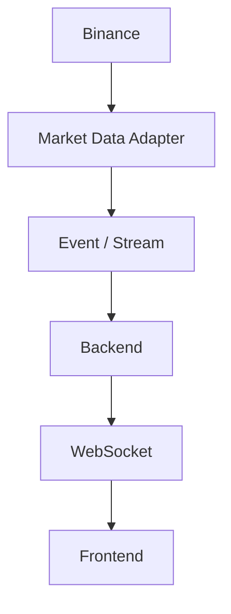


<!-- Page 5 -->

### Yêu cầu kiến trúc

Không được để frontend phụ thuộc trực tiếp vào cấu trúc dữ liệu Binance.

Ví dụ không nên:

```text
  Frontend → Binance API
```

Nên:

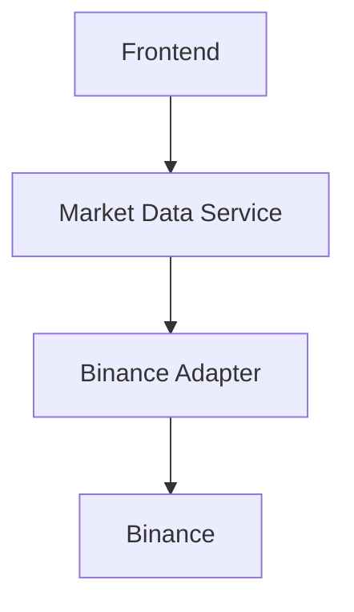

Nhờ đó sau này có thể bổ sung:

```text
  BinanceAdapter
  OKXAdapter
  BybitAdapter
  CoinbaseAdapter
```

mà frontend không phải thay đổi.

## 5. Module 2 – Multi-Timeframe Chart

Hệ thống phải hỗ trợ tối đa 4 chart trên một màn hình.

Ví dụ:

```text
  BTCUSDT
```

```text
  Chart 1 → 5m
  Chart 2 → 15m
  Chart 3 → 1h
  Chart 4 → 4h
```


<!-- Page 6 -->

Mỗi chart phải có thể thay đổi timeframe riêng.

Ví dụ:

```text
  Chart 1
```

Pair:
```text
  BTCUSDT
```

Timeframe:
```text
  [1m] [5m] [15m] [1h] [4h] [1d]
```

Nếu người dùng đổi:

```text
  5m → 1h
```

thì chỉ Chart 1 cần đổi dữ liệu.

Có thể visualize

- Candlestick.
- Volume.
- MA.
- Bollinger Bands.
- vùng Support.
- vùng Resistance.
- Buy Signal.
- Sell Signal.
- điểm Entry.
- Stop Loss.
- Take Profit.

Ví dụ:

```text
         Resistance
  ----------------------------
```

```text
                  SELL ↓
                       █
                 █     █
             █   █     █
     █ █ █
  ------ MA -------------------
```


<!-- Page 7 -->

```text
          ↑ BUY
```

```text
  ----------------------------
         Support
```

## 6. Module 3 – Strategy Engine

Đây là một module quan trọng nhất của hệ thống.

Một strategy nhận dữ liệu thị trường và tạo ra một tín hiệu.

Có thể chuẩn hóa tín hiệu thành:

```text
  BUY
  SELL
  HOLD
```

hoặc:

```text
  LONG
  SHORT
  NONE
```

Ví dụ:

```text
  interface Strategy {
```

```text
         analyze(context)
```

return:
```text
             BUY
             SELL
             HOLD
  }
```

context có thể chứa:

```text
  price
  volume
  candles
```


<!-- Page 8 -->

```text
  timeframe
  indicators
  market state
  sentiment
```
...

## 7. Strategy ví dụ 1 – Moving Average

Moving Average – MA là giá trung bình của một khoảng thời gian.

Ví dụ:

MA20 = trung bình giá của 20 candles gần nhất.
MA50 = trung bình giá của 50 candles gần nhất.

Strategy đơn giản:

```text
  Nếu MA20 cắt lên MA50
  → BUY
```

```text
  Nếu MA20 cắt xuống MA50
  → SELL
```

Có thể implement:

```text
  MAStrategy
      fastPeriod = 20
      slowPeriod = 50
```

Điều quan trọng về kiến trúc:

MAStrategy chỉ nên chịu trách nhiệm về logic MA.

Không nên chứa:

```text
  code gọi Binance
  code lưu database
  code vẽ chart
  code gửi notification
```


<!-- Page 9 -->

## 8. Strategy ví dụ 2 – RSI

RSI có giá trị từ:

```text
  0 → 100
```

Ví dụ một rule đơn giản:

```text
  RSI < 30
  → Oversold
  → BUY
```

```text
  RSI > 70
  → Overbought
  → SELL
```

Có thể xây dựng:

```text
  RSIStrategy
     period = 14
     buyThreshold = 30
     sellThreshold = 70
```

Như vậy có thể thử:

```text
  RSI(14, 30, 70)
  RSI(14, 25, 75)
  RSI(21, 30, 70)
```

## 9. Strategy ví dụ 3 – Bollinger Bands

Bollinger Bands tạo ba đường:

```text
  Upper Band
  Middle Band
  Lower Band
```


<!-- Page 10 -->

Ví dụ strategy:

```text
  Price < Lower Band
  → BUY
```

```text
  Price > Upper Band
  → SELL
```

Hoặc strategy khác:

```text
  Price breakout Upper Band
  → BUY
```

Như vậy cùng một indicator có thể sinh ra nhiều strategy khác nhau.

## 10. Strategy ví dụ 4 – Support/Resistance

Support là vùng giá mà giá trước đây thường ngừng giảm.

Resistance là vùng mà giá trước đây thường gặp khó khăn khi tăng tiếp.

Ví dụ:

```text
            Resistance 120K
  ----------------------------
```

```text
              /\          /
            /     \      /
           /       \    /
          /         \ /
```

```text
  ----------------------------
            Support 110K
```

Một strategy có thể là:

```text
  Price gần Support
  → BUY
```


<!-- Page 11 -->

```text
  Price gần Resistance
  → SELL
```

Hoặc:

```text
  Price breakout Resistance
  → BUY
```

## 11. Strategy nâng cao – SMC, Wyckoff

Sinh viên không bắt buộc phải xây dựng đầy đủ các phương pháp phức tạp này.

Mục tiêu là chứng minh kiến trúc có khả năng hỗ trợ chúng.

Ví dụ:

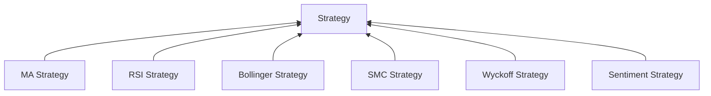

Thêm một strategy mới không được yêu cầu sửa toàn bộ Strategy Engine.

Đây chính là yêu cầu về:

Extensibility – khả năng mở rộng hệ thống.

## 12. Module 4 – Strategy Plugin

Một yêu cầu quan trọng:

Hệ thống phải cho phép bổ sung strategy mới dễ dàng.

Ví dụ ban đầu hệ thống có:


<!-- Page 12 -->

```text
  strategies/
```

```text
       MA
       RSI
       Bollinger
```

Nhóm phát triển thêm:

```text
  SupportResistance
```

Lý tưởng nhất, Strategy Engine chỉ cần đăng ký:

```text
  register(SupportResistance)
```

thay vì phải sửa:

```text
  if strategy == MA ...
  else if strategy == RSI ...
  else if strategy == Bollinger ...
  else if strategy == SR ...
```

Sinh viên cần nghiên cứu các architectural/design pattern thích hợp như:

- Strategy Pattern.
- Plugin Architecture.
- Factory.
- Registry.
- Dependency Injection.

Không bắt buộc phải sử dụng đúng một pattern cụ thể.

Quan trọng là phải giải thích được:

```text
       Vì sao kiến trúc của nhóm có thể thêm strategy mới mà ảnh hưởng tối thiểu đến code hiện
```
tại?

## 13. Module 5 – Composite Strategy

Đây là phần trung tâm của bài toán.


<!-- Page 13 -->

Giả sử có:

```text
  MA
  RSI
  Bollinger
  SupportResistance
```

Ta có thể tạo:

```text
  MA + RSI
  MA + Bollinger
  MA + SR
  RSI + Bollinger
  RSI + SR
  MA + RSI + SR
```
...

Nhưng câu hỏi quan trọng là:

Khi các strategy đưa ra tín hiệu khác nhau thì kết hợp thế nào?

Ví dụ:

```text
  MA     → BUY
  RSI → BUY
  SR     → HOLD
```

Có thể dùng Majority Vote:

```text
  BUY = 2
  HOLD = 1
```

```text
  → BUY
```

Một trường hợp khác:

```text
  MA     → BUY
  RSI → SELL
  SR     → BUY
```


<!-- Page 14 -->

```text
  → BUY
```

## 14. Weighted Combination

Không nhất thiết strategy nào cũng có trọng số giống nhau.

Ví dụ:

```text
  MA      = 0.2
  RSI     = 0.3
  SR      = 0.5
```

Nếu encode:

```text
  BUY = +1
  HOLD = 0
  SELL = -1
```

và:

```text
  MA     → BUY
  RSI → SELL
  SR     → BUY
```

ta có:

```text
  Score
```

```text
  = MA × 0.2
  + RSI × 0.3
  + SR × 0.5
```

```text
  = 1×0.2
  + (-1)×0.3
  + 1×0.5
```

```text
  = 0.4
```


<!-- Page 15 -->

Quy định:

```text
  score > 0.3
  → BUY
```

```text
  score < -0.3
  → SELL
```

```text
  còn lại
  → HOLD
```

Đây chỉ là một ví dụ. Nhóm được quyền thiết kế phương pháp combination riêng.

## 15. Module 6 – Strategy Search Engine

Nếu có nhiều strategy, số tổ hợp có thể tăng rất nhanh.

Ví dụ chỉ có 4 strategy:

```text
  MA
  RSI
  BB
  SR
```

đã có thể tạo:

```text
  MA + RSI
  MA + BB
  MA + SR
```

```text
  RSI + BB
  RSI + SR
```

```text
  BB + SR
```

```text
  MA + RSI + BB
  MA + RSI + SR
```
...

Nếu mỗi strategy lại có nhiều parameter:


<!-- Page 16 -->

MA:
```text
  10/20
  20/50
  50/200
```

RSI:
```text
  14/30/70
  14/20/80
  21/30/70
```

không gian tìm kiếm sẽ lớn hơn rất nhiều.

Hệ thống cần cung cấp một Strategy Search Engine.

## 16. Cách tìm kiếm 1 – Random Search

Cách đơn giản nhất:

Random một tổ hợp.

Ví dụ:

```text
  Loop 1
  MA + RSI
```

```text
  Loop 2
  BB + SR
```

```text
  Loop 3
  MA + RSI + SR
```

```text
  Loop 4
  MA + BB + SR
```
...

Mỗi combination được:

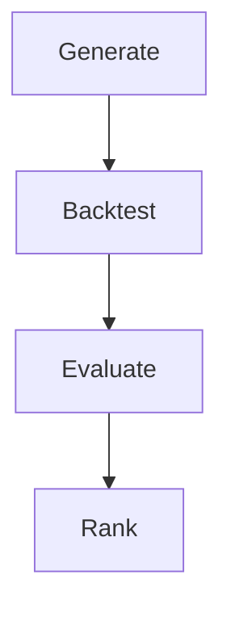

## 17. Cách tìm kiếm 2 – Domain-guided Search

Thay vì random hoàn toàn, có thể dựa trên đặc điểm domain.

Ví dụ phân nhóm:

Trend:
```text
  MA
  MACD
```

Momentum:
```text
  RSI
  Stochastic
```

Volatility:
```text
  Bollinger
  ATR
```

Structure:
```text
  Support/Resistance
  SMC
  Wyckoff
```

Information:
```text
  News Sentiment
```

Có thể đặt rule:

Một composite strategy phải lấy:

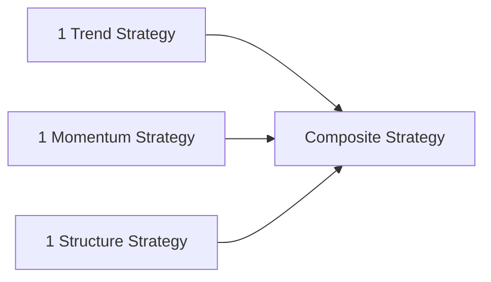

Ví dụ:


<!-- Page 18 -->

```text
  MA
  +
  RSI
  +
  Support Resistance
```

thay vì:

```text
  MA10
  +
  MA20
  +
  MA50
```

Nhóm cần giải thích:

Domain knowledge đã được đưa vào quá trình search như thế nào?

## 18. Cách tìm kiếm nâng cao

Nhóm có thể nghiên cứu thêm:

```text
  Genetic Algorithm
```

```text
  Bayesian Optimization
```

```text
  Evolutionary Search
```

```text
  Reinforcement Learning
```

```text
  LLM-generated Strategy
```

```text
  Agent-based Search
```

```text
  AlphaEvolve-style optimization
```

```text
  Loop Engineering
```

Đây là phần mở rộng, không bắt buộc.


<!-- Page 19 -->

## 19. Module 7 – Backtesting Engine

Backtesting nghĩa là giả lập:

Nếu sử dụng strategy này trong quá khứ thì kết quả sẽ như thế nào?

Ví dụ dữ liệu:

```text
  01/01 BTC = $80,000
```
...
```text
  01/03 BTC = $95,000
```

Strategy tạo:

```text
  05/01 BUY @82,000
  12/01 SELL @86,000
```

```text
  22/01 BUY @88,000
  31/01 SELL @87,000
```

Backtesting Engine sẽ giả lập các giao dịch này.

Ví dụ:

```text
  Trade 1
  Buy 82K
  Sell 86K
  → Profit
```

```text
  Trade 2
  Buy 88K
  Sell 87K
  → Loss
```

## 20. Không chỉ đánh giá Profit

Strategy không được đánh giá chỉ bằng:


<!-- Page 20 -->

```text
  Total Profit
```

Ví dụ:

### Strategy A

```text
  Profit = +30%
```

nhưng từng có lúc:
```text
  -45%
```

### Strategy B

```text
  Profit = +25%
```

nhưng Max Drawdown:
```text
  -8%
```

Strategy B có thể ổn định hơn Strategy A.

Hệ thống nên cung cấp một số metrics như:

```text
  Total Return
  Profit/Loss
  Win Rate
  Number of Trades
  Maximum Drawdown
  Profit Factor
  Sharpe Ratio
```

Không yêu cầu sinh viên phải hiểu sâu tài chính định lượng.

Nhưng cần hiểu:

Strategy Evaluation phải tách biệt khỏi Strategy Implementation.

## 21. Module 8 – Leaderboard

Sau mỗi lần backtest, kết quả được đưa vào Leaderboard.


<!-- Page 21 -->

Ví dụ:

```text
                      Rank    Strategy       Return        Win Rate     MDD     Trades
```

```text
                      1       MA+RSI+SR       24.2%            62%      -7.1%      81
```

```text
                      2       MA+BB           21.7%            55%      -8.4%     105
```

```text
                      3       RSI+SR          18.4%            64%      -6.7%      52
```

```text
                      4       MA               9.1%            48%     -14.2%     140
```

Có thể cho phép:

Sort by:
```text
  Return
  Win Rate
  Max Drawdown
  Sharpe
```

Hoặc định nghĩa:

```text
  Overall Score
```

Ví dụ:

```text
  Score =
  0.5 × Return
  + 0.2 × WinRate
  + 0.3 × RiskScore
```

Nhóm phải trình bày rõ cách tính.

## 22. Top-K Strategies

Hệ thống không nhất thiết giữ tất cả strategy tốt nhất lên màn hình.

Ví dụ:

```text
  Top K = 10
```


<!-- Page 22 -->

Leaderboard luôn hiển thị:

```text
  Top 10 strategies hiện tại
```

Một candidate mới:

```text
  MA20 + RSI14 + SR
```

được backtest.

Nếu score:

```text
  82.1
```

cao hơn strategy đứng thứ 10:

```text
  78.4
```

thì strategy mới được đưa vào Leaderboard.

## 23. Module 9 – Continuous Strategy Loop

Hệ thống có thể chạy một vòng loop ngầm:

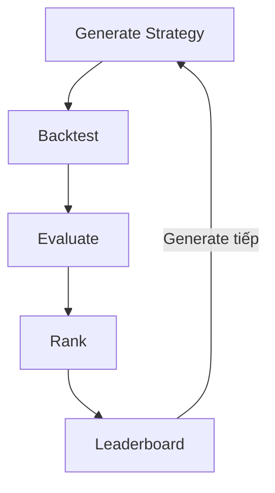

Ví dụ:

```text
  #182
  MA20 + RSI14
  Score = 71
```

```text
  #183
  MA20 + Bollinger
  Score = 68
```

```text
  #184
  MA50 + RSI21 + SR
  Score = 84
  → New Top Strategy
```

```text
  #185
```
...

Loop có thể chạy:

```text
  100 candidate
```

```text
  hoặc
```

```text
  1 giờ
```

```text
  hoặc
```

đến khi không cải thiện sau 50 iterations.

Nhóm phải thiết kế Stop Condition.

Không được để:


<!-- Page 24 -->

```text
  while(true)
```

chạy vô hạn mà không kiểm soát.

## 24. Vì sao phần Loop quan trọng đối với Kiến trúc

phần mềm?
Một implementation kém có thể viết:

```text
  for 100000 strategies:
```

```text
       calculate indicator
       backtest
       save DB
       update UI
```

Tất cả nằm trong một function.

Implementation tốt nên tách:

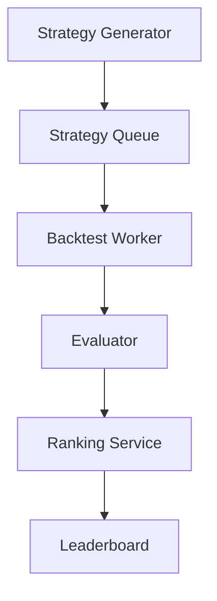

Qua đó có thể:

- chạy nhiều worker;
- retry khi worker lỗi;
- pause loop;
- resume loop;
- theo dõi tiến trình;
- thay search algorithm;


<!-- Page 25 -->

- scale trong tương lai.

## 25. Visualization Strategy

Không chỉ hiển thị:

```text
  Profit = +20%
```

mà phải cho phép người dùng hiểu strategy đã làm gì.

Ví dụ:

```text
  BTCUSDT 15m
```

```text
                    SELL
                       ↓
              █ █
          █   █ █
   █      █
   █
  ↑
  BUY
```

```text
  MA -------------------
```

```text
  Support =============
```

Người dùng click:

Strategy:
```text
  MA20 + RSI14 + SupportResistance
```

chart hiển thị:

```text
  MA20
```

```text
  RSI signals
```

```text
  Support zones
```

```text
  Buy points
```


<!-- Page 26 -->

```text
  Sell points
```

## 26. Trade Detail

Người dùng có thể xem bảng:

```text
                         #    Entry Time       Entry   Exit Time      Exit   Result
```

```text
                         1    01/07 08:00      108K    01/07 15:00   110K    +1.85%
```

```text
                         2    02/07 10:00      111K    02/07 18:00   110K    -0.90%
```

```text
                         3    04/07 07:00      109K    05/07 12:00   114K    +4.58%
```

Click Trade #3 thì chart có thể highlight:

```text
  ENTRY ↑
```

...

```text
  EXIT ↓
```

## 27. Module 10 – News Crawler

Giá cryptocurrency không chỉ phụ thuộc vào biểu đồ.

Tin tức cũng có thể tác động đến thị trường.

Ví dụ:

```text
  Bitcoin ETF news
```

```text
  Federal Reserve interest rates
```

```text
  Crypto regulation
```

```text
  Exchange hacked
```

```text
  New blockchain upgrade
```


<!-- Page 27 -->

```text
  Institutional adoption
```

Hệ thống cần có một module:

```text
  News Collector
```

có nhiệm vụ thu thập dữ liệu từ các nguồn phù hợp.

Sau đó chuẩn hóa thành:

```text
  News
```

```text
  id
  title
  content
  source
  publishedAt
  crawledAt
  relatedCoins
  url
```

Ví dụ:

title:
Bitcoin rises after ...

publishedAt:
```text
  2026-07-28 08:15
```

relatedCoins:
```text
  BTC
```

source:
```text
  XXX
```

## 28. News không được gắn cứng với một crawler

Không nên thiết kế:


<!-- Page 28 -->

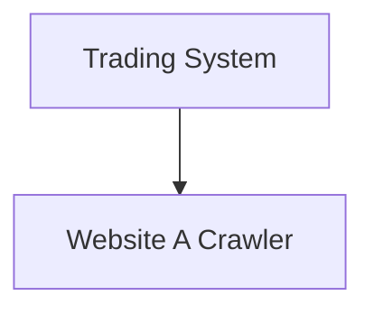

Nên có:

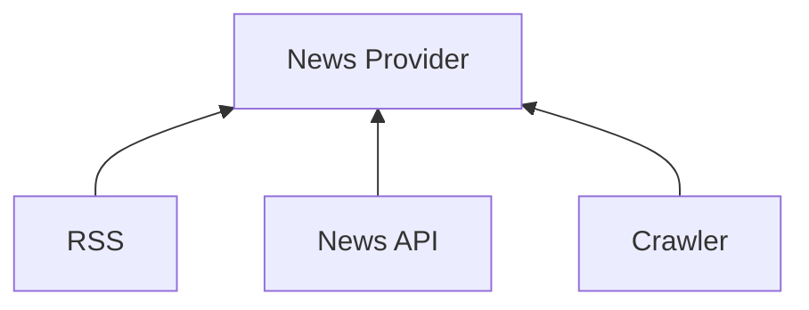

Các provider trả về cùng một format chuẩn.

Ví dụ:

```text
  NewsItem
```

Nhờ đó việc thay nguồn dữ liệu không ảnh hưởng đến các module phía sau.

## 29. Module 11 – Sentiment Analysis

Sau khi có news:

```text
  "Bitcoin surges after institutional adoption..."
```

Machine Learning Service có thể phân loại:

```text
  POSITIVE
```

Tin:

```text
  "Major exchange suffers security breach..."
```

có thể là:


<!-- Page 29 -->

```text
  NEGATIVE
```

Tin trung lập:

```text
  "Bitcoin network upgrade scheduled..."
```

có thể là:

```text
  NEUTRAL
```

Kết quả lưu:

```text
  News
```

sentiment:
```text
  POSITIVE
```

score:
```text
  0.82
```

## 30. Sentiment có thể trở thành một Strategy

Đây là một điểm kiến trúc thú vị.

Ban đầu:

```text
  MA
  RSI
  BB
  SR
```

Sau này có thể có:

```text
  NewsSentimentStrategy
```

Ví dụ:


<!-- Page 30 -->

```text
  Average sentiment trong 1 giờ > 0.7
  → BUY
```

```text
  Average sentiment < -0.7
  → SELL
```

Sau đó hệ thống có thể tìm:

```text
  MA
  +
  RSI
  +
  News Sentiment
```

hoặc:

```text
  Support Resistance
  +
  News Sentiment
```

Như vậy kiến trúc không còn giới hạn ở Technical Analysis.

## 31. Kiến trúc tổng thể gợi ý

Một kiến trúc logic có thể gồm:

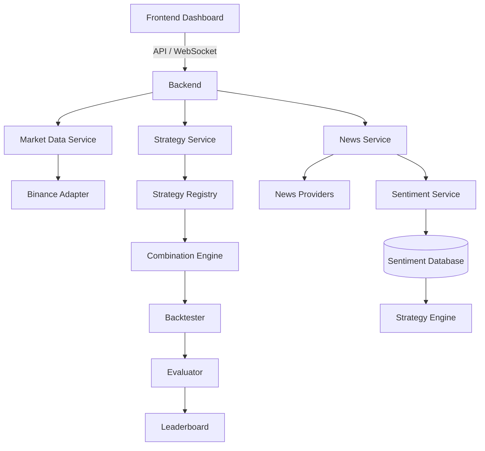

Đây chỉ là kiến trúc tham khảo.

Nhóm được phép đề xuất kiến trúc khác nếu giải thích được lựa chọn của mình.

## 32. Những vấn đề Kiến trúc phần mềm mà đồ án

phải giải quyết
Sinh viên cần xem đây là các architectural drivers.

### 32.1 Modifiability

Có thể thêm:


<!-- Page 32 -->

```text
  MACD Strategy
```

mà không phải sửa 20 module.

### 32.2 Scalability

Ban đầu:

```text
  10 strategies
```

Sau này:

```text
  100,000 candidate strategies
```

hệ thống có thể thay đổi kiến trúc như thế nào?

### 32.3 Realtime

Khi Binance có dữ liệu mới:

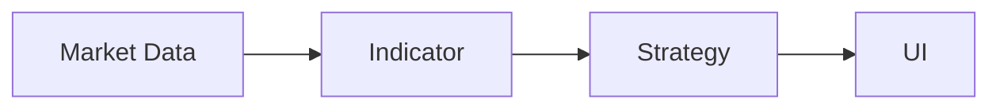

làm sao cập nhật với độ trễ thấp?

### 32.4 Reliability

Nếu Binance mất kết nối:

```text
  Connection lost
```

hệ thống xử lý ra sao?

Reconnect?

Retry?

Có mất candles không?


<!-- Page 33 -->

### 32.5 Performance

Có 1.000 strategy cần backtest.

Có nên chạy tuần tự:

...
```text
  1000
```

hay sử dụng:

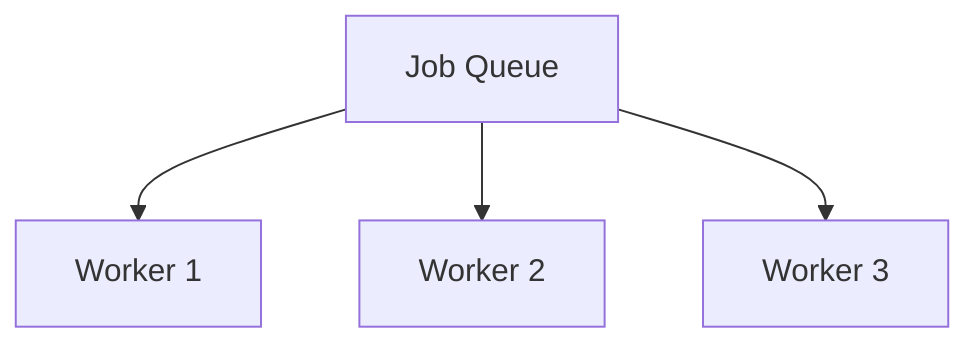

### 32.6 Maintainability

Strategy Search không được phụ thuộc chặt vào Backtesting implementation.

Ví dụ có thể thay:

```text
  Random Search
```

bằng:

```text
  Genetic Search
```

mà Backtester vẫn giữ nguyên.

### 32.7 Observability

Hệ thống nên biết:

Loop đang chạy hay dừng?

Đã thử bao nhiêu strategy?

Backtest mất bao lâu?


<!-- Page 34 -->

Có bao nhiêu job lỗi?

Strategy nào đang đứng Top 1?

## 33. Một luồng hoàn chỉnh của hệ thống

Ví dụ:

Người dùng chọn:

```text
  BTCUSDT
  5m
```

Bước 1 – Market Data

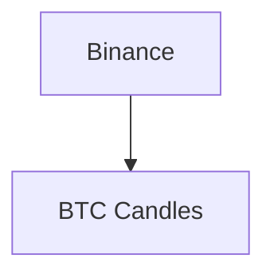

Bước 2 – Strategy Generator

Sinh candidate:

```text
  MA20
  +
  RSI14
  +
  SupportResistance
```

Bước 3 – Backtester

Chạy trên:

```text
  BTCUSDT
  01/01 → 01/07
  5m
```


<!-- Page 35 -->

Bước 4 – Trade Simulation

Sinh:

```text
  82 trades
```

Bước 5 – Evaluator

Tính:

```text
  Return = 18.2%
  Win Rate = 61%
  MDD = -6.1%
```

Bước 6 – Ranking

Tính:

```text
  Score = 81.4
```

Bước 7

Candidate hiện tại đứng:

```text
  Rank #2
```

Bước 8

Frontend nhận event:

```text
  LEADERBOARD_UPDATED
```

Bước 9

Leaderboard tự cập nhật.

Không cần refresh trang.


<!-- Page 36 -->

## 34. Các Event có thể xuất hiện

Nhóm sử dụng event-driven architecture có thể định nghĩa:

```text
  MarketPriceUpdated
```

```text
  CandleClosed
```

```text
  StrategyGenerated
```

```text
  BacktestStarted
```

```text
  BacktestCompleted
```

```text
  StrategyEvaluated
```

```text
  LeaderboardUpdated
```

```text
  NewsCollected
```

```text
  SentimentAnalyzed
```

Ví dụ:

```text
  Backtest Worker
```

không cần gọi trực tiếp:

```text
  LeaderboardService.update()
```

mà có thể publish:

```text
  StrategyEvaluatedEvent
```

Ranking Service nhận event đó.

Điều này giúp giảm coupling giữa các module.


<!-- Page 37 -->

## 35. Database

Có thể có các nhóm dữ liệu:

### Market Data

```text
  Candles
  Pair
  Timeframe
  Timestamp
  Open
  High
  Low
  Close
  Volume
```

### Strategy

```text
  StrategyDefinition
  Parameters
  Version
  CreatedAt
```

Experiment

```text
  Combination
  Dataset
  Timeframe
  Parameters
  Result
```

Trades

```text
  Entry
  Exit
  Profit
  Strategy
```


<!-- Page 38 -->

### News

```text
  Title
  Content
  Source
  PublishedAt
  RelatedCoin
  Sentiment
```

### Leaderboard

Có thể:

```text
  lưu trực tiếp
```

hoặc:

```text
  tính từ Experiment Results
```

Nhóm cần giải thích lựa chọn.

## 36. Strategy phải có Version

Ví dụ:

```text
  MA-RSI Strategy v1
```

```text
  MA20
  MA50
  RSI14
```

Sau đó sửa:

```text
  MA-RSI Strategy v2
```

```text
  MA10
  MA30
  RSI21
```


<!-- Page 39 -->

Không nên overwrite kết quả cũ.

Cần đảm bảo:

```text
  Experiment #122
```

luôn biết chính xác nó đã sử dụng strategy nào.

Đây là vấn đề:

Reproducibility.

## 37. Mức tối thiểu – MVP

Để tránh đồ án quá lớn, nhóm bắt buộc hoàn thành tối thiểu:

Market

- Binance data.
- Candlestick chart.
- Realtime update.
- Tối đa 4 timeframe.

### Strategy

Ít nhất 4 strategy đơn lẻ, ví dụ:

```text
  MA
  RSI
  Bollinger
  Support/Resistance
```

### Combination

Có khả năng tạo composite strategy.

### Backtest

Có khả năng giả lập giao dịch trên historical data.

### Evaluation

Tối thiểu:


<!-- Page 40 -->

```text
  Return
  Win Rate
  Max Drawdown
  Number of Trades
```

### Search

Ít nhất một phương pháp:

```text
  Random Search
```

### Leaderboard

Top-K strategies.

### Visualization

Chart có:

```text
  Buy/Sell
  Entry/Exit
```

### News

Có pipeline:

```text
  Collect
  ↓
  Store
  ↓
  Analyze sentiment
```

## 38. Phần mở rộng

Các nhóm có thể mở rộng bằng:


<!-- Page 41 -->

### Search

Genetic Algorithm
Evolutionary Search
Bayesian Optimization
LLM Strategy Generator

### Trading

Long/Short
Stop Loss
Take Profit
Trailing Stop
Position Sizing

Market

Multiple Coins
Multiple Exchanges

### ML

Sentiment
Price Prediction
Market Regime Detection

### Architecture

Redis

Kafka/RabbitMQ

Worker Pool

Microservices

CQRS

Event Sourcing

Plugin Architecture


<!-- Page 42 -->

Không được cộng điểm chỉ vì sử dụng công nghệ phức tạp.

Nhóm phải chứng minh:

Công nghệ đó giải quyết vấn đề kiến trúc nào?

## 39. Một ví dụ để hiểu đúng mục tiêu đồ án

Không nên hiểu đồ án là:

Viết MA + RSI để kiếm tiền.

Mà phải hiểu là:

```text
       Thiết kế một hệ thống mà hôm nay có MA + RSI, ngày mai có thể thêm SMC, Wyckoff,
```
Sentiment hoặc một strategy hoàn toàn mới mà kiến trúc cũ vẫn hoạt động.

Tương tự, hôm nay hệ thống dùng:

```text
  Random Search
```

ngày mai có thể thay bằng:

```text
  Genetic Algorithm
```

mà:

```text
  Backtester
  Evaluator
  Leaderboard
  Visualization
```

không cần viết lại.

Đây mới là vấn đề của Software Architecture.

## 40. Câu hỏi kiến trúc trung tâm

Trong báo cáo, nhóm phải trả lời được các câu hỏi:


<!-- Page 43 -->

## 1. Strategy mới được thêm vào hệ thống như thế nào?

Ví dụ:

```text
  MACDStrategy
```

được thêm mà sửa những component nào?

## 2. Search algorithm mới được thêm như thế nào?

Từ:

```text
  Random Search
```

sang:

```text
  Genetic Search
```

có ảnh hưởng Backtesting Engine không?

## 3. Market Data Provider mới được thêm như thế nào?

Từ:

```text
  Binance
```

sang:

```text
  Binance + OKX
```

có phải sửa frontend không?

## 4. Nếu số backtest tăng từ 100 lên 100.000 thì kiến trúc thay đổi thế nào?

## 5. Nếu News Service bị lỗi thì Chart có còn chạy không?

## 6. Nếu Sentiment Model thay đổi thì Strategy Engine có bị ảnh hưởng không?

## 7. Nếu Binance WebSocket disconnect thì hệ thống phục hồi như thế nào?


<!-- Page 44 -->

## 8. Làm sao kiểm tra một kết quả trên Leaderboard được tạo ra bởi version strategy nào?

## 41. Scenario đánh giá khả năng mở rộng

Giảng viên có thể đặt yêu cầu:

Hệ thống hiện có MA, RSI, Bollinger và Support/Resistance. Hãy bổ sung MACD.

Nhóm tốt chỉ cần:

```text
  class MACDStrategy implements Strategy
```

và:

```text
  StrategyRegistry.register(MACDStrategy)
```

Nhóm thiết kế coupling cao có thể phải sửa:

```text
  Controller
  Backtester
  UI
  Database
  Combination Engine
  Evaluator
```

Đây là một minh chứng trực quan cho chất lượng kiến trúc.

## 42. Scenario đánh giá khả năng thay đổi

Một scenario khác:

Hiện tại:

```text
  RandomStrategyGenerator
```

Giảng viên yêu cầu thêm:


<!-- Page 45 -->

```text
  DomainGuidedStrategyGenerator
```

Ví dụ:

```text
  interface StrategyGenerator {
```

```text
          generate()
  }
```

có:

```text
  RandomGenerator
```

```text
  DomainGuidedGenerator
```

```text
  GeneticGenerator
```

Các component phía sau chỉ nhận:

```text
  CandidateStrategy
```

và không cần biết candidate được sinh ra bằng cách nào.

## 43. Scenario đánh giá scalability

Giả sử:

```text
  1 Backtest Worker
```

mất:

```text
  2 giây / candidate
```

### 10.000 candidate cần:

```text
  20.000 giây
```


<!-- Page 46 -->

Hệ thống nên cho phép mở rộng:


Đây là ví dụ để sinh viên hiểu tại sao:

```text
  Queue
  Worker
  Event
```

có thể quan trọng trong kiến trúc này.

## 44. Các Anti-pattern nên tránh

### God Service

Không nên có:

```text
  TradingService
```

vừa:

```text
  get Binance data
  calculate RSI
  crawl news
  run ML
  backtest
  rank
  save database
  send WebSocket
```

### Hard-coded Strategy

Không nên:


<!-- Page 47 -->

```text
  if MA && RSI ...
  else if MA && Bollinger ...
  else if RSI && Bollinger ...
```

### Frontend chứa business logic

Không nên để React/Vue tính:

```text
  trading strategy
  backtest
  profit
  ranking
```

### Strategy truy cập trực tiếp Database

Không nên:

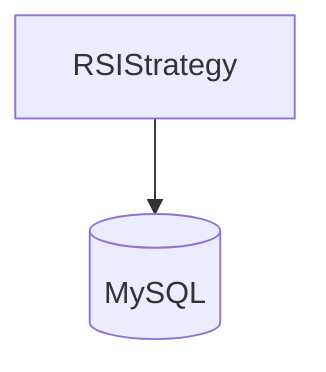

Strategy nên nhận data cần thiết thông qua abstraction thích hợp.

### Crawler phụ thuộc chặt vào ML

Không nên:

```text
  Crawler → BERT model
```

Crawler chỉ cần:

```text
  collect news
```

Sentiment Service xử lý:

```text
  analyze news
```


<!-- Page 48 -->

## 45. Deliverables

Nhóm cần nộp:

## 1. Source Code

Repository hoàn chỉnh.

## 2. README

Hướng dẫn:

```text
  Install
  Run
  Architecture
  Demo
```

## 3. Architecture Document

Tối thiểu mô tả:

```text
  System Context
```

```text
  Container/Module decomposition
```

```text
  Component responsibilities
```

```text
  Data Flow
```

```text
  Realtime Flow
```

```text
  Strategy Flow
```

```text
  Search/Backtest Flow
```

## 4. Architectural Decisions

Ví dụ:

```text
  ADR-001
```
Tại sao dùng WebSocket?

```text
  ADR-002
```


<!-- Page 49 -->

Tại sao dùng Plugin Architecture cho Strategy?

```text
  ADR-003
```
Tại sao dùng Queue cho Backtesting?

```text
  ADR-004
```
Tại sao tách Sentiment Service?

## 5. Demo

Demo tối thiểu:

```text
  Realtime chart
```

```text
  Multi timeframe
```

```text
  Thêm/chọn strategy
```

```text
  Generate combination
```

```text
  Backtest
```

```text
  Leaderboard
```

```text
  Trade visualization
```

```text
  News
```

```text
  Sentiment
```

## 46. Demo scenario đề xuất

Một demo tốt có thể diễn ra như sau.

Bước 1

Mở BTCUSDT.

```text
  5m | 15m | 1h | 4h
```

4 chart realtime.


<!-- Page 50 -->

Bước 2

Chọn:

```text
  MA
  RSI
  Bollinger
  Support Resistance
```

Bước 3

Bấm:

```text
  START SEARCH
```

Bước 4

Màn hình hiển thị:

```text
  Candidates tested: 125
```

Current:
```text
  MA20 + RSI14 + SR
```

Backtesting...

Bước 5

Leaderboard thay đổi:

```text
  #1 MA20 + RSI14 + SR
  #2 MA50 + BB
  #3 RSI + SR
```

Bước 6

Click Top #1.

Chart hiển thị:


<!-- Page 51 -->

```text
  Buy
  Sell
  MA
  Support
  Resistance
```

Bước 7

Hiển thị:

```text
  Trades = 81
  Win Rate = 61%
  Return = 18.2%
  MDD = -6.1%
```

Bước 8

Chuyển sang News:

```text
  BTC News
```

```text
  Positive: 42%
  Neutral: 38%
  Negative: 20%
```

Bước 9

Thêm:

```text
  SentimentStrategy
```

vào search space.

Bước 10

Chạy lại loop:

```text
  MA + RSI + Sentiment
```

```text
  MA + SR + Sentiment
```


<!-- Page 52 -->

...

Qua demo này có thể thấy hầu hết các component kiến trúc hoạt động cùng nhau.

## 47. Ý nghĩa cuối cùng của đồ án

Đồ án không nhằm chứng minh rằng:

```text
  MA + RSI + SMC
```

có thể kiếm tiền thật.

Mục tiêu là xây dựng một software architecture có khả năng thử nghiệm các ý tưởng như vậy một
cách có hệ thống.

Hệ thống phải chuyển bài toán:

```text
  "Tôi có một strategy mới."
```

thành:

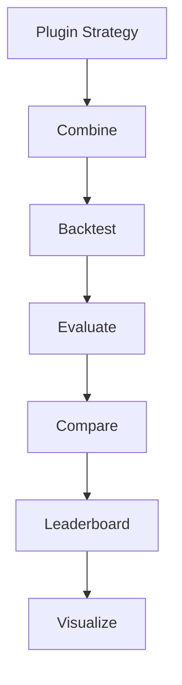

và có thể lặp lại quá trình:

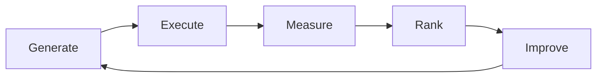

Do đó, bản chất đồ án là sự kết hợp của:

Realtime System + Plugin Architecture + Data Pipeline + Event-driven Architecture + Experiment
Platform + Verification Loop.

Sinh viên được tự do lựa chọn framework, database, message queue, mô hình ML và thuật toán tìm kiếm.

Điều quan trọng nhất cần chứng minh là:

Kiến trúc được thiết kế như thế nào để các thành phần có thể thay đổi, mở rộng và hoạt động
độc lập trong khi toàn bộ hệ thống vẫn duy trì được tính đúng đắn, khả năng quan sát và khả
năng phát triển lâu dài.


<!-- Page 54 -->
