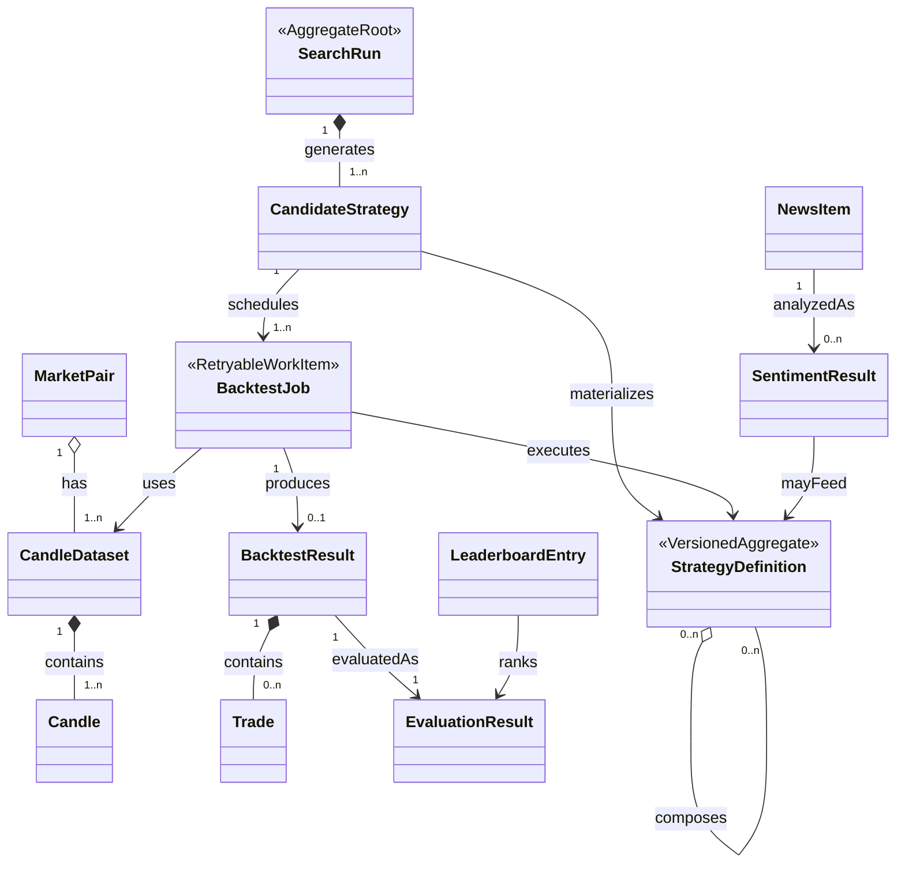

# Crypto Strategy Lab - Software Requirements Specification (SRS)

| Version | Date | Author | Change |
|---------|------|--------|--------|
| 0.1 | 2026-08-11 | Crypto Strategy Lab Team | Khởi tạo SRS từ `REQUIREMENT.md` và thống nhất Feature/User Story baseline |

---

## Table of Contents 📋

- [1. Introduction](#1-introduction)
  - [1.1 Purpose](#11-purpose)
  - [1.2 Scope](#12-scope)
  - [1.3 Assumptions and Constraints](#13-assumptions-and-constraints)
    - [1.3.1 Assumptions](#131-assumptions)
    - [1.3.2 Constraints](#132-constraints)
  - [1.4 Definitions and Acronyms](#14-definitions-and-acronyms)
  - [1.5 Roles and Actors](#15-roles-and-actors)
  - [1.6 Out of Scope](#16-out-of-scope)
  - [1.7 Related Documents](#17-related-documents)
- [2. Conceptual Domain Model](#2-conceptual-domain-model)
  - [2.1 Domain Diagram](#21-domain-diagram)
  - [2.2 Domain Entity](#22-domain-entity)
  - [2.3 Entity Relationship and Cardinality](#23-entity-relationship-and-cardinality)
  - [2.4 Business Rules](#24-business-rules)
- [3. Functional Requirements](#3-functional-requirements-fr)
  - [3.1 Realtime Market Data](#31-realtime-market-data)
  - [3.2 Multi-Timeframe Chart](#32-multi-timeframe-chart)
  - [3.3 Strategy Engine](#33-strategy-engine)
  - [3.4 Strategy Plugin](#34-strategy-plugin)
  - [3.5 Composite Strategy](#35-composite-strategy)
  - [3.6 Strategy Search Engine](#36-strategy-search-engine)
  - [3.7 Backtesting Engine](#37-backtesting-engine)
  - [3.8 Strategy Evaluation and Leaderboard](#38-strategy-evaluation-and-leaderboard)
  - [3.9 Visualization Dashboard](#39-visualization-dashboard)
  - [3.10 News Collection](#310-news-collection)
  - [3.11 Sentiment Analysis and Continuous Loop](#311-sentiment-analysis-and-continuous-loop)
- [4. Non-Functional Requirements](#4-non-functional-requirements-nfr)
  - [4.1 Performance](#41-performance)
  - [4.2 Availability](#42-availability)
  - [4.3 Scalability](#43-scalability)
  - [4.4 Security](#44-security)
    - [4.4.1 Authentication](#441-authentication)
    - [4.4.2 Authorization](#442-authorization)
  - [4.5 Privacy](#45-privacy)
  - [4.6 Reliability](#46-reliability)
- [5. User Experience Requirements](#5-user-experience-requirements-uxr)
  - [5.1 Clarity](#51-clarity)
  - [5.2 Responsiveness](#52-responsiveness)
  - [5.3 Immediate Feedback](#53-immediate-feedback)
  - [5.4 Role-aware Navigation](#54-role-aware-navigation)
  - [5.5 Data-heavy Page Usability](#55-data-heavy-page-usability)
- [6. Business Flows](#6-business-flows)
  - [6.1 Market Data Acquisition Flow](#61-market-data-acquisition-flow)
  - [6.2 Main Business Flow - End-to-End User Journey](#62-main-business-flow-end-to-end-user-journey)
  - [6.3 Multi-Timeframe Dashboard Flow](#63-multi-timeframe-dashboard-flow)
  - [6.4 Strategy Plugin and Combination Flow](#64-strategy-plugin-and-combination-flow)
  - [6.5 Search and Distributed Backtest Flow](#65-search-and-distributed-backtest-flow)
  - [6.6 Leaderboard and Visualization Flow](#66-leaderboard-and-visualization-flow)
  - [6.7 News and Sentiment Flow](#67-news-and-sentiment-flow)
  - [6.8 Continuous Strategy Loop Flow](#68-continuous-strategy-loop-flow)
- [7. Features and User Stories](#7-features-and-user-stories)
  - [7.1 Market Data (MD)](#71-market-data-md)
    - [7.1.1 MD-US-01: Load Historical Candles](#711-md-us-01-load-historical-candles)
    - [7.1.2 MD-US-02: Receive Realtime Candles](#712-md-us-02-receive-realtime-candles)
    - [7.1.3 MD-US-03: Recover Market Data Connection](#713-md-us-03-recover-market-data-connection)
  - [7.2 Multi-Timeframe Chart (MTC)](#72-multi-timeframe-chart-mtc)
    - [7.2.1 MTC-US-01: View Up to Four Charts](#721-mtc-us-01-view-up-to-four-charts)
    - [7.2.2 MTC-US-02: Change Each Timeframe Independently](#722-mtc-us-02-change-each-timeframe-independently)
  - [7.3 Strategy Engine (SE)](#73-strategy-engine-se)
    - [7.3.1 SE-US-01: Run a Built-in Strategy](#731-se-us-01-run-a-built-in-strategy)
    - [7.3.2 SE-US-02: View Strategy Signals](#732-se-us-02-view-strategy-signals)
  - [7.4 Strategy Plugin (SP)](#74-strategy-plugin-sp)
    - [7.4.1 SP-US-01: Register a New Strategy](#741-sp-us-01-register-a-new-strategy)
    - [7.4.2 SP-US-02: Version a Strategy Definition](#742-sp-us-02-version-a-strategy-definition)
    - [7.4.3 SP-US-03: Discover Registered Strategies](#743-sp-us-03-discover-registered-strategies)
  - [7.5 Composite Strategy (CS)](#75-composite-strategy-cs)
    - [7.5.1 CS-US-01: Create a Majority-Vote Composite](#751-cs-us-01-create-a-majority-vote-composite)
    - [7.5.2 CS-US-02: Create a Weighted Composite](#752-cs-us-02-create-a-weighted-composite)
    - [7.5.3 CS-US-03: Inspect Composite Decisions](#753-cs-us-03-inspect-composite-decisions)
  - [7.6 Strategy Search (SRCH)](#76-strategy-search-srch)
    - [7.6.1 SRCH-US-01: Launch Random Search](#761-srch-us-01-launch-random-search)
    - [7.6.2 SRCH-US-02: Monitor Search Progress](#762-srch-us-02-monitor-search-progress)
    - [7.6.3 SRCH-US-03: Replace the Search Generator](#763-srch-us-03-replace-the-search-generator)
  - [7.7 Backtesting Engine (BT)](#77-backtesting-engine-bt)
    - [7.7.1 BT-US-01: Run a Historical Backtest](#771-bt-us-01-run-a-historical-backtest)
    - [7.7.2 BT-US-02: Inspect Simulated Trades](#772-bt-us-02-inspect-simulated-trades)
    - [7.7.3 BT-US-03: Execute Backtests with Multiple Workers](#773-bt-us-03-execute-backtests-with-multiple-workers)
    - [7.7.4 BT-US-04: Recover a Failed Backtest Job](#774-bt-us-04-recover-a-failed-backtest-job)
  - [7.8 Strategy Evaluation (EV)](#78-strategy-evaluation-ev)
    - [7.8.1 EV-US-01: Calculate Strategy Metrics](#781-ev-us-01-calculate-strategy-metrics)
    - [7.8.2 EV-US-02: Score a Strategy](#782-ev-us-02-score-a-strategy)
    - [7.8.3 EV-US-03: Compare Evaluation Results](#783-ev-us-03-compare-evaluation-results)
  - [7.9 Leaderboard and Visualization (LV)](#79-leaderboard-and-visualization-lv)
    - [7.9.1 LV-US-01: View Top-K Strategies](#791-lv-us-01-view-top-k-strategies)
    - [7.9.2 LV-US-02: Receive Leaderboard Updates](#792-lv-us-02-receive-leaderboard-updates)
    - [7.9.3 LV-US-03: Visualize Signals and Trades](#793-lv-us-03-visualize-signals-and-trades)
  - [7.10 News Collection (NC)](#710-news-collection-nc)
    - [7.10.1 NC-US-01: Collect Normalized News](#7101-nc-us-01-collect-normalized-news)
    - [7.10.2 NC-US-02: Replace a News Provider](#7102-nc-us-02-replace-a-news-provider)
    - [7.10.3 NC-US-03: View Coin-Related News](#7103-nc-us-03-view-coin-related-news)
  - [7.11 Sentiment Analysis (SA)](#711-sentiment-analysis-sa)
    - [7.11.1 SA-US-01: Analyze News Sentiment](#7111-sa-us-01-analyze-news-sentiment)
    - [7.11.2 SA-US-02: View Sentiment Summary](#7112-sa-us-02-view-sentiment-summary)
    - [7.11.3 SA-US-03: Use Sentiment as a Strategy](#7113-sa-us-03-use-sentiment-as-a-strategy)
  - [7.12 Continuous Strategy Loop (CL)](#712-continuous-strategy-loop-cl)
    - [7.12.1 CL-US-01: Start and Stop a Strategy Loop](#7121-cl-us-01-start-and-stop-a-strategy-loop)
    - [7.12.2 CL-US-02: Monitor Loop Health](#7122-cl-us-02-monitor-loop-health)
    - [7.12.3 CL-US-03: Reproduce a Ranked Result](#7123-cl-us-03-reproduce-a-ranked-result)
    - [7.12.4 CL-US-04: Continue When an Optional Service Fails](#7124-cl-us-04-continue-when-an-optional-service-fails)
- [8. External Dependencies](#8-external-dependencies)
  - [8.1 Third-Party APIs](#81-third-party-apis)
  - [8.2 Internal Systems / Legacy Services](#82-internal-systems-legacy-services)
  - [8.3 Infrastructure Dependencies](#83-infrastructure-dependencies)

---

## 1. Introduction 📖 

### 1.1 Purpose 📝 

Tài liệu này định nghĩa Software Requirements Specification cho Crypto Strategy Lab.

Mục đích của SRS:

- Xác nhận phạm vi chức năng, phi chức năng, trải nghiệm, business flow, feature và user story trước khi thiết kế chi tiết.
- Là baseline để mỗi lần chạy `$speckit-specify` tạo đúng một feature đã được thống nhất.
- Giữ thuật ngữ, business rule và architectural driver độc lập với framework hay cách triển khai.
- Tạo traceability từ `REQUIREMENT.md` đến feature spec, plan, tasks, implementation và demo.

### 1.2 Scope 🔍 

Crypto Strategy Lab là nền tảng thử nghiệm chiến lược giao dịch crypto, không phải hệ thống giao dịch tiền thật. Phạm vi gồm:

- Thu thập historical và realtime market data từ Binance qua abstraction có thể thay thế.
- Hiển thị tối đa bốn candlestick chart với timeframe độc lập.
- Cung cấp tối thiểu bốn strategy đơn lẻ: MA, RSI, Bollinger Bands và Support/Resistance.
- Cho phép đăng ký strategy mới qua contract/registry mà không sửa Backtester, Evaluator và Leaderboard.
- Tạo Composite Strategy bằng majority vote hoặc weighted combination.
- Sinh candidate bằng Random Search và hỗ trợ thay thuật toán search.
- Backtest strategy trên dữ liệu lịch sử, mô phỏng trade và lưu provenance.
- Đánh giá bằng Return, Win Rate, Maximum Drawdown, Number of Trades và các metric mở rộng.
- Xếp hạng Top-K, cập nhật leaderboard và trực quan hóa signal/trade.
- Thu thập news, phân tích sentiment và dùng sentiment như một Strategy.
- Chạy continuous strategy loop có khả năng theo dõi, scale và phục hồi lỗi.

### 1.3 Assumptions and Constraints ⚠️ 

#### 1.3.1 Assumptions 

- Người dùng chính là người phân tích/nhóm phát triển đang thử nghiệm strategy.
- Binance cung cấp historical candle và realtime stream cho các pair/timeframe được hỗ trợ.
- Giá trị backtest chỉ có ý nghĩa khi biết chính xác dataset, strategy version và execution configuration.
- News và sentiment là dữ liệu bổ sung; market chart và technical backtest vẫn hoạt động khi chúng lỗi.
- Một strategy mới tuân thủ contract chung có thể đi qua backtest, evaluation và leaderboard hiện có.

#### 1.3.2 Constraints 

- Frontend không phụ thuộc trực tiếp vào schema Binance/news provider và không chứa business logic strategy/backtest/ranking.
- MVP hỗ trợ tối đa bốn chart trên một màn hình.
- MVP có ít nhất bốn strategy đơn lẻ, một Composite Strategy policy và Random Search.
- Backtest phải deterministic, không look-ahead và không mất/nhân đôi kết quả khi job retry.
- Strategy Definition và scoring policy phải có version; kết quả lịch sử không bị overwrite.
- Hệ thống chỉ phân tích và mô phỏng, không gửi lệnh giao dịch thật.
- Công nghệ phức tạp chỉ được dùng khi giải quyết một architectural driver có bằng chứng.

### 1.4 Definitions and Acronyms 📚 

| Term | Definition |
|------|------------|
| CSL | Crypto Strategy Lab |
| SRS | Software Requirements Specification |
| FR | Functional Requirement |
| NFR | Non-Functional Requirement |
| UXR | User Experience Requirement |
| OHLCV | Open, High, Low, Close, Volume |
| Candle | Dữ liệu OHLCV của một pair trong một timeframe |
| Pair | Cặp giao dịch, ví dụ `BTCUSDT` |
| Timeframe | Khoảng thời gian của một candle, ví dụ `5m`, `1h` |
| Strategy | Thành phần nhận dữ liệu chuẩn hóa và phát BUY/SELL/HOLD signal |
| Composite Strategy | Strategy kết hợp tín hiệu của nhiều strategy thành viên |
| Candidate Strategy | Strategy definition do Search Engine sinh để thử nghiệm |
| Backtest Run | Một lần mô phỏng strategy trên dataset lịch sử |
| Evaluation Result | Tập metric và score của một backtest result |
| Top-K | K strategy đứng đầu theo scoring policy hiện hành |
| MDD | Maximum Drawdown |
| Provider | Adapter cung cấp market data hoặc news theo contract chuẩn |
| Sentiment | Nhãn/score POSITIVE, NEUTRAL hoặc NEGATIVE của News Item |

### 1.5 Roles and Actors 👥 

| Role | Description | Example persona |
|------|-------------|-----------------|
| `ANALYST` | Chọn pair/timeframe, cấu hình strategy, chạy backtest/search và phân tích leaderboard | Sinh viên, trader nghiên cứu |
| `STRATEGY_DEVELOPER` | Bổ sung implementation strategy/provider/generator mới theo contract | Thành viên phát triển thuật toán |
| `OPERATOR` | Theo dõi stream, queue, worker, lỗi và continuous loop | Thành viên vận hành/demo |
| `MARKET_DATA_PROVIDER` | External actor cung cấp historical/realtime candle | Binance; tương lai OKX/Bybit |
| `NEWS_PROVIDER` | External actor cung cấp news | RSS, News API hoặc crawler |
| `BACKTEST_WORKER` | System actor nhận job, chạy backtest và ghi kết quả idempotent | Worker process |

Các actor trên mô tả trách nhiệm nghiệp vụ, không mặc định là role authorization. Authentication/authorization chỉ được bổ sung khi có feature spec riêng.

### 1.6 Out of Scope ❌ 

Các nội dung ngoài phạm vi SRS hiện tại:

- Gửi, sửa hoặc hủy lệnh giao dịch thật trên exchange.
- Cam kết lợi nhuận hoặc đưa ra lời khuyên đầu tư.
- Quản lý ví, private key, tài sản hoặc nạp/rút tiền.
- High-frequency trading với yêu cầu microsecond latency.
- Các mở rộng Genetic/Bayesian/LLM search, price prediction, multiple exchange, CQRS hoặc microservices nếu chưa có feature được phê duyệt.
- Một hệ thống identity/RBAC hoàn chỉnh; actor hiện tại chỉ dùng để diễn đạt user story.

### 1.7 Related Documents 🔗 

| Document | Location | Purpose |
|----------|----------|---------|
| Project Requirement | `docs/REQUIREMENT.md` | Đề bài gốc, MVP, architectural drivers và deliverables |
| Constitution | `.specify/memory/constitution.md` | Nguyên tắc quản trị bắt buộc cho mọi feature |
| Tech Stack and Skeleton | `docs/TECH_STACK_SKELETON_SPECKIT_FLOW.md` | Đề xuất kiến trúc, stack và Spec Kit workflow |
| Feature Specifications | `specs/<feature>/spec.md` | WHAT/WHY và acceptance criteria chi tiết của từng feature |
| Architecture/ADR | Chưa tạo | Container/module view, data flow và quyết định kiến trúc |
| RUNBOOK | Chưa tạo | Hướng dẫn setup, vận hành và troubleshooting |

---

## 2. Conceptual Domain Model 🏛️ 

> Section này định nghĩa entity, relationship và cross-feature rule của Crypto Strategy Lab.
>
> **Last synced with §7 User Stories:** 2026-08-11

### 2.1 Domain Diagram 🗺️ 

### 2.2 Domain Entity 📦 

| Entity | Description | Key Business Attributes | Ownership / Lifecycle |
|--------|-------------|-------------------------|-----------------------|
| MarketPair | Pair được theo dõi và phân tích | symbol, base asset, quote asset, provider status | Reference entity |
| CandleDataset | Snapshot/range candle có thể tái sử dụng | provider, pair, timeframe, start/end, completeness, version | Immutable khi dùng cho backtest |
| Candle | Một OHLCV interval chuẩn hóa | provider, pair, timeframe, open time, OHLCV, closed flag | Thuộc một dataset/stream; unique theo identity rule |
| StrategyDefinition | Strategy và parameter đã được version hóa | strategy ID, type, version, parameters, created at | Immutable versioned aggregate |
| CandidateStrategy | Strategy definition được generator sinh trong search | run ID, generator, members, parameters, seed | Thuộc một SearchRun |
| SearchRun | Nhóm candidate/backtest của một vòng search | generator version, search space, status, progress | Aggregate root: queued/running/completed/failed/cancelled |
| BacktestJob | Đơn vị công việc retry được | job ID, run ID, dataset, strategy version, attempt, status | At-least-once; idempotent result |
| BacktestResult | Kết quả mô phỏng giao dịch | initial/final equity, equity curve, duration, checksum | Immutable sau completion |
| Trade | Một giao dịch mô phỏng | entry/exit time and price, side, quantity, P/L | Thành phần của BacktestResult |
| EvaluationResult | Metrics và score của result | return, win rate, MDD, trades, profit factor, Sharpe, policy version | Immutable theo scoring policy |
| LeaderboardEntry | Projection Top-K | rank, evaluation result, score, updated at | Tính/lưu từ EvaluationResult |
| NewsItem | News chuẩn hóa từ provider | title, content, source, URL, published/collected at, related coins | Provider-neutral record |
| SentimentResult | Kết quả model cho NewsItem | label, score, model version, analyzed at | Versioned model output |

### 2.3 Entity Relationship and Cardinality 🔗 

| Subject | Verb Phrase | Object | Type | Cardinality | Constraint |
|---------|-------------|--------|------|-------------|------------|
| MarketPair | has | CandleDataset | Aggregation | 1..n | Dataset xác định provider, pair, timeframe và range |
| CandleDataset | contains | Candle | Composition | 1..n | Candle không trùng identity và phải theo thứ tự thời gian |
| Composite StrategyDefinition | contains | StrategyDefinition | Aggregation | 1..n | Member version, weight và resolution rule phải được lưu |
| SearchRun | generates | CandidateStrategy | Composition | 1..n | Candidate truy nguyên được generator/version/seed |
| CandidateStrategy | schedules | BacktestJob | Composition | 1..n | Mỗi dataset/timeframe cần job riêng |
| BacktestJob | uses | CandleDataset | Association | 1 | Dataset immutable và đầy đủ cho range |
| BacktestJob | executes | StrategyDefinition | Association | 1 | Phải trỏ đúng immutable version |
| BacktestResult | contains | Trade | Composition | 0..n | Trade không được sử dụng future information |
| BacktestResult | has | EvaluationResult | Composition | 1 | Evaluation tách khỏi Strategy implementation |
| LeaderboardEntry | references | EvaluationResult | Association | 1 | Rank theo versioned scoring policy |
| NewsItem | has | SentimentResult | Composition | 0..n | Một News Item có thể được phân tích bởi nhiều model version |

### 2.4 Business Rules 📏 

| Rule ID | Statement | Entities Involved | Enforced In |
|---------|-----------|-------------------|-------------|
| BR-01 | Candle MUST unique theo `(provider, pair, timeframe, openTime)` và tuân thủ OHLCV invariant. | Candle, CandleDataset | §3.1, §7.1 |
| BR-02 | Frontend và domain MUST NOT phụ thuộc schema của Binance/News Provider. | Candle, NewsItem, Provider | §3.1, §3.10 |
| BR-03 | Strategy Definition và parameter set MUST immutable theo version; historical result không bị overwrite. | StrategyDefinition, BacktestResult | §3.3, §3.4, §7.4 |
| BR-04 | Composite Strategy MUST lưu member version, weight và conflict-resolution rule. | StrategyDefinition | §3.5, §7.5 |
| BR-05 | Backtest MUST deterministic, không look-ahead và cùng input/seed sinh cùng output. | CandleDataset, BacktestJob, BacktestResult | §3.7, §7.7 |
| BR-06 | Strategy phát signal; Evaluator riêng biệt tính metric/score. | StrategyDefinition, EvaluationResult | §3.3, §3.8 |
| BR-07 | Leaderboard MUST dùng versioned scoring policy và deterministic tie-breaker. | EvaluationResult, LeaderboardEntry | §3.8, §7.9 |
| BR-08 | Job retry MUST idempotent theo `jobId`; worker lỗi không làm mất hoặc nhân đôi result. | BacktestJob, BacktestResult | §3.7, §7.7 |
| BR-09 | News collection và Sentiment analysis MUST decoupled; lỗi news không dừng chart/backtest. | NewsItem, SentimentResult | §3.10, §3.11 |
| BR-10 | Hệ thống MUST NOT thực thi lệnh giao dịch thật. | StrategyDefinition, Trade | §1.6, §3.7 |

---

## 3. Functional Requirements (FR) ✅ 

### 3.1 Realtime Market Data 📡 

| No. | Function | Requirement | Business Rules |
|-----|----------|-------------|----------------|
| MD-FR-01 | Historical candles | Hệ thống shall tải candle lịch sử theo provider, pair, timeframe và date range. | Kết quả được chuẩn hóa và kiểm tra BR-01/BR-02. |
| MD-FR-02 | Realtime stream | Hệ thống shall nhận realtime candle/price update mà frontend không polling liên tục. | Stream phải phân biệt candle đang mở và đã đóng. |
| MD-FR-03 | Provider abstraction | Hệ thống shall truy cập Binance qua Market Data Provider contract. | Thêm OKX/Bybit không đổi frontend/domain. |
| MD-FR-04 | Persistence/reuse | Hệ thống shall lưu dataset để chart, indicator và backtest dùng lại. | Duplicate delivery không tạo duplicate candle. |
| MD-FR-05 | Reconnect/gap recovery | Hệ thống shall reconnect khi stream mất và backfill closed candle bị thiếu. | UI hiển thị stale/reconnecting cho đến khi đồng bộ. |
| MD-FR-06 | Supported dimensions | MVP shall hỗ trợ `BTCUSDT` và các timeframe `1m`, `5m`, `15m`, `30m`, `1h`, `2h`, `4h`, `1d` nếu provider cung cấp. | Feature spec có thể thu hẹp pair demo nhưng không phá contract. |

### 3.2 Multi-Timeframe Chart 📈 

| No. | Function | Requirement | Business Rules |
|-----|----------|-------------|----------------|
| MTC-FR-01 | Chart grid | Dashboard shall hiển thị từ một đến tối đa bốn candlestick chart. | Mỗi chart có slot identity ổn định. |
| MTC-FR-02 | Independent timeframe | Người dùng shall đổi timeframe của từng chart độc lập. | Không reload toàn bộ dashboard. |
| MTC-FR-03 | Realtime update | Chart shall cập nhật candle mới từ backend stream. | Không gọi trực tiếp Binance. |
| MTC-FR-04 | Subscription lifecycle | Hệ thống shall subscribe/unsubscribe khi pair/timeframe/slot thay đổi. | Không giữ subscription mồ côi. |
| MTC-FR-05 | Connection state | UI shall hiển thị loading, live, stale, reconnecting và error. | Trạng thái không được ngụy trang dữ liệu cũ thành live. |

### 3.3 Strategy Engine 🧠 

| No. | Function | Requirement | Business Rules |
|-----|----------|-------------|----------------|
| SE-FR-01 | Strategy contract | Mọi strategy shall nhận normalized data/parameters và trả timestamped BUY/SELL/HOLD signals. | Strategy không gọi DB, queue hoặc HTTP trực tiếp. |
| SE-FR-02 | Built-in strategies | MVP shall cung cấp MA, RSI, Bollinger Bands và Support/Resistance. | Mỗi strategy có parameter schema và test fixture. |
| SE-FR-03 | Signal explanation | Signal shall có strategy/version/timestamp/action và optional strength/reason. | Không yêu cầu strategy tự tính rank. |
| SE-FR-04 | Determinism | Cùng input và parameter shall sinh cùng signal sequence. | Random behavior cần explicit seed. |
| SE-FR-05 | Advanced strategies | Engine shall không chặn việc thêm SMC, Wyckoff hoặc Sentiment Strategy. | Việc bổ sung đi qua plugin contract. |

### 3.4 Strategy Plugin 🔌 

| No. | Function | Requirement | Business Rules |
|-----|----------|-------------|----------------|
| SP-FR-01 | Registry | Hệ thống shall đăng ký/discover strategy qua registry hoặc plugin mechanism. | Không có `if/switch` concrete strategy trong Backtester/Evaluator/Leaderboard. |
| SP-FR-02 | Add strategy | Strategy Developer shall thêm MACD bằng implementation + registration + tests. | Thành phần downstream không sửa code. |
| SP-FR-03 | Parameter metadata | Plugin shall công bố parameter schema/default/range. | Invalid parameter bị reject trước execution. |
| SP-FR-04 | Versioning | Mỗi behavior/parameter-set được sử dụng shall có immutable version. | Experiment luôn truy nguyên đúng version. |
| SP-FR-05 | Compatibility | Registry shall từ chối plugin không tương thích contract version. | Lỗi đăng ký không làm hỏng strategy đã hoạt động. |

### 3.5 Composite Strategy 🧩 

| No. | Function | Requirement | Business Rules |
|-----|----------|-------------|----------------|
| CS-FR-01 | Member selection | Người dùng/Search Engine shall chọn từ hai strategy member trở lên. | Lưu exact member version và parameters. |
| CS-FR-02 | Majority vote | Hệ thống shall hỗ trợ resolution theo số phiếu BUY/SELL/HOLD. | Tie behavior phải được cấu hình. |
| CS-FR-03 | Weighted combination | Hệ thống shall hỗ trợ weight và threshold cho member. | Weight finite và cấu hình được version hóa. |
| CS-FR-04 | Decision trace | Composite signal shall giải thích member signal và rule tạo quyết định cuối. | Kết quả không phụ thuộc thứ tự chạy member. |
| CS-FR-05 | Reuse | Composite Strategy shall tuân thủ cùng Strategy contract. | Backtester không phân biệt single/composite. |

### 3.6 Strategy Search Engine 🔎 

| No. | Function | Requirement | Business Rules |
|-----|----------|-------------|----------------|
| SRCH-FR-01 | Search space | Người dùng shall chọn strategy types, parameter ranges, combination size và candidate limit. | Search space được lưu với run. |
| SRCH-FR-02 | Random Search | MVP shall cung cấp Random Search sinh Candidate Strategy hợp lệ. | Seed được lưu để tái tạo candidate sequence. |
| SRCH-FR-03 | Generator abstraction | Search generator shall tuân thủ contract chung. | Thay Random bằng Genetic/Domain-Guided không đổi Backtester. |
| SRCH-FR-04 | Progress | Hệ thống shall báo total/generated/queued/running/succeeded/failed. | Progress gắn `runId`. |
| SRCH-FR-05 | Lifecycle | Search run shall hỗ trợ start, pause/resume nếu được triển khai, cancel và terminal status. | Cancel không xóa durable result đã hoàn thành. |
| SRCH-FR-06 | Duplicate control | Hệ thống shall nhận diện candidate definition trùng trong cùng run. | Không enqueue duplicate vô ích trừ khi spec yêu cầu replicate. |

### 3.7 Backtesting Engine ⏪ 

| No. | Function | Requirement | Business Rules |
|-----|----------|-------------|----------------|
| BT-FR-01 | Historical simulation | Hệ thống shall chạy strategy version trên immutable dataset/range/timeframe. | Tuân thủ BR-03/BR-05. |
| BT-FR-02 | Execution config | Run shall lưu initial capital, fees, slippage, sizing rule và seed. | Config không hợp lệ bị reject trước queue. |
| BT-FR-03 | Trade simulation | Engine shall tạo entry/exit, quantity, P/L và equity curve. | Không dùng future candle. |
| BT-FR-04 | Queue/worker | Backtest candidate shall là independent durable job có thể chạy bởi nhiều worker. | Tăng 1→4 worker không sửa producer/evaluator/leaderboard. |
| BT-FR-05 | Retry | Job chỉ ack sau durable write; lease timeout cho phép retry ở worker khác. | Bounded retry và dead-letter/failed terminal state. |
| BT-FR-06 | Idempotency | Ghi result shall idempotent theo `jobId`. | Duplicate delivery không tạo duplicate result/evaluation. |
| BT-FR-07 | Status | Job shall có queued, running, succeeded, failed, cancelled và attempt history. | Worker chết không để job kẹt vô hạn. |

### 3.8 Strategy Evaluation and Leaderboard 🏆 

| No. | Function | Requirement | Business Rules |
|-----|----------|-------------|----------------|
| EV-FR-01 | Required metrics | Evaluator shall tính Total Return, Win Rate, Maximum Drawdown và Number of Trades. | Tách khỏi Strategy. |
| EV-FR-02 | Extended metrics | Evaluator may tính Profit Factor, Sharpe Ratio và metric được spec thêm. | Semantics cho no-trade/zero-variance phải rõ. |
| EV-FR-03 | Overall score | Hệ thống shall dùng versioned scoring policy với weight/normalization đã công bố. | Historical evaluation giữ policy version. |
| EV-FR-04 | Top-K | Leaderboard shall duy trì Top-K strategy theo metric/score được chọn. | Tie-break deterministic. |
| EV-FR-05 | Sorting/filtering | Người dùng shall sort/filter theo Return, Win Rate, MDD, Sharpe, pair và timeframe. | Query có pagination. |
| EV-FR-06 | Incremental update | Candidate hoàn thành shall được evaluate/rank mà không chờ toàn bộ run. | UI nhận LeaderboardUpdated event. |

### 3.9 Visualization Dashboard 📊 

| Section | Requirement |
|---------|-------------|
| Market Charts | Hiển thị candlestick historical/realtime cho tối đa bốn timeframe. |
| Indicator Overlay | Hiển thị MA, Bollinger, Support/Resistance hoặc overlay do strategy cung cấp. |
| Signals | Hiển thị BUY/SELL/HOLD marker theo timestamp. |
| Trades | Hiển thị Entry/Exit và cho phép xem trade detail. |
| Leaderboard | Hiển thị Top-K, metrics, score, strategy members/version và trạng thái cập nhật. |
| Run Progress | Hiển thị candidate tested/current, queue/worker progress, failures và elapsed time. |
| News/Sentiment | Hiển thị news theo coin và phân bố positive/neutral/negative. |

### 3.10 News Collection 📰 

| Item | Requirement |
|------|-------------|
| Provider abstraction | RSS, News API và crawler trả cùng normalized NewsItem contract. |
| Core data | NewsItem gồm id, title, content, source, publishedAt, collectedAt, relatedCoins và URL. |
| Deduplication | Hệ thống shall tránh lưu lại cùng article theo provider ID/canonical URL/content fingerprint. |
| Collection lifecycle | Hệ thống shall ghi success/failure/last collected time của từng provider. |
| Isolation | Provider hoặc crawler lỗi không làm market chart, backtest và technical strategy ngừng. |
| Query | Người dùng shall xem news theo pair/coin, source, sentiment và date range. |

### 3.11 Sentiment Analysis and Continuous Loop 🤖 

| ID | Function | Requirement |
|----|----------|-------------|
| SA-FR-01 | Sentiment classification | Hệ thống shall phân loại NewsItem thành POSITIVE, NEUTRAL hoặc NEGATIVE kèm score. |
| SA-FR-02 | Model version | Mỗi SentimentResult shall lưu model/version và analyzedAt. |
| SA-FR-03 | Reanalysis | NewsItem may được phân tích lại bằng model version mới mà không overwrite result cũ. |
| SA-FR-04 | Sentiment Strategy | Hệ thống shall có thể cung cấp sentiment aggregate cho một Strategy theo contract chung. |
| CL-FR-01 | Continuous loop | Hệ thống shall lặp Generate → Backtest → Evaluate → Rank → Improve trong run có kiểm soát. |
| CL-FR-02 | Loop controls | Người dùng shall start/stop và quan sát loop; pause/resume là extension được spec riêng. |
| CL-FR-03 | Observability | Hệ thống shall báo run status, candidates tested, duration, failures/retries và Top-1. |
| CL-FR-04 | Reproducibility | Mọi ranked result shall truy nguyên generator, seed, strategy version, dataset và scoring policy. |

---

## 4. Non-Functional Requirements (NFR) ⚡ 

### 4.1 Performance ⚡ 

| Metric | Target |
|--------|--------|
| Read APIs | 95% non-job read response ≤ 300 ms dưới documented demo load |
| Realtime propagation | 95% update đến browser ≤ 1 giây sau backend ingestion, không tính upstream provider delay |
| Chart update | Candle mới được cập nhật mà không render lại toàn bộ dashboard |
| Worker scaling benchmark | 4 worker đạt mục tiêu ≥3x throughput của 1 worker khi không có shared bottleneck được đo |
| Result consistency | Workload giống nhau cho 1 và 4 worker tạo tập result giống nhau theo `jobId` |

### 4.2 Availability 🌐 

- Market chart và technical backtest vẫn hoạt động khi News/Sentiment unavailable.
- Provider stream mất kết nối phải chuyển trạng thái rõ ràng và tự reconnect/backfill.
- Health/readiness phải phản ánh dependency bắt buộc và optional riêng biệt.
- Planned maintenance không được làm historical result/provenance biến mất.

### 4.3 Scalability 📈 

- Kiến trúc phải tăng Backtest Worker từ 1 lên 4 bằng deployment/configuration, không sửa Generator, Evaluator hay Leaderboard.
- Job phải độc lập để phân phối ngang.
- SearchRun phải có candidate limit và có thể mô hình hóa workload tới 100.000 candidate.
- Queue depth, worker utilization và database bottleneck phải đo được trước khi thêm hạ tầng phức tạp.

### 4.4 Security 🔒 

#### 4.4.1 Authentication 

- MVP không yêu cầu user-account system nếu chạy trong môi trường demo tin cậy.
- Nếu một feature bổ sung authentication, actor, credential lifecycle, session/token, failure và recovery phải được định nghĩa trong feature spec trước implementation.
- Provider API key/secret không bao giờ được gửi xuống browser, commit hoặc ghi log.
- Exchange credential nếu cần chỉ được cấp quyền đọc; hệ thống không yêu cầu trade/withdraw permission.

#### 4.4.2 Authorization 

| Actor boundary | Authorization Scope |
|----------------|---------------------|
| Browser client | Chỉ truy cập public/product REST-WebSocket contract; không truy cập DB/Redis/provider trực tiếp |
| Backtest Worker | Chỉ nhận job và ghi status/result theo service identity |
| Operator endpoint | Health/metrics/control được bảo vệ theo environment policy |
| Provider adapter | Chỉ dùng credential tối thiểu cho data collection |

Không coi `ANALYST`, `STRATEGY_DEVELOPER`, `OPERATOR` là security role cho tới khi một authorization feature được thống nhất.

### 4.5 Privacy 🔏 

- Hệ thống chỉ lưu dữ liệu người dùng tối thiểu cần cho audit/run ownership nếu feature đó tồn tại.
- API key, token, cookie, IP không được xuất hiện trong business response hoặc log.
- News content/source attribution và URL phải được lưu/hiển thị theo quyền sử dụng nguồn.
- Exported experiment không chứa secret hoặc internal stack trace.

### 4.6 Reliability 🛡️ 

| Failure scenario | Expected system behaviour |
|------------------|--------------------------|
| Binance WebSocket disconnect | Đánh dấu stale/reconnecting, backoff reconnect và backfill candle thiếu |
| Duplicate/out-of-order candle | Chuẩn hóa theo identity/time; không tạo duplicate hoặc time regression |
| Worker chết giữa backtest | Job hết lease, retry ở worker khác và result vẫn idempotent |
| Job lỗi vĩnh viễn | Bounded retry rồi chuyển terminal failed/dead-letter với reason |
| News provider lỗi | Ghi lỗi provider; chart, technical strategy và backtest tiếp tục |
| Sentiment model lỗi | News vẫn được lưu; pending/failed sentiment hiển thị rõ |
| Evaluation/leaderboard update lặp | Unique `jobId`/policy version ngăn duplicate score/rank event |

---

## 5. User Experience Requirements (UXR) 🎨 

### 5.1 Clarity 👁️ 

- UI dùng nhất quán pair, timeframe, strategy version, metric và run status.
- Chart marker BUY/SELL và Entry/Exit phải phân biệt bằng label/shape, không chỉ màu.
- Leaderboard hiển thị metric direction rõ ràng, đặc biệt MDD là rủi ro âm.
- Dữ liệu live, stale, historical và simulated phải có nhãn khác nhau.

### 5.2 Responsiveness 📱 

- Dashboard thích ứng từ một đến bốn chart theo chiều rộng màn hình.
- Trên màn hình không đủ rộng, chart chuyển sang layout một cột mà không mất controls.
- Thay timeframe và điều hướng không reload toàn bộ ứng dụng.
- Bảng lớn giữ khả năng đọc và scroll hợp lý.

### 5.3 Immediate Feedback 💬 

- Load data, subscribe, start/cancel search/backtest phải có loading/accepted/success/error feedback.
- Progress cập nhật queued/running/succeeded/failed và số candidate tested.
- Khi reconnect/retry, UI cho biết hệ thống đang phục hồi thay vì im lặng.
- Invalid parameter hiển thị field-level error trước khi tạo job.

### 5.4 Role-aware Navigation 🧭 

- Navigation phản ánh capability của actor và feature đã bật: Market, Strategies, Backtests, Leaderboard, News/Sentiment và Operations.
- Nếu authentication được bổ sung, action visibility phản ánh permission nhưng backend vẫn là enforcement authority.
- Internal worker/provider controls không xuất hiện trong product navigation.

### 5.5 Data-heavy Page Usability 📊 

- Leaderboard, trades, experiments và news hỗ trợ sort/filter/pagination.
- Người dùng có thể drill down từ Leaderboard Entry đến metrics, trades và provenance.
- Biểu đồ không tải/render toàn bộ lịch sử không giới hạn; range được chọn rõ.
- Empty, partial, no-trade và failed-result state có message riêng.

---

## 6. Business Flows 🔄 

### 6.1 Market Data Acquisition Flow 🔑 

1. Analyst chọn pair, timeframe và historical date range.
2. Backend kiểm tra dataset hiện có.
3. Market Data Provider tải phần candle còn thiếu.
4. Adapter chuẩn hóa và validate OHLCV.
5. Hệ thống deduplicate, lưu dataset và trả candle cho chart/backtest.
6. Backend subscribe realtime stream cho pair/timeframe được xem.
7. Candle update được phát đến frontend qua realtime channel.

#### Alternative Flows

- Nếu dataset đã đầy đủ, hệ thống tái sử dụng mà không gọi provider toàn range.
- Provider mới có thể thay Binance nếu trả cùng contract.

#### Negative Flows

- Unsupported pair/timeframe bị reject với lý do rõ.
- Rate limit/timeout tạo retry có giới hạn và không lưu payload không hợp lệ.

### 6.2 Main Business Flow - End-to-End User Journey 🔄 

1. Analyst mở `BTCUSDT` với `5m`, `15m`, `1h`, `4h`.
2. Dashboard tải historical candle và nhận realtime update cho bốn chart.
3. Analyst chọn MA, RSI, Bollinger và Support/Resistance.
4. Analyst tạo search space và bấm Start Search.
5. Random Search sinh Candidate Strategy/Composite Strategy.
6. Queue phân phối BacktestJob cho worker.
7. Worker mô phỏng trade trên historical dataset và ghi result.
8. Evaluator tính Return, Win Rate, MDD và Number of Trades.
9. Leaderboard cập nhật Top-K ngay khi từng candidate hoàn thành.
10. Analyst mở Top-1 để xem signal, Entry/Exit, trades và provenance.
11. News được collect/store/analyze sentiment.
12. Analyst có thể đưa Sentiment Strategy vào search space và chạy vòng mới.

#### Alternative Flows

- Analyst chỉ chạy một strategy đơn lẻ thay vì search.
- Analyst sort leaderboard theo metric thay vì Overall Score.

#### Negative Flows

- Worker/provider/news failure được cô lập và hiển thị; durable result đã hoàn thành không bị mất.

### 6.3 Multi-Timeframe Dashboard Flow ⚙️ 

1. Analyst chọn số chart từ một đến bốn.
2. Mỗi chart chọn một timeframe độc lập.
3. Frontend yêu cầu historical range cho slot mới.
4. Frontend subscribe realtime channel tương ứng.
5. Analyst đổi timeframe của một slot.
6. Slot đó unsubscribe channel cũ, tải dữ liệu mới và subscribe channel mới.
7. Các chart còn lại tiếp tục chạy không reload.

#### Alternative Flows

- Nhiều chart có thể dùng cùng timeframe nhưng vẫn có slot state riêng.

#### Negative Flows

- Nếu subscription lỗi, chỉ slot liên quan hiển thị reconnect/error.

### 6.4 Strategy Plugin and Combination Flow 💰 

1. Strategy Developer cài đặt Strategy contract cho MACD.
2. Plugin khai báo parameter schema và version.
3. Registry validate và đăng ký MACD.
4. Analyst thấy MACD trong danh sách strategy.
5. Analyst kết hợp MACD với MA/RSI bằng majority hoặc weighted rule.
6. Composite được lưu như Strategy Definition versioned.
7. Backtester, Evaluator và Leaderboard xử lý qua contract cũ mà không sửa code.

#### Alternative Flows

- Strategy mới có thể là SMC, Wyckoff hoặc Sentiment Strategy.

#### Negative Flows

- Plugin sai contract/version hoặc parameter schema bị từ chối mà không ảnh hưởng plugin đang hoạt động.

### 6.5 Search and Distributed Backtest Flow 📢 

1. Analyst cấu hình Random Search, search space, dataset và candidate limit.
2. Generator tạo Candidate Strategy với `runId` và seed.
3. Mỗi candidate/dataset tạo một durable BacktestJob.
4. Worker rảnh lease một job và chạy deterministic backtest.
5. Worker ghi result idempotent rồi ack job.
6. Evaluator và Leaderboard xử lý result.
7. Progress được cập nhật cho Analyst.

#### Alternative Flows

- Số worker tăng từ 1 lên 4 bằng cấu hình triển khai.
- Generator có thể được thay bằng Domain-Guided hoặc Genetic trong feature mở rộng.

#### Negative Flows

- Worker chết trước ack làm job hết lease và được worker khác retry.
- Job vượt retry limit chuyển failed/dead-letter với reason.

### 6.6 Leaderboard and Visualization Flow 🏢 

1. Evaluation Result được tính bằng scoring policy versioned.
2. Ranking so sánh candidate với Top-K hiện tại.
3. Nếu đủ điều kiện, Leaderboard Entry được thêm/cập nhật.
4. Backend phát `LEADERBOARD_UPDATED`.
5. Frontend cập nhật table không refresh trang.
6. Analyst chọn một entry.
7. Chart tải strategy overlays, signal và Entry/Exit; trade detail và provenance được hiển thị.

#### Alternative Flows

- Analyst sort theo Return, Win Rate, MDD hoặc Sharpe.

#### Negative Flows

- Evaluation có NaN/no-trade dùng semantics đã định nghĩa và không âm thầm phá ranking.

### 6.7 News and Sentiment Flow 🔔 

1. Scheduler/operator kích hoạt collection từ News Provider.
2. Provider trả article và adapter chuẩn hóa NewsItem.
3. Hệ thống deduplicate và lưu news.
4. Sentiment analyzer tạo label/score kèm model version.
5. Analyst xem news và sentiment distribution theo coin/time range.
6. Sentiment aggregate có thể được Strategy Engine tiêu thụ qua Sentiment Strategy.

#### Alternative Flows

- Thêm RSS/API/crawler provider không đổi Sentiment analyzer.
- NewsItem được reanalyze bằng model version mới mà không overwrite kết quả cũ.

#### Negative Flows

- Crawler lỗi được ghi riêng; market/technical pipeline tiếp tục hoạt động.

### 6.8 Continuous Strategy Loop Flow ⚙️ 

1. Analyst tạo Continuous Loop từ search configuration.
2. Loop sinh candidate, execute backtest, measure, rank và dùng kết quả cho vòng tiếp.
3. Operator/Analyst theo dõi run status, candidates tested, duration, retries/failures và Top-1.
4. Analyst dừng loop; hệ thống ngừng tạo job mới và xử lý job đang chạy theo cancel policy.
5. Durable results và provenance được giữ lại.

#### Alternative Flows

- Loop chạy theo candidate/time budget hoặc manual stop.

#### Negative Flows

- Dependency optional lỗi không dừng loop technical; dependency bắt buộc lỗi chuyển run sang degraded/failed rõ ràng.

## 7. Features and User Stories 👤 

### 7.1 Market Data (MD) 📡 

> Planned Spec: [specs/001-market-data/spec.md](../specs/001-market-data/spec.md)

#### 7.1.1 MD-US-01: Load Historical Candles 

**As an** `ANALYST`, **I want to** load historical candles by pair, timeframe and date range **so that** I can inspect the market and reuse the same dataset for backtesting.

**Acceptance Criteria:**
- [ ] Valid range returns normalized, chronologically ordered candles.
- [ ] Duplicate provider delivery does not create duplicate candle identity.
- [ ] Unsupported pair/timeframe and provider failure return actionable errors.

#### 7.1.2 MD-US-02: Receive Realtime Candles 

**As an** `ANALYST`, **I want to** receive realtime candle updates **so that** the chart stays current without manual refresh or repeated polling.

**Acceptance Criteria:**
- [ ] Frontend receives normalized updates through the backend realtime channel.
- [ ] Current/open and closed candles are distinguishable.
- [ ] Frontend does not use Binance payload fields directly.

#### 7.1.3 MD-US-03: Recover Market Data Connection 

**As an** `OPERATOR`, **I want to** recover automatically from a provider disconnect **so that** candle history remains continuous.

**Acceptance Criteria:**
- [ ] Disconnect changes stream state to stale/reconnecting.
- [ ] Reconnect uses bounded backoff and backfills missing closed candles.
- [ ] Stream becomes live only after continuity is restored.

### 7.2 Multi-Timeframe Chart (MTC) 📈 

> Planned Spec: [specs/002-multi-timeframe-chart/spec.md](../specs/002-multi-timeframe-chart/spec.md)

#### 7.2.1 MTC-US-01: View Up to Four Charts 

**As an** `ANALYST`, **I want to** view one to four candlestick charts **so that** I can compare market behavior across timeframes.

**Acceptance Criteria:**
- [ ] Dashboard supports one, two, three or four chart slots.
- [ ] Each slot displays pair, timeframe, connection status and candles.
- [ ] Adding/removing a slot does not reload unaffected charts.

#### 7.2.2 MTC-US-02: Change Each Timeframe Independently 

**As an** `ANALYST`, **I want to** change one chart timeframe independently **so that** other chart contexts remain intact.

**Acceptance Criteria:**
- [ ] Only the selected slot reloads/resubscribes.
- [ ] Previous slot subscription is released.
- [ ] Other chart data and viewport state remain unchanged.

### 7.3 Strategy Engine (SE) 🧠 

> Planned Spec: [specs/003-strategy-engine/spec.md](../specs/003-strategy-engine/spec.md)

#### 7.3.1 SE-US-01: Run a Built-in Strategy 

**As an** `ANALYST`, **I want to** run MA, RSI, Bollinger or Support/Resistance with valid parameters **so that** I can produce comparable signals.

**Acceptance Criteria:**
- [ ] Each MVP strategy follows the common Strategy contract.
- [ ] Invalid parameters fail before execution.
- [ ] Same candles/parameters produce the same signals.

#### 7.3.2 SE-US-02: View Strategy Signals 

**As an** `ANALYST`, **I want to** inspect timestamped BUY/SELL/HOLD signals **so that** I understand strategy behavior before backtesting.

**Acceptance Criteria:**
- [ ] Signal includes strategy/version, timestamp and action.
- [ ] Signal timestamps align to normalized market data.
- [ ] Optional strength/reason is shown when the strategy provides it.

### 7.4 Strategy Plugin (SP) 🔌 

> Planned Spec: [specs/004-strategy-plugin/spec.md](../specs/004-strategy-plugin/spec.md)

#### 7.4.1 SP-US-01: Register a New Strategy 

**As a** `STRATEGY_DEVELOPER`, **I want to** register MACD through the Strategy contract **so that** Backtester, Evaluator and Leaderboard work without modification.

**Acceptance Criteria:**
- [ ] MACD requires implementation, registration, metadata and tests only.
- [ ] Backtester/Evaluator/Leaderboard contain no MACD-specific branch.
- [ ] Existing strategy regression results remain unchanged.

#### 7.4.2 SP-US-02: Version a Strategy Definition 

**As a** `STRATEGY_DEVELOPER`, **I want to** create a new immutable version when behavior or parameters change **so that** old experiments remain reproducible.

**Acceptance Criteria:**
- [ ] New behavior/parameter set creates a distinct version.
- [ ] Existing BacktestResult retains the original version reference.
- [ ] Version metadata is visible in result provenance.

#### 7.4.3 SP-US-03: Discover Registered Strategies 

**As an** `ANALYST`, **I want to** discover available strategies and parameter schemas **so that** I can configure valid strategy definitions without hard-coded UI knowledge.

**Acceptance Criteria:**
- [ ] Registry exposes active strategy type/version/parameter metadata.
- [ ] Incompatible plugin is rejected without affecting registered plugins.
- [ ] UI/search consumes registry metadata rather than a fixed strategy list.

### 7.5 Composite Strategy (CS) 🧩 

> Planned Spec: [specs/005-composite-strategy/spec.md](../specs/005-composite-strategy/spec.md)

#### 7.5.1 CS-US-01: Create a Majority-Vote Composite 

**As an** `ANALYST`, **I want to** combine member signals by majority vote **so that** one strategy can represent group consensus.

**Acceptance Criteria:**
- [ ] Composite stores exact member versions and parameters.
- [ ] BUY/SELL/HOLD counts produce the configured final action.
- [ ] Tie behavior is explicit and deterministic.

#### 7.5.2 CS-US-02: Create a Weighted Composite 

**As an** `ANALYST`, **I want to** assign weights and thresholds to strategy members **so that** trusted signals can influence the final decision more strongly.

**Acceptance Criteria:**
- [ ] Weights/thresholds are validated and versioned.
- [ ] Decision does not depend on member execution order.
- [ ] Composite follows the same Strategy contract as a single strategy.

#### 7.5.3 CS-US-03: Inspect Composite Decisions 

**As an** `ANALYST`, **I want to** see member signals and the resolution rule **so that** I can explain a composite BUY/SELL/HOLD decision.

**Acceptance Criteria:**
- [ ] Final signal links to all contributing member signals.
- [ ] Weight/vote calculation is inspectable.
- [ ] Missing member data follows a documented rule.

### 7.6 Strategy Search (SRCH) 🔎 

> Planned Spec: [specs/006-strategy-search/spec.md](../specs/006-strategy-search/spec.md)

#### 7.6.1 SRCH-US-01: Launch Random Search 

**As an** `ANALYST`, **I want to** launch a bounded Random Search over strategy combinations and parameters **so that** many candidates can be evaluated systematically.

**Acceptance Criteria:**
- [ ] Run records search space, dataset, generator version, seed and candidate limit.
- [ ] Generated candidates satisfy plugin/parameter constraints.
- [ ] Duplicate candidate definitions are not enqueued within the run.

#### 7.6.2 SRCH-US-02: Monitor Search Progress 

**As an** `ANALYST`, **I want to** monitor generated, queued, running, succeeded and failed candidates **so that** I know search progress and problems.

**Acceptance Criteria:**
- [ ] Counts reconcile to run total/status.
- [ ] Current candidate, elapsed time and Top-1 are visible.
- [ ] Terminal run status is explicit.

#### 7.6.3 SRCH-US-03: Replace the Search Generator 

**As a** `STRATEGY_DEVELOPER`, **I want to** add Domain-Guided/Genetic Generator through a common contract **so that** downstream backtest/evaluation code remains unchanged.

**Acceptance Criteria:**
- [ ] Generator outputs the same Candidate Strategy contract.
- [ ] Backtester has no generator-specific branch.
- [ ] Generator/version/seed is retained for provenance.

### 7.7 Backtesting Engine (BT) ⏪ 

> Planned Spec: [specs/007-backtesting-engine/spec.md](../specs/007-backtesting-engine/spec.md)

#### 7.7.1 BT-US-01: Run a Historical Backtest 

**As an** `ANALYST`, **I want to** backtest a versioned strategy on a fixed historical dataset **so that** I can assess past simulated behavior.

**Acceptance Criteria:**
- [ ] Run stores dataset, range, timeframe, capital, fees, slippage, sizing and seed.
- [ ] Same complete input produces the same result/checksum.
- [ ] No signal/trade uses future data.

#### 7.7.2 BT-US-02: Inspect Simulated Trades 

**As an** `ANALYST`, **I want to** inspect entry/exit, quantity, P/L and equity curve **so that** aggregate metrics can be explained by individual simulated trades.

**Acceptance Criteria:**
- [ ] Every trade links to generating signal/strategy version.
- [ ] No-trade result is valid and explicit.
- [ ] Trade ordering and balance changes reconcile to final equity.

#### 7.7.3 BT-US-03: Execute Backtests with Multiple Workers 

**As an** `OPERATOR`, **I want to** scale from one to four workers by configuration **so that** more candidates complete without changing producers or consumers.

**Acceptance Criteria:**
- [ ] Same workload produces identical `jobId` result set for one/four workers.
- [ ] Generator, Evaluator and Leaderboard code are unchanged.
- [ ] Benchmark reports throughput and shared bottlenecks.

#### 7.7.4 BT-US-04: Recover a Failed Backtest Job 

**As an** `OPERATOR`, **I want to** retry a job after worker failure **so that** work is not lost or duplicated.

**Acceptance Criteria:**
- [ ] Unacknowledged job becomes eligible after lease timeout.
- [ ] Retry at another worker produces at most one durable result/evaluation.
- [ ] Exhausted retries end in visible failed/dead-letter state.

### 7.8 Strategy Evaluation (EV) 📐 

> Planned Spec: [specs/008-strategy-evaluation/spec.md](../specs/008-strategy-evaluation/spec.md)

#### 7.8.1 EV-US-01: Calculate Strategy Metrics 

**As an** `ANALYST`, **I want to** calculate Return, Win Rate, MDD and Number of Trades **so that** I evaluate both performance and risk.

**Acceptance Criteria:**
- [ ] Metric formulas/edge-case semantics are documented and deterministic.
- [ ] Evaluation reads BacktestResult rather than concrete Strategy.
- [ ] No-trade/zero-variance/zero-loss cases are explicit.

#### 7.8.2 EV-US-02: Score a Strategy 

**As an** `ANALYST`, **I want to** apply a versioned scoring policy **so that** candidates can be ranked consistently across multiple metrics.

**Acceptance Criteria:**
- [ ] Policy stores metric weights, normalization and tie-breaker.
- [ ] Score retains policy version.
- [ ] Changing policy does not overwrite historical evaluation.

#### 7.8.3 EV-US-03: Compare Evaluation Results 

**As an** `ANALYST`, **I want to** compare results on compatible datasets/configurations **so that** ranking conclusions are meaningful.

**Acceptance Criteria:**
- [ ] Comparison displays pair/timeframe/range/config differences.
- [ ] Incompatible comparison is warned or explicitly allowed with context.
- [ ] Metrics can be sorted without changing stored values.

### 7.9 Leaderboard and Visualization (LV) 🏆 

> Planned Spec: [specs/009-leaderboard-visualization/spec.md](../specs/009-leaderboard-visualization/spec.md)

#### 7.9.1 LV-US-01: View Top-K Strategies 

**As an** `ANALYST`, **I want to** view Top-K strategies with metrics and version information **so that** I can identify candidates worth inspecting.

**Acceptance Criteria:**
- [ ] Top-K follows selected metric/scoring policy and deterministic tie-breaker.
- [ ] Entry shows strategy composition/version, dataset and metrics.
- [ ] List supports sort/filter/pagination.

#### 7.9.2 LV-US-02: Receive Leaderboard Updates 

**As an** `ANALYST`, **I want to** receive incremental leaderboard updates **so that** I see new top candidates without refreshing or waiting for the whole run.

**Acceptance Criteria:**
- [ ] Completed candidate can update leaderboard immediately.
- [ ] Duplicate result event does not duplicate an entry.
- [ ] UI indicates latest update/run state.

#### 7.9.3 LV-US-03: Visualize Signals and Trades 

**As an** `ANALYST`, **I want to** overlay strategy signals and simulated trades on candles **so that** I can explain a ranked result visually.

**Acceptance Criteria:**
- [ ] BUY/SELL and Entry/Exit are distinguishable without color alone.
- [ ] Markers align to candle/trade timestamps.
- [ ] Selecting a trade shows detail and provenance.

### 7.10 News Collection (NC) 📰 

> Planned Spec: [specs/010-news-collection/spec.md](../specs/010-news-collection/spec.md)

#### 7.10.1 NC-US-01: Collect Normalized News 

**As an** `ANALYST`, **I want to** collect normalized coin-related news **so that** downstream sentiment does not depend on one crawler schema.

**Acceptance Criteria:**
- [ ] NewsItem contains required title/content/source/time/coin/URL fields.
- [ ] Duplicate article is not stored twice.
- [ ] Collection status/failure is observable per provider.

#### 7.10.2 NC-US-02: Replace a News Provider 

**As a** `STRATEGY_DEVELOPER`, **I want to** add RSS/API/crawler provider behind one contract **so that** Sentiment Service and UI remain unchanged.

**Acceptance Criteria:**
- [ ] New provider maps to the same NewsItem contract.
- [ ] Sentiment analyzer has no concrete-provider branch.
- [ ] One provider failure does not block others or market pipeline.

#### 7.10.3 NC-US-03: View Coin-Related News 

**As an** `ANALYST`, **I want to** filter news by coin, date, source and sentiment **so that** I can review context around market activity.

**Acceptance Criteria:**
- [ ] Results show source attribution, published time and related coin.
- [ ] Pagination prevents unbounded result rendering.
- [ ] Pending/failed sentiment is distinguishable from neutral sentiment.

### 7.11 Sentiment Analysis (SA) 🤖 

> Planned Spec: [specs/011-sentiment-analysis/spec.md](../specs/011-sentiment-analysis/spec.md)

#### 7.11.1 SA-US-01: Analyze News Sentiment 

**As an** `ANALYST`, **I want to** classify news as positive, neutral or negative with confidence **so that** market context becomes measurable.

**Acceptance Criteria:**
- [ ] Result links NewsItem, label, score, model version and analyzed time.
- [ ] Model failure does not alter/remove original news.
- [ ] Reanalysis creates a new versioned result.

#### 7.11.2 SA-US-02: View Sentiment Summary 

**As an** `ANALYST`, **I want to** view positive/neutral/negative distribution for a coin/time window **so that** I can compare news context with price behavior.

**Acceptance Criteria:**
- [ ] Summary states time window, sample count and model version.
- [ ] Percentages reconcile to included results.
- [ ] Empty/pending data has explicit state.

#### 7.11.3 SA-US-03: Use Sentiment as a Strategy 

**As an** `ANALYST`, **I want to** use a versioned Sentiment Strategy alone or in a Composite **so that** news context can enter the same search/backtest pipeline.

**Acceptance Criteria:**
- [ ] Sentiment Strategy implements the common Strategy contract.
- [ ] Aggregation window/threshold/model version are parameters.
- [ ] Backtester/Evaluator/Leaderboard require no sentiment-specific branch.

### 7.12 Continuous Strategy Loop (CL) ♻️ 

> Planned Spec: [specs/012-continuous-strategy-loop/spec.md](../specs/012-continuous-strategy-loop/spec.md)

#### 7.12.1 CL-US-01: Start and Stop a Strategy Loop 

**As an** `ANALYST`, **I want to** start and stop a bounded Generate→Backtest→Evaluate→Rank loop **so that** the platform explores strategies under my control.

**Acceptance Criteria:**
- [ ] Loop records configuration, budget/limit and start/stop time.
- [ ] Stop prevents new generation and follows documented in-flight job policy.
- [ ] Completed results are retained.

#### 7.12.2 CL-US-02: Monitor Loop Health 

**As an** `OPERATOR`, **I want to** monitor loop, queue and worker health **so that** I can diagnose slow or failing exploration.

**Acceptance Criteria:**
- [ ] Dashboard exposes run status, queue depth, job durations, retries/failures and Top-1.
- [ ] Correlation by `runId`/`jobId` is available.
- [ ] Stuck/degraded state is distinguishable from active progress.

#### 7.12.3 CL-US-03: Reproduce a Ranked Result 

**As an** `ANALYST`, **I want to** reproduce a leaderboard result from its provenance **so that** I can verify architecture and experiment correctness.

**Acceptance Criteria:**
- [ ] Entry identifies generator/seed, strategy/member versions, dataset, execution config and scoring policy.
- [ ] Re-run with identical inputs produces equivalent deterministic result.
- [ ] Historical provenance cannot be overwritten.

#### 7.12.4 CL-US-04: Continue When an Optional Service Fails 

**As an** `OPERATOR`, **I want to** isolate optional News/Sentiment failures **so that** market charts and technical strategy loops continue.

**Acceptance Criteria:**
- [ ] News/Sentiment failure is observable and scoped.
- [ ] Market Data, technical Backtest and existing Leaderboard remain available.
- [ ] Sentiment-dependent candidates fail/defer explicitly rather than use fabricated data.

---

## 8. External Dependencies 🔌 

### 8.1 Third-Party APIs 🔗 

| Dependency | Purpose | Failure expectation |
|------------|---------|---------------------|
| Binance REST API | Historical candle/backfill và pair/timeframe metadata | Retry/backoff/rate-limit; cached dataset vẫn dùng được |
| Binance WebSocket | Realtime market update | Reconnect, stale status và missing-candle recovery |
| News Provider(s) | RSS/API/crawler news input | Provider isolation; không dừng market/backtest |
| Sentiment Model/Runtime | Phân loại NewsItem | Versioned result; news vẫn tồn tại khi model lỗi |

### 8.2 Internal Systems / Legacy Services 🏢 

Không có internal legacy system bắt buộc trong phạm vi hiện tại. API, worker và frontend là các boundary nội bộ của cùng Crypto Strategy Lab và trao đổi qua contract được version hóa.

### 8.3 Infrastructure Dependencies 🖥️ 

| Dependency | Purpose | Trigger |
|------------|---------|---------|
| Relational database | Lưu normalized data, strategy versions, runs, jobs, results, trades, news và sentiment | Mọi durable workflow và reproducibility |
| Durable job queue | Phân phối independent BacktestJob và quản lý lease/ack/retry | Search/backtest scale 100→100.000 candidate |
| Backtest worker pool | Chạy CPU-bound backtest song song | Worker count tăng theo measured backlog |
| Realtime transport | Đẩy market/progress/leaderboard event tới UI | Dashboard không polling/reload |
| Object/file storage (optional) | Lưu dataset export, report hoặc model artifact lớn | Chỉ khi feature spec chứng minh DB không phù hợp |
| Metrics/logging pipeline | Quan sát stream, queue, worker, run và failure | Architectural driver Observability |
