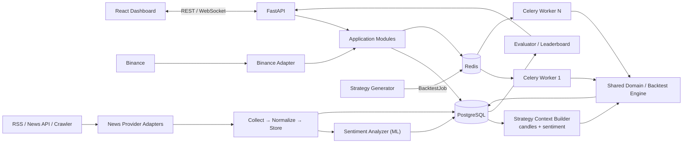
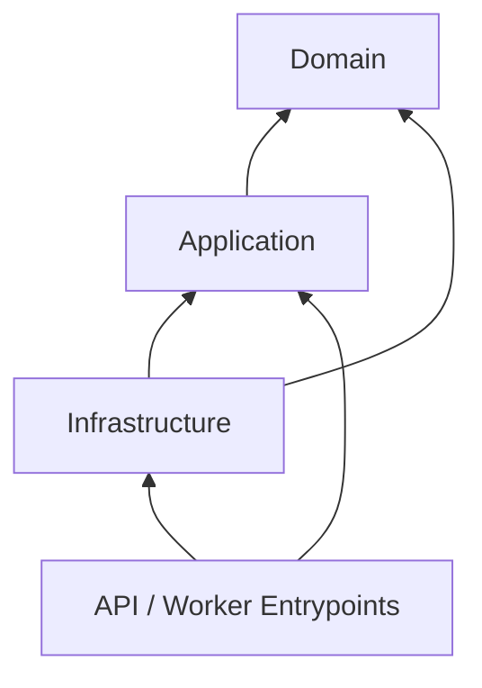

# Tech stack, project skeleton và Spec Kit flow

## 1. Quyết định kiến trúc

### Đề xuất chính

Xây dựng hệ thống theo hướng **modular monolith + background workers**:

- Một backend Python chứa các module nghiệp vụ với ranh giới rõ ràng.
- API server và Backtest Worker là hai process/entry point khác nhau nhưng dùng chung domain code.
- Queue cho phép tăng worker mà không sửa Generator, Evaluator hoặc Leaderboard.
- Frontend là một ứng dụng React độc lập.
- Chỉ tách thành microservices khi đã đo được nhu cầu triển khai hoặc scale độc lập.

Lựa chọn này thể hiện được các yêu cầu kiến trúc của đồ án nhưng không tạo gánh nặng vận hành quá sớm.



## 2. Tech stack đề xuất

### 2.1. Stack cốt lõi

| Phần | Công nghệ | Lý do chọn |
| --- | --- | --- |
| Frontend | React + TypeScript + Vite | Nhẹ, dễ phát triển dashboard, type-safe |
| UI | Tailwind CSS | Tạo layout dashboard nhanh, ít CSS tùy biến ban đầu |
| Chart | TradingView Lightweight Charts | Phù hợp candlestick và dữ liệu realtime |
| Server state | TanStack Query | Quản lý REST cache, loading và invalidation |
| UI state | Zustand hoặc React state | Dùng cho tối đa 4 chart và lựa chọn timeframe; chỉ thêm Zustand khi state dùng chung trở nên rõ ràng |
| Backend API | Python 3.12 + FastAPI | Hợp với data/ML, hỗ trợ REST và WebSocket, OpenAPI tự động |
| Validation | Pydantic | Hợp đồng request/event rõ ràng, kiểm tra dữ liệu tại boundary |
| ORM/migration | SQLAlchemy 2 + Alembic | Data access và schema migration ổn định |
| Database | PostgreSQL | Lưu candles, news, sentiment result, strategy definition/version, backtest run/result, trade và leaderboard |
| Queue/cache | Chưa chọn cho Feature 001–005; Redis là ứng viên của Feature 007 | Chỉ thêm sau khi ADR về broker/worker được chấp thuận |
| Job worker | Chưa chọn cho Feature 001–005; Celery là ứng viên của Feature 007 | Không tạo worker trước feature sở hữu queued execution |
| Numerical work | NumPy + Pandas | Dễ kiểm chứng công thức indicator và backtest; chỉ chuyển hotspot sang Polars/Numba sau profiling |
| HTTP/WebSocket client | httpx + websockets | Viết Binance Adapter bất đồng bộ, dễ test contract |
| Sentiment runtime | Hugging Face Transformers + PyTorch, pin model/revision | Chạy mô hình phân loại POSITIVE/NEUTRAL/NEGATIVE; chỉ tối ưu ONNX sau profiling |
| Package management | uv | Cài nhanh, lock dependency và cũng là công cụ Spec Kit khuyến nghị |
| Local runtime | Docker Compose | Chạy PostgreSQL, Redis, API, worker và frontend nhất quán |

### 2.2. Testing và chất lượng

| Loại | Công nghệ | Phạm vi |
| --- | --- | --- |
| Backend unit/contract | pytest + pytest-asyncio | Strategy, indicator, evaluator, market/news provider và sentiment analyzer contract |
| Backend integration | pytest + Testcontainers hoặc Docker Compose | PostgreSQL, Redis, news deduplication, sentiment persistence, job retry/idempotency |
| Frontend unit | Vitest + React Testing Library | Component và state transitions |
| End-to-end | Playwright | Chọn pair/timeframe, xem chart, chạy backtest/search, xem leaderboard, News/Sentiment và đưa SentimentStrategy vào search space |
| Load test | k6 | WebSocket fan-out và throughput của backtest API/job submission |
| Static checks | Ruff + mypy | Format/lint và type checking Python |
| Frontend checks | ESLint + TypeScript | Lint và type checking TypeScript |
| CI | GitHub Actions | Lint, test, build image và migration check |

### 2.3. Observability

Bản đầu chỉ cần:

- Log JSON có `request_id`, `run_id`, `job_id`, `strategy_id`, `strategy_version`; luồng News/Sentiment bổ sung `provider_id`, `news_id` và `model_version` khi có.
- Prometheus metrics từ API/worker: queue depth, job duration, success/failure/retry count, WebSocket clients, news collection status và sentiment analysis status/duration.
- Endpoint `/health/live` và `/health/ready`.
- Theo dõi trạng thái run: `queued`, `running`, `completed`, `failed`, `cancelled`.

Grafana và OpenTelemetry là bước tiếp theo, không phải điều kiện để bắt đầu MVP.

## 3. Các quyết định cần giữ đơn giản

- Không dùng Kubernetes trong bản đầu; Docker Compose đủ cho demo và kiểm thử kiến trúc.
- Không dùng Kafka khi Redis/Celery đã đáp ứng job queue của đồ án.
- Không tạo database riêng cho từng module.
- Không gọi Binance trực tiếp từ frontend.
- Không để strategy tự truy cập database, queue hoặc HTTP.
- Không tối ưu cho 100.000 backtests trước khi có benchmark baseline; thiết kế job boundary ngay từ đầu nhưng scale theo số đo.
- News/Sentiment thuộc MVP. Lát cắt tối thiểu phải có `Collect → Store → Analyze sentiment`, hiển thị News/Sentiment và đưa `NewsSentimentStrategy` vào search space.
- Lỗi News provider hoặc sentiment model phải được cô lập để chart và technical backtest vẫn hoạt động; candidate phụ thuộc sentiment phải fail/defer rõ ràng, không dùng dữ liệu giả.
- Không tách News hoặc Sentiment thành microservice riêng trong bản đầu; giữ boundary module/provider/analyzer rõ ràng trong modular monolith.
- Không tự huấn luyện sentiment model trong MVP; dùng model/revision được pin và cho phép thay analyzer qua contract.

## 4. Project skeleton

### Baseline đã review cho Feature 001–005

Skeleton dưới đây là baseline được dùng để setup repository ở giai đoạn hiện
tại. Nó là hợp nhất của `plan.md` và `tasks.md` thuộc Feature 001–005:

- Feature 001 sở hữu historical Market Data, database/Alembic và backend nền.
- Feature 002 sở hữu realtime delivery và frontend Market Chart.
- Feature 003 sở hữu Strategy Foundation; không tạo frontend hay worker.
- Feature 004 sở hữu Backtest và Evaluation; không tạo frontend hay worker.
- Feature 005 sở hữu Leaderboard backend và frontend visualization.
- Queue, Celery worker, Search, Composite, News và Sentiment thuộc Feature
  006–010; không được tạo sớm trong skeleton 001–005.
- Các model mở rộng dùng module riêng (`strategy_models.py`,
  `backtest_models.py`, `evaluation_models.py`, `leaderboard_models.py`) và
  import chung một SQLAlchemy `Base` từ `persistence/models.py`.

```text
crypto-strategy-lab/
├── backend/
│   ├── src/crypto_lab/
│   │   ├── api/{routes,schemas,websocket}/
│   │   ├── application/
│   │   │   ├── market_data/            # 001 + phần realtime dùng chung của 002
│   │   │   ├── chart_delivery/         # 002
│   │   │   ├── strategies/             # 003
│   │   │   ├── backtests/              # 004
│   │   │   ├── evaluations/            # 004
│   │   │   └── leaderboard/            # 005
│   │   ├── domain/
│   │   │   ├── market_data/            # 001 + selection contract của 002
│   │   │   ├── strategy/               # 003
│   │   │   ├── backtest/               # 004
│   │   │   ├── evaluation/             # 004
│   │   │   └── leaderboard/            # 005
│   │   ├── infrastructure/
│   │   │   ├── binance/                # historical adapter, 001
│   │   │   ├── market_data/            # realtime adapter, 002
│   │   │   ├── persistence/repositories/
│   │   │   └── observability/
│   │   └── bootstrap/                   # trusted Strategy registration, 003
│   ├── migrations/versions/
│   └── tests/{architecture,unit,contract,integration,performance,fixtures}/
├── frontend/
│   ├── src/
│   │   ├── app/{layouts,providers,routes}/
│   │   ├── features/
│   │   │   ├── market-chart/{api,realtime,components,hooks}/  # 002
│   │   │   └── leaderboard/{api,components,hooks}/             # 005
│   │   └── shared/{ui,charts,hooks,api,lib,types}/
│   └── tests/{market-chart,leaderboard}/
├── infra/
├── tests/{e2e,load}/
├── specs/001-historical-market-data/
├── specs/002-realtime-multi-chart/
├── specs/003-strategy-foundation/
├── specs/004-backtest-evaluation/
└── specs/005-leaderboard-visualization/
```

### Skeleton roadmap đầy đủ (chỉ tạo khi feature sở hữu bắt đầu)

Khối dưới đây mô tả đích dài hạn 001–010. Nó không phải danh sách thư mục cần
tạo ngay trong giai đoạn 001–005.

```text
crypto-strategy-lab/
├── .agents/
│   └── skills/                         # Spec Kit tạo cho Codex
├── .specify/
│   ├── memory/
│   │   └── constitution.md
│   ├── templates/
│   └── feature.json
├── specs/
│   ├── 001-historical-market-data/
│   │   ├── spec.md
│   │   ├── plan.md
│   │   ├── research.md
│   │   ├── data-model.md
│   │   ├── quickstart.md
│   │   ├── contracts/
│   │   └── tasks.md
│   └── ...
├── frontend/
│   ├── src/
│   │   ├── app/
│   │   │   ├── layouts/
│   │   │   ├── providers/
│   │   │   └── routes/
│   │   ├── features/
│   │   │   ├── market-chart/
│   │   │   │   ├── api/
│   │   │   │   ├── components/
│   │   │   │   ├── hooks/
│   │   │   │   └── types.ts
│   │   │   ├── strategy-builder/
│   │   │   │   ├── api/
│   │   │   │   ├── components/
│   │   │   │   └── hooks/
│   │   │   ├── backtest-runs/
│   │   │   ├── leaderboard/
│   │   │   └── news-sentiment/
│   │   ├── shared/
│   │   │   ├── ui/                    # Button, Card, Dialog, Select...
│   │   │   ├── charts/                # Chart primitives dùng bởi nhiều feature
│   │   │   ├── hooks/                 # useWebSocket, useDebounce...
│   │   │   ├── api/                   # HTTP client, query client, error mapping
│   │   │   ├── lib/                   # Formatter và utility thuần
│   │   │   └── types/                 # Kiểu dữ liệu thực sự dùng chung
│   │   └── main.tsx
│   ├── tests/
│   ├── package.json
│   └── vite.config.ts
├── backend/
│   ├── src/crypto_lab/
│   │   ├── api/
│   │   │   ├── routes/
│   │   │   ├── websocket/
│   │   │   └── dependencies.py
│   │   ├── application/
│   │   │   ├── market_data/
│   │   │   ├── strategies/
│   │   │   ├── backtests/
│   │   │   ├── evaluations/
│   │   │   ├── search/
│   │   │   ├── leaderboard/
│   │   │   ├── news_collection/
│   │   │   └── sentiment_analysis/
│   │   ├── domain/
│   │   │   ├── market_data/
│   │   │   │   ├── candle.py
│   │   │   │   └── timeframe.py
│   │   │   ├── strategy/
│   │   │   │   ├── protocol.py
│   │   │   │   ├── context.py
│   │   │   │   ├── definition.py
│   │   │   │   ├── signal.py
│   │   │   │   ├── registry.py
│   │   │   │   ├── composite.py
│   │   │   │   └── implementations/
│   │   │   │       ├── moving_average.py
│   │   │   │       ├── rsi.py
│   │   │   │       ├── bollinger.py
│   │   │   │       ├── support_resistance.py
│   │   │   │       └── news_sentiment.py
│   │   │   ├── news/
│   │   │   │   ├── item.py
│   │   │   │   └── provider.py
│   │   │   ├── sentiment/
│   │   │   │   ├── analyzer.py
│   │   │   │   ├── result.py
│   │   │   │   └── series.py
│   │   │   ├── backtest/
│   │   │   │   ├── engine.py
│   │   │   │   ├── portfolio.py
│   │   │   │   ├── trade.py
│   │   │   │   └── result.py
│   │   │   ├── evaluation/
│   │   │   │   ├── metrics.py
│   │   │   │   └── scoring.py
│   │   │   └── search/
│   │   │       ├── generator.py
│   │   │       └── random_search.py
│   │   ├── infrastructure/
│   │   │   ├── binance/
│   │   │   │   ├── rest_adapter.py
│   │   │   │   ├── websocket_adapter.py
│   │   │   │   └── mapper.py
│   │   │   ├── news_providers/
│   │   │   │   ├── rss_adapter.py
│   │   │   │   ├── api_adapter.py
│   │   │   │   └── mapper.py
│   │   │   ├── sentiment/
│   │   │   │   └── transformers_analyzer.py
│   │   │   ├── persistence/
│   │   │   │   ├── models.py
│   │   │   │   └── repositories/
│   │   │   ├── queue/
│   │   │   │   ├── celery_app.py
│   │   │   │   └── tasks.py
│   │   │   └── observability/
│   │   ├── worker.py                  # Worker entry point
│   │   ├── main.py                    # FastAPI entry point
│   │   └── settings.py
│   ├── tests/
│   │   ├── unit/
│   │   ├── contract/
│   │   ├── integration/
│   │   └── fixtures/
│   ├── migrations/
│   └── pyproject.toml
├── infra/
│   ├── compose.yaml
│   ├── prometheus/
│   └── grafana/
├── tests/
│   ├── e2e/
│   └── load/
├── docs/
├── .env.example
├── Makefile
└── README.md
```

### Quy tắc tổ chức frontend component

Không đặt mọi component vào một thư mục `components/` toàn cục. Component được chia theo mức độ sở hữu:

| Vị trí | Chứa gì | Ví dụ |
| --- | --- | --- |
| `shared/ui/` | UI primitive không biết nghiệp vụ crypto | `Button`, `Card`, `Dialog`, `Select`, `Table`, `Badge`, `Spinner` |
| `shared/charts/` | Chart primitive được ít nhất hai feature sử dụng | `ChartContainer`, `ChartLegend`, `TimeRangeSelector` |
| `shared/hooks/` | Hook kỹ thuật, không thuộc riêng một feature | `useWebSocket`, `useDebounce`, `useResizeObserver` |
| `shared/api/` | Cấu hình giao tiếp dùng chung | HTTP client, TanStack Query client, error mapping |
| `shared/lib/` | Hàm thuần và formatter dùng chung | `formatDate`, `formatNumber`, assertions |
| `features/<feature>/components/` | Component chứa ngữ nghĩa và hành vi của feature | `CandlestickChart`, `StrategyParameterForm`, `BacktestProgress`, `LeaderboardTable` |

Ví dụ phân loại:

```text
Button                   -> shared/ui
Select                   -> shared/ui
ChartContainer           -> shared/charts
CandlestickChart         -> features/market-chart/components
StrategyParameterForm    -> features/strategy-builder/components
BacktestProgress         -> features/backtest-runs/components
LeaderboardTable         -> features/leaderboard/components
```

Chỉ chuyển một component từ feature vào `shared` khi thỏa cả ba điều kiện:

1. Có ít nhất hai feature thực sự sử dụng.
2. Public API của component không chứa luật nghiệp vụ riêng của feature nguồn.
3. Việc dùng chung làm giảm lặp code mà không tạo một component có quá nhiều prop hoặc nhánh điều kiện.

Quy tắc này tránh hai cực đoan: copy component giữa các feature và tạo abstraction dùng chung quá sớm. `shared` là phần ổn định, còn component nghiệp vụ mặc định ở cùng feature sở hữu nó.

### Quy tắc phụ thuộc



- `domain` không import FastAPI, SQLAlchemy, Celery, Redis hoặc Binance SDK.
- `application` điều phối use case và phụ thuộc vào protocol/interface của repository, queue, market/news provider và sentiment analyzer.
- `infrastructure` cài đặt các interface đó.
- `api` và `worker` chỉ là composition root/entry point.

## 5. Domain contract tối thiểu

```python
@dataclass(frozen=True)
class StrategyContext:
    candles: Sequence[Candle]
    sentiment: Sequence[SentimentPoint] = ()


class Strategy(Protocol):
    name: str
    version: str

    def generate_signals(
        self,
        context: StrategyContext,
        parameters: Mapping[str, object],
    ) -> Sequence[Signal]: ...
```

`StrategyContext` bám theo contract `analyze(context)` của PDF: context có thể chứa price, volume, candles, timeframe, indicators, market state và sentiment. Bản MVP tối thiểu cần candles và sentiment; mỗi strategy chỉ đọc dữ liệu nó cần. Context là snapshot immutable, được căn chỉnh theo timestamp và chỉ chứa dữ liệu hợp lệ tại thời điểm tạo signal để tránh look-ahead. Technical strategy có thể bỏ qua sentiment; `NewsSentimentStrategy` đọc sentiment đã tổng hợp theo coin/time window. Strategy không tự gọi database, provider hoặc model.

Mỗi `StrategyDefinition` là immutable và tối thiểu có `strategy_id`, `strategy_type`, `strategy_version`, `parameters`. Composite lưu chính xác version của từng member. Khi logic hoặc parameters đổi, tạo version mới thay vì overwrite version cũ.

```text
BacktestJob
- schema_version
- job_id
- run_id
- strategy_id
- strategy_version
- strategy_definition
- dataset_id
- sentiment_dataset_id (optional)
- execution_config
- attempt

BacktestResult
- schema_version
- job_id
- run_id
- strategy_id
- strategy_version
- dataset_id
- sentiment_dataset_id (optional)
- sentiment_model_version (optional)
- trades
- equity_curve
- total_return
- win_rate
- max_drawdown
- profit_factor
- sharpe_ratio
- duration_ms
```

`BacktestResult` phải giữ provenance trực tiếp tới immutable strategy version và mọi input dataset/model version đã dùng; không chỉ dựa vào tên strategy hoặc trạng thái registry hiện tại. Các schema trao đổi giữa API, queue và worker có `schema_version`. Kết quả được ghi idempotent theo `job_id`, và historical result không bị overwrite khi strategy/model có version mới.

## 6. Chia roadmap thành các Spec Kit feature

Không nên dùng một lần `$speckit-specify` cho toàn bộ đồ án. Mỗi feature phải tạo ra một lát cắt có thể demo và kiểm thử độc lập.

| Thứ tự | Feature | Kết quả demo |
| --- | --- | --- |
| 001 | Historical market data | Tải, chuẩn hóa, lưu và tái sử dụng immutable Candle Dataset qua backend API |
| 002 | Realtime multi-timeframe dashboard | Tối đa 4 chart, đổi timeframe độc lập, tự reconnect WebSocket |
| 003 | Strategy plugin foundation | Đăng ký MA/RSI; thêm strategy mới không sửa Backtester |
| 004 | Deterministic backtest + evaluation | Chạy một strategy và sinh trades, equity curve, metrics |
| 005 | Leaderboard + visualization | Xếp hạng Top-K và vẽ signal/trade trên chart |
| 006 | Composite strategy | Majority vote/weighted rule với cấu hình được lưu |
| 007 | Random search + queued workers | Sinh candidate, queue job, scale 1 -> 4 worker, retry an toàn |
| 008 | Continuous strategy loop | Start/stop/resume run, progress và observability |
| 009 | News provider abstraction | Thu thập và chuẩn hóa NewsItem từ provider thay thế được |
| 010 | Sentiment strategy | Sentiment pipeline và dùng sentiment như một Strategy |

Mốc MVP bắt buộc gồm feature 001-007 và 009-010. Feature 009-010 không phải phần mở rộng tùy chọn: phải chứng minh `Collect → Store → Analyze sentiment`, hiển thị News/Sentiment và chạy được `NewsSentimentStrategy` trong search space qua cùng pipeline Backtest/Evaluate/Leaderboard. Normalize/deduplicate, provider abstraction và model revision là các quyết định thiết kế để đáp ứng khả năng thay nguồn, maintainability và reproducibility.

Feature 008 có thể đi sau lát cắt MVP nếu `start/stop/resume` chưa cần cho demo tối thiểu; Random Search ở feature 007 vẫn phải có giới hạn/stop condition rõ ràng.

## 7. Cài Spec Kit cho Codex

Tại thời điểm viết tài liệu, release ổn định mới nhất là `v0.16.2`. Nên pin version để các thành viên nhận cùng template và hành vi.

```bash
uv tool install specify-cli \
  --from git+https://github.com/github/spec-kit.git@v0.16.2

specify init . --integration codex
specify integration list
```

Sau `init`, Codex dùng các skill trong `.agents/skills/` và gọi theo dạng `$speckit-constitution`, `$speckit-specify`, v.v.

Trước khi chạy `init` trong repository hiện có:

1. Khởi tạo Git nếu chưa có.
2. Commit các tài liệu đề bài và bài phân tích hiện tại.
3. Chạy `specify init . --integration codex`.
4. Kiểm tra diff trước khi commit scaffold Spec Kit.

## 8. Spec Kit flow được đề xuất

### Bước 0 - Constitution, chỉ làm một lần

Gọi:

```text
$speckit-constitution
```

Prompt đề xuất:

```text
Crypto Strategy Lab follows these non-negotiable principles:
1. Domain logic is framework-independent; strategy, backtest and evaluation code must not depend on FastAPI, Celery, Redis, SQLAlchemy or Binance payloads.
2. Stable contracts and explicit boundaries: market providers, strategies, search generators, repositories and job queues are replaceable through protocols; contract changes are versioned.
3. Test-first for domain behavior. Each strategy uses deterministic candle fixtures. Backtests with the same input and seed must produce identical results.
4. Architecture fitness tests must prove: adding MACD does not modify Backtester/Evaluator/Leaderboard; switching Random Search to another generator does not modify Backtester; scaling workers does not modify producers or consumers.
5. Reliability: jobs use late acknowledgement, bounded retry and idempotent result writes by job_id. No silent data loss.
6. Observability: every run/job has correlation IDs and exposes progress, duration, failures and retries.
7. Simplicity: begin as a modular monolith plus worker processes. Kafka, Kubernetes and new deployable services require measured evidence and an ADR.
8. Security and data integrity: secrets stay outside source control; all external payloads are validated; this system is for analysis/backtesting and must not execute real trades.
9. News and Sentiment are mandatory MVP capabilities: collect, normalize/store, analyze and expose sentiment to a NewsSentimentStrategy through the common StrategyContext. News/provider/model failures remain isolated from market charts and technical backtests.
10. Strategy definitions are immutable and versioned. Every experiment/result retains the exact strategy version and input provenance used; a new version never overwrites historical results.
11. Every feature has independent acceptance criteria, contract tests where boundaries change, and an executable quickstart demo.
```

Review kỹ `.specify/memory/constitution.md` và sửa câu chữ trước khi chuyển sang feature đầu tiên.

### Bước 1 - Specify từng feature

Gọi:

```text
$speckit-specify
```

Không đưa framework hoặc database vào prompt này. Chỉ mô tả **what/why**, user story, constraint và success criteria.

Prompt cho feature 001:

```text
Build the first vertical slice of Crypto Strategy Lab. A user selects BTCUSDT and a supported timeframe, requests a historical date range, and sees a candlestick chart. Market data must be normalized so the UI never depends on Binance response fields. Duplicate candles must not be stored. Missing or invalid ranges produce actionable errors. Success means the same stored dataset can later be reused by backtests without another Binance request. Exclude realtime streaming, strategies, news and live trading from this feature.
```

Việc feature 001 chưa triển khai News chỉ là phân kỳ theo vertical slice; không được diễn giải thành loại News/Sentiment khỏi MVP toàn dự án.

### Bước 2 - Clarify trước khi chọn công nghệ chi tiết

Gọi:

```text
$speckit-clarify Focus on data freshness, supported intervals, pagination/rate limits, duplicate candles, gaps, timezone, error behavior and measurable acceptance criteria.
```

Không chấp nhận spec còn các từ mơ hồ như “nhanh”, “ổn định”, “dễ mở rộng” nếu chưa có cách kiểm chứng.

### Bước 3 - Plan

Gọi:

```text
$speckit-plan
```

Prompt nền cho feature 001:

```text
Use Python 3.12, FastAPI, Pydantic, SQLAlchemy 2, Alembic and PostgreSQL for the backend; React, TypeScript, Vite and TradingView Lightweight Charts for the frontend. Keep a modular-monolith boundary with domain/application/infrastructure/API layers. Implement Binance behind a MarketDataProvider protocol and map external payloads to the internal Candle model. Use pytest contract and integration tests plus Vitest for the chart component. Use Docker Compose for local PostgreSQL and application startup. Produce an OpenAPI contract, data model, research decisions and an executable quickstart.
```

Plan phải trả lời tối thiểu:

- Data model và uniqueness của candle.
- REST/WebSocket contract liên quan đến feature.
- Failure modes và timeout/retry.
- Test strategy và acceptance mapping.
- Cách chạy demo từ môi trường sạch.
- Những lựa chọn bị loại và lý do.

### Bước 4 - Checklist

```text
$speckit-checklist Check requirement completeness, measurable acceptance criteria, provider isolation, data integrity, failure handling, observability and testability.
```

Checklist kiểm tra chất lượng **requirements**, không thay thế test code.

### Bước 5 - Tasks

```text
$speckit-tasks
```

Review `tasks.md` để bảo đảm:

- Task được sắp theo dependency và user story.
- Test/contract task đứng trước implementation task tương ứng.
- Mỗi task có đường dẫn file rõ ràng.
- Task song song `[P]` thật sự không ghi vào cùng file/module.
- Có task migration, seed/fixture, docs và quickstart verification.
- Không lẫn feature 002+ vào feature 001.

### Bước 6 - Analyze trước khi code

```text
$speckit-analyze
```

Chỉ implement khi:

- Mỗi functional requirement ánh xạ được tới task và acceptance scenario.
- Không có contract mâu thuẫn giữa `spec.md`, `plan.md`, `data-model.md` và `contracts/`.
- Không vi phạm constitution mà chưa ghi Complexity/ADR justification.

### Bước 7 - Implement theo lát cắt nhỏ

```text
$speckit-implement
```

Không giao toàn bộ feature cho một lần chạy không kiểm soát. Nên dừng ở các gate:

1. Contract + failing tests.
2. Domain implementation.
3. Infrastructure adapter/database.
4. API/UI integration.
5. Quickstart + acceptance test.

Sau mỗi gate: chạy test, review diff và commit nhỏ.

### Bước 8 - Converge

```text
$speckit-converge
```

Lệnh này đối chiếu codebase với spec/plan/tasks và bổ sung phần còn thiếu. Sau đó chạy lại test suite và quickstart từ môi trường sạch trước khi đóng feature.

### Bước 9 - Lặp lại cho feature tiếp theo

Với mỗi feature 002-010, lặp:

```text
$speckit-specify
$speckit-clarify
$speckit-plan
$speckit-checklist
$speckit-tasks
$speckit-analyze
$speckit-implement
$speckit-converge
```

Không chạy lại constitution trừ khi nguyên tắc cấp dự án thật sự thay đổi. Nếu sửa constitution, phải ghi lý do, phạm vi ảnh hưởng và migration plan cho các spec hiện có.

## 9. Prompt trọng điểm cho các feature sau

### Feature 003 - Strategy plugin foundation

```text
Allow a developer to add a strategy by implementing one stable Strategy contract and registering it. Ship MA and RSI as reference implementations. The Backtester, Evaluator and Leaderboard must not contain branches for concrete strategy names. A strategy receives an immutable StrategyContext that can contain candles, timeframe, indicators, market state and sentiment; each implementation reads only the fields it needs and returns timestamped BUY/SELL/HOLD signals. Every StrategyDefinition has an immutable version, and signals/results retain that exact version. Invalid parameters fail before execution. Prove extensibility with a test-only example strategy. Exclude composite strategies and distributed workers from this feature, but keep the contract compatible with a later NewsSentimentStrategy.
```

### Feature 004 - Backtest + evaluation

```text
Allow a user to run one immutable, versioned StrategyDefinition against a fixed historical context with explicit initial capital, fees and slippage. Produce deterministic trades, equity curve and metrics including total return, win rate, trade count, maximum drawdown, profit factor and Sharpe ratio. Prevent look-ahead bias and define position-sizing rules. The result must retain the exact strategy version, dataset/context identity and execution configuration so an old experiment is never reinterpreted using the current registry version. The same input and seed must produce the same result. Exclude search and distributed execution.
```

### Feature 007 - Queued search workers

```text
Allow a user to launch a bounded random search that generates independent BacktestJobs and reports run progress. Jobs are consumed by one or more workers. Scaling from one to four workers must require deployment configuration only. If a worker terminates mid-job, the job becomes eligible for retry. At-least-once delivery must not create duplicate results because writes are idempotent by job_id. A permanently failing job has bounded retries and a visible terminal state. The leaderboard updates incrementally. Exclude Kubernetes and Kafka.
```

Plan prompt bổ sung cho feature 007:

```text
Use Redis as Celery broker, Celery prefork workers for CPU-bound backtests, PostgreSQL as the durable source of run/job/result state, late acknowledgement, visibility timeout, bounded exponential retry and a unique job_id constraint. Benchmark 1 versus 4 workers with a fixed workload; require identical result sets and report throughput, p95 job duration, retries and failures.
```

### Feature 009 - News provider abstraction

```text
Build the mandatory MVP News pipeline. Collect coin/pair-related articles through a replaceable NewsProvider contract, normalize them to one NewsItem format, deduplicate and store them, and expose collection status and query APIs. The UI can browse BTC news with source and published time. A provider failure must not stop market charts or technical backtests. Prove replaceability with at least one alternate/fake provider contract test. This feature stops after durable normalized news; sentiment analysis is implemented in feature 010.
```

### Feature 010 - Sentiment analysis and strategy integration

```text
Analyze stored NewsItems with a replaceable machine-learning SentimentAnalyzer and persist POSITIVE, NEUTRAL or NEGATIVE plus score. Show the sentiment distribution for a selected coin/time window. Add a versioned NewsSentimentStrategy that consumes timestamp-aligned sentiment through the common StrategyContext, can run alone or in a Composite, and can be added to the Random Search space without sentiment-specific branches in Backtester, Evaluator, Leaderboard or Visualization. The MVP demo must run combinations such as MA + RSI + Sentiment and MA + Support/Resistance + Sentiment. Model/analyzer failure leaves stored news intact and does not stop market charts or technical backtests.
```

## 10. Definition of Done cho mỗi feature

- Spec không còn điểm mơ hồ ảnh hưởng thiết kế.
- Constitution, spec, plan, contracts và tasks nhất quán.
- Acceptance scenarios có automated test hoặc quickstart verification tương ứng.
- Unit, contract, integration và relevant E2E tests đều qua.
- Migration chạy được trên database rỗng và nâng cấp được từ version trước.
- Mọi backtest/leaderboard entry truy nguyên được đúng immutable `strategy_version`; thay đổi strategy không overwrite kết quả cũ.
- Trước khi chốt MVP, acceptance flow chứng minh `Collect → Store → Analyze sentiment` và `NewsSentimentStrategy` chạy trong search/composite pipeline chung.
- Không commit secret; `.env.example` đủ biến và mô tả.
- Logs/metrics cần thiết xuất hiện trong happy path và failure path.
- `README`/quickstart chạy được từ clone sạch.
- Đã chạy `$speckit-converge` và xử lý các task còn thiếu.
- Có ADR nếu feature thêm service, broker, database hoặc abstraction lớn mới.

## 11. Các mốc demo nên chốt

### Demo 1 - Market data

BTCUSDT 5m được tải, chuẩn hóa, lưu và hiển thị; frontend không biết schema Binance.

### Demo 2 - Extensibility

Thêm `MACDStrategy` chỉ bằng implementation + registration + tests; Backtester/Evaluator/Leaderboard không đổi.

### Demo 3 - Scale và failure

Cùng workload chạy với 1 và 4 worker; kết quả giống nhau, throughput tăng; kill một worker không làm mất hoặc nhân đôi job.

### Demo 4 - Replaceability

Thay `RandomSearchGenerator` bằng generator giả trong contract test hoặc Genetic Search ở feature sau; Backtester không đổi.

### Demo 5 - News, Sentiment và Strategy version

Thu thập và lưu BTC News, hiển thị phân bố Positive/Neutral/Negative, thêm `NewsSentimentStrategy` vào search space rồi chạy `MA + RSI + Sentiment`. Mở một kết quả cũ để chứng minh nó vẫn trỏ đúng strategy version đã dùng sau khi tạo version mới.

Các demo này biến architectural drivers thành bằng chứng kiểm chứng được, thay vì chỉ trình bày sơ đồ.

## 12. Tài liệu chính thức

- [GitHub Spec Kit](https://github.com/github/spec-kit)
- [Spec Kit Quick Start](https://github.github.io/spec-kit/quickstart.html)
- [Supported integrations](https://github.github.io/spec-kit/reference/integrations.html)
- [Spec-Driven Development methodology](https://github.com/github/spec-kit/blob/main/spec-driven.md)
