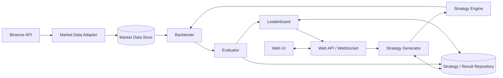
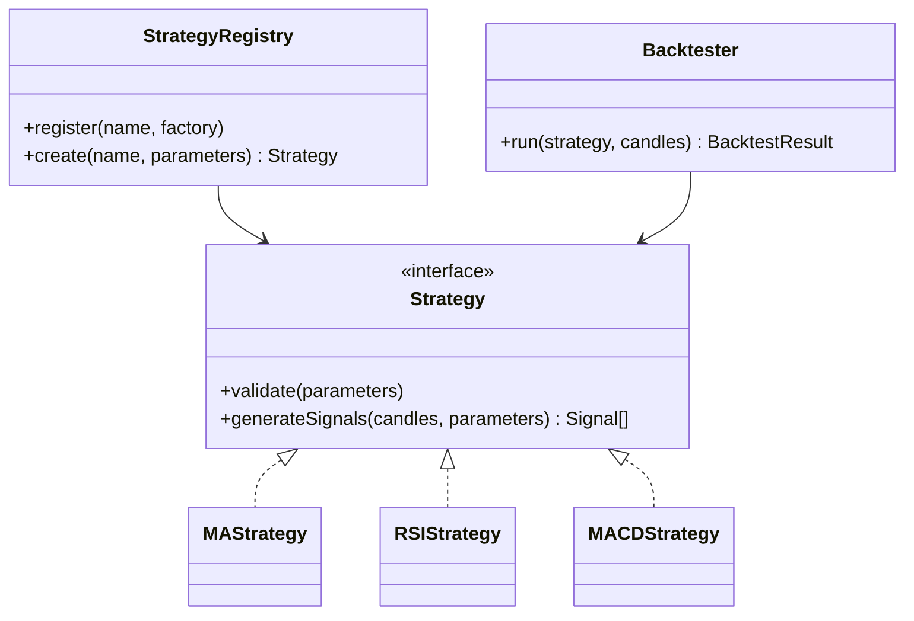
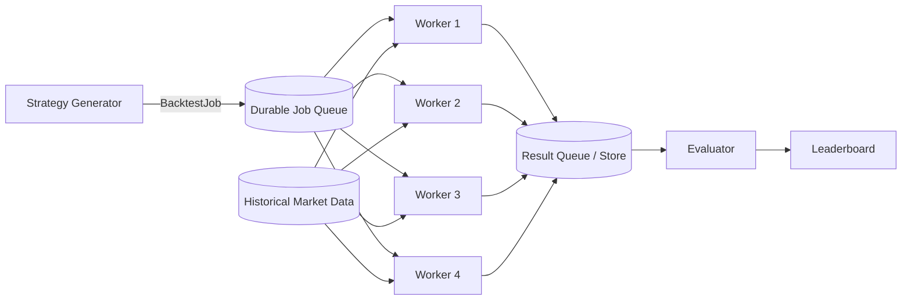

# Software Architecture - 11/08/2026

Họ tên: Nguyễn Hoàng Phi Hùng\
MSSV: 23127194

## Câu 1 - Chia hệ thống như thế nào? (2 điểm)

### 1.1. Các module/component

| Thành phần              | Trách nhiệm chính                                                                                | Không nên chịu trách nhiệm        |
| ----------------------- | ------------------------------------------------------------------------------------------------ | --------------------------------- |
| **Market Data Adapter** | Gọi Binance, xử lý xác thực/rate limit, chuyển dữ liệu Binance thành `Candle` chuẩn của hệ thống | Tính strategy, backtest, xếp hạng |
| **Market Data Store**   | Lưu và đọc dữ liệu nến lịch sử đã chuẩn hóa                                                      | Biết cấu trúc API Binance         |
| **Strategy Engine**     | Chạy MA, RSI, Bollinger, Support/Resistance... và tạo tín hiệu                                   | Gọi Binance, ghi leaderboard      |
| **Strategy Generator**  | Sinh các strategy candidate và bộ tham số để thử                                                 | Thực hiện backtest                |
| **Backtester**          | Mô phỏng giao dịch của một strategy trên dữ liệu lịch sử, tạo `BacktestResult`                   | Quyết định thứ hạng               |
| **Evaluator**           | Tính profit, win rate, max drawdown và score từ kết quả backtest                                 | Hiển thị giao diện                |
| **Leaderboard**         | Sắp xếp, truy vấn và công bố các kết quả tốt nhất                                                | Chạy strategy/backtest            |
| **Repository**          | Lưu strategy, job, kết quả và leaderboard vào database                                           | Chứa luật nghiệp vụ của strategy  |
| **Web API / WebSocket** | Nhận yêu cầu từ Web và trả dữ liệu/tín hiệu/trạng thái                                           | Tự tính indicator hoặc backtest   |

### 1.2. Sơ đồ đơn giản



Các mũi tên thể hiện phụ thuộc hoặc luồng dữ liệu chính. Database có thể là một database vật lý, nhưng mỗi module chỉ truy cập dữ liệu thông qua repository/hợp đồng thuộc trách nhiệm của nó.

### 1.3. Vì sao tốt hơn một `TradingService` làm tất cả?

* **Mỗi nơi có một lý do thay đổi rõ ràng.** Binance đổi API thì sửa `Market Data Adapter`; công thức chấm điểm đổi thì sửa `Evaluator`.

* **Giảm ảnh hưởng dây chuyền.** `Backtester` chỉ nhận `Candle[]` chuẩn nên không cần biết Binance trả JSON như thế nào.

* **Dễ kiểm thử.** Có thể đưa dữ liệu nến giả vào strategy hoặc backtester mà không cần mạng, database hay giao diện web.

* **Dễ thay thế và mở rộng.** Có thể thêm nguồn dữ liệu khác, strategy khác hoặc nhiều worker mà vẫn giữ nguyên hợp đồng giữa các module.

* **Dễ tìm lỗi.** Lỗi lấy dữ liệu, lỗi tín hiệu và lỗi xếp hạng nằm ở các ranh giới khác nhau, thay vì trộn trong một lớp lớn.

**Khi Binance thay đổi API:** chỉ `Market Data Adapter` và các kiểm thử adapter cần đổi. Kiểu `Candle` nội bộ cùng `Strategy Engine`, `Backtester`, `Evaluator`, `Leaderboard` và Web không nên đổi, miễn là adapter vẫn trả đúng hợp đồng dữ liệu chuẩn.

***

## Câu 2 - Ngày mai thêm MACD thì sao? (2 điểm)

### 2.1. Hợp đồng chung cho mọi strategy

```text
Strategy
  id/name
  validate(parameters)
  generateSignals(candles, parameters) -> Signal[]

Signal
  timestamp
  action: BUY | SELL | HOLD
  strength/reason (tùy chọn)
```

MA, RSI, Bollinger, Support/Resistance và MACD đều cài đặt hợp đồng `Strategy`. `Backtester` chỉ làm việc với `Strategy`, `Candle[]` và `Signal[]`, không chứa các câu lệnh kiểu `if strategy == "MA"`.



### 2.2. Các bước thêm MACD

1. Tạo `MACDStrategy` thực hiện đúng hợp đồng `Strategy`.
2. Khai báo tham số riêng, ví dụ `fastPeriod`, `slowPeriod`, `signalPeriod`, và kiểm tra tính hợp lệ của chúng.
3. Đăng ký strategy mới vào `StrategyRegistry` hoặc cấu hình plugin.
4. Thêm kiểm thử cho công thức và tín hiệu MACD.
5. Không sửa `Backtester`, `Evaluator` và `Leaderboard` vì đầu vào/đầu ra chung không đổi.

Điều giúp giảm ảnh hưởng code cũ là **phụ thuộc vào abstraction/hợp đồng ổn định thay vì phụ thuộc vào từng strategy cụ thể**. Registry chịu trách nhiệm tìm strategy theo tên; tính toán đặc thù nằm trong lớp MACD. Đây là bản chất của nguyên tắc mở rộng mà không phải sửa các thành phần đã ổn định.

Một dấu hiệu thiết kế chưa tốt là mỗi lần thêm strategy phải thêm `if/else` hoặc `switch` trong Backtester, Evaluator và API. Khi đó kiến thức về các strategy đã bị rải ở quá nhiều nơi.

***

## Câu 3 - Từ 100 lên 100.000 backtests (3 điểm)

### 3.1. Kiến trúc xử lý theo job



Mỗi `BacktestJob` tối thiểu có:

```text
jobId, runId, strategyType, parameters, datasetId, timeframe, dateRange, attempt
```

Luồng xử lý:

1. Generator tạo candidate và đẩy từng `BacktestJob` nhỏ, độc lập vào queue.
2. Worker rảnh lấy một job, đọc dataset dùng chung, tạo strategy từ registry và chạy backtest.
3. Worker ghi kết quả gắn với `jobId`, sau đó mới xác nhận hoàn thành job.
4. Evaluator đọc kết quả, tính score; Leaderboard cập nhật thứ hạng dần, không phải chờ cả 100.000 job hoàn tất.
5. Hệ thống theo dõi số job `queued/running/succeeded/failed` theo `runId` để Web hiển thị tiến độ.

Queue ở đây là một vai trò kiến trúc. Bản đầu có thể dùng database job table hoặc Redis queue; không bắt buộc Kafka.

### 3.2. a) Tăng từ 1 lên 4 worker

Chỉ thay đổi cấu hình triển khai/số instance của `Backtest Worker`. Generator, định dạng `BacktestJob`, queue, thuật toán backtest, Evaluator, Leaderboard và Web API **không nên phải sửa code**.

Điều kiện để làm được:

* Mỗi job độc lập, không phụ thuộc biến nhớ của worker khác.

* Queue giao một job cho một worker tại một thời điểm.

* Worker không giữ trạng thái nghiệp vụ quan trọng chỉ trong RAM.

* Kết quả được ghi theo `jobId` duy nhất và thao tác ghi có tính idempotent.

Có thể 4 worker không nhanh đúng 4 lần do giới hạn CPU, I/O hoặc database, nhưng việc tăng worker vẫn không được làm thay đổi kết quả của cùng bộ input.

### 3.3. b) Worker lỗi giữa lúc backtest

1. Worker chỉ `ack` sau khi đã ghi kết quả thành công.
2. Khi worker chết hoặc quá `visibility timeout/lease`, queue đưa job chưa được `ack` trở lại trạng thái chờ.
3. Job được retry ở worker khác, với số lần thử tăng lên.
4. Ghi kết quả bằng khóa duy nhất `jobId`; nếu job bị giao ít nhất hai lần thì lần ghi lặp không tạo hai kết quả hay hai lần cộng điểm.
5. Dùng retry có giới hạn, ví dụ tối đa 3 lần và có khoảng chờ tăng dần cho lỗi tạm thời.
6. Sau giới hạn, chuyển job sang `failed/dead-letter`, lưu nguyên nhân và cảnh báo để điều tra hoặc chạy lại thủ công.

Cách này chọn cơ chế **at-least-once + idempotency**: chấp nhận một job có thể được giao lại, nhưng bảo đảm trạng thái cuối không bị nhân đôi. Không nên đánh dấu job hoàn thành trước khi kết quả được lưu vì worker chết sau đó sẽ làm mất job.

***

## Câu 4 - Kiến trúc có thật sự tốt không? (3 điểm)

Chọn hai tình huống **A - Thêm MACD Strategy** và **D - Tăng Backtest Worker từ 1 lên 4**. Hai phép thử này trực tiếp kiểm chứng hai thuộc tính quan trọng nhất của bài: khả năng mở rộng chức năng và khả năng mở rộng tải.

### Tình huống A - Thêm MACD Strategy

#### 1. Sẽ thử điều gì?

* Ghi lại danh sách file/module phải sửa khi thêm MACD.

* Cài đặt `MACDStrategy`, đăng ký vào registry và chạy cùng một bộ dữ liệu qua luồng thật: tạo strategy -> backtest -> evaluate -> leaderboard.

* Chạy lại toàn bộ regression test của MA, RSI, Bollinger và Support/Resistance.

* Kiểm tra Web có thể nhận strategy mới từ metadata/registry mà không thêm logic MACD vào Backtester, Evaluator và Leaderboard.

#### 2. Kết quả nào chứng minh kiến trúc tốt?

* Chỉ thêm code MACD, cấu hình đăng ký, kiểm thử và phần metadata hiển thị cần thiết.

* `Backtester`, `Evaluator` và `Leaderboard` không đổi code nhưng vẫn xử lý kết quả MACD đúng định dạng.

* Các strategy cũ vẫn cho cùng kết quả; toàn bộ regression test qua.

* MACD xuất hiện trên leaderboard và có đầy đủ metric như các strategy khác.

#### 3. Khi nào kết luận kiến trúc có vấn đề?

* Phải thêm nhánh `if/switch MACD` ở nhiều module.

* Thay đổi MACD làm hỏng MA/RSI hoặc bắt buộc sửa schema kết quả chung dù không có nhu cầu nghiệp vụ mới.

* Backtester biết công thức MACD, hoặc Leaderboard phải biết từng loại strategy mới có thể xếp hạng.

* Số module bị sửa lớn và không tương xứng với phạm vi yêu cầu.

### Tình huống D - Tăng Backtest Worker từ 1 lên 4

#### 1. Sẽ thử điều gì?

* Chuẩn bị cùng một workload cố định, ví dụ 10.000 job, cùng dataset và cấu hình máy có kiểm soát.

* Chạy lần lượt với 1 worker và 4 worker; đo tổng thời gian, throughput, CPU/RAM, độ dài queue và số job thành công/thất bại.

* So sánh tập kết quả giữa hai lần chạy bằng `jobId` để bảo đảm không mất hoặc trùng kết quả.

* Trong lần chạy 4 worker, chủ động dừng một worker giữa job để kiểm tra retry và khôi phục.

#### 2. Kết quả nào chứng minh kiến trúc tốt?

* Chỉ đổi số instance/cấu hình worker; các module khác không sửa code.

* Throughput tăng rõ rệt, ví dụ đạt ít nhất khoảng 3 lần với 4 worker trong môi trường chưa nghẽn tài nguyên.

* 100% job cuối cùng có trạng thái rõ ràng; không mất job, không có hai kết quả cho cùng `jobId`.

* Kết quả tính toán của 1 và 4 worker giống nhau với cùng input.

* Khi một worker bị dừng, job hết lease được worker khác thực hiện lại và toàn bộ run vẫn hoàn tất.

#### 3. Khi nào kết luận kiến trúc có vấn đề?

* Phải sửa Generator, Evaluator hoặc Leaderboard mới chạy được 4 worker.

* Tăng worker nhưng throughput gần như không tăng do queue/database/khóa dùng chung trở thành nút thắt nghiêm trọng.

* Xuất hiện race condition, job bị mất, kết quả trùng lặp hoặc leaderboard thay đổi không xác định.

* Một worker hỏng làm cả run dừng hoặc job kẹt vĩnh viễn ở trạng thái `running`.

* Kết quả phụ thuộc vào thứ tự worker xử lý dù input không đổi.

***

## Kết luận

Kiến trúc đề xuất tách hệ thống theo trách nhiệm và giữ hợp đồng giữa các module ổn định. Thay đổi nguồn Binance được cô lập ở adapter; thêm MACD chỉ mở rộng Strategy Engine; tăng số lượng backtest được giải quyết bằng queue và các worker độc lập. Chất lượng kiến trúc không được chứng minh bằng độ đẹp của sơ đồ mà bằng các phép thử thay đổi: phạm vi code phải sửa nhỏ, kết quả cũ không bị phá vỡ, tải tăng được xử lý tốt hơn và lỗi worker không làm mất hoặc nhân đôi công việc.
