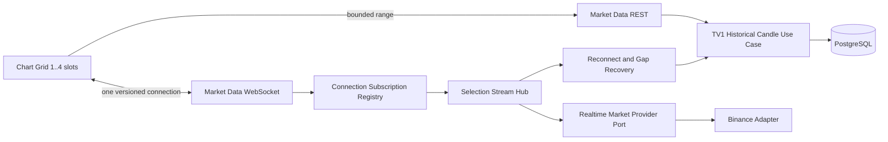

# Implementation Plan: Realtime Multi-Chart Dashboard

**Branch**: `002-realtime-multi-chart` | **Date**: 2026-08-13 | **Spec**: [spec.md](spec.md)

**Input**: Feature specification from `/specs/002-realtime-multi-chart/spec.md`

## Summary

Build the TV2 vertical slice that bootstraps bounded historical candles from the TV1 market-data contract, multiplexes provider-neutral realtime candle updates through one versioned backend WebSocket connection, and renders one to four isolated chart slots. The backend owns provider validation, subscription reference counting, candle ordering, reconnect, and gap recovery. The React feature owns slot layout, viewport isolation, connection feedback, and accessible controls. TV2 does not calculate strategies or overlays and does not introduce a durable queue or new database tables.

## Technical Context

**Language/Version**: Python 3.12; TypeScript 5 on Node.js active LTS

**Primary Dependencies**: FastAPI, Pydantic, SQLAlchemy 2, httpx, websockets; React 19, Vite, TanStack Query, TradingView Lightweight Charts, Tailwind CSS

**Storage**: PostgreSQL 16 through the TV1 Candle repository for historical bootstrap and gap backfill; chart-slot and subscription state are ephemeral

**Testing**: pytest and pytest-asyncio; real PostgreSQL/provider-stub integration tests through Testcontainers or Docker Compose; Vitest and React Testing Library; Playwright; k6 for realtime propagation and four-slot soak checks

**Target Platform**: Linux containers for API; evergreen desktop and mobile web browsers for the dashboard

**Project Type**: Monorepo web application with a modular-monolith backend and separate React frontend

**Performance Goals**: p95 accepted candle update visible within 1 second of backend ingestion; four active slots for 30 minutes without duplicate identity, time regression, orphan subscription, or full-dashboard rerender

**Constraints**: one dashboard-level pair in MVP; one to four slots; provider-neutral candle schema; UTC timestamps; bounded history; open/closed candle distinction; old data never shown as live; only the selected slot resets on timeframe change; no direct browser-provider access

**Scale/Scope**: one browser WebSocket per dashboard; maximum four logical slot subscriptions; up to four unique provider selections per connection; eight canonical timeframes; initial display range derived as at most 500 candles and contract hard limit 1,000 candles

## Constitution Check

*GATE: Passed for planning before Phase 0 research, re-checked after Phase 1 design, and approved for implementation on 2026-08-19 after Architecture/ADR acceptance and TV1/TV2 contract cross-review.*

| Gate | Result | Design evidence |
|---|---|---|
| SRS traceability and canonical terminology | PASS | Spec preserves `MD-US-02`, `MD-US-03`, `MTC-US-01`, and `MTC-US-02`; artifacts use `Candle`, `Chart Slot`, and provider-neutral market selection consistently. |
| Simplicity and approved stack | PASS | Uses the approved API/frontend stack, one browser connection, in-process subscription registry, and the TV1 repository; no new service, broker, cache, or dependency. |
| Layered architecture | PASS | Domain Candle rules stay framework-free; application owns subscriptions and recovery; provider, persistence, REST, and WebSocket code remain adapters/delivery. |
| Replaceable market provider | PASS | Provider payload is mapped before application delivery; public contracts contain no Binance field names. |
| Frontend boundary and strict typing | PASS | Browser uses only versioned REST/WebSocket contracts with runtime validation and typed chart inputs. |
| API and event standards | PASS | `/api/v1/**`, `/ws/v1/**`, standard response envelope, uppercase error/event values, schema version, timestamps, and request IDs are defined. |
| Data integrity and recovery | PASS | Candle identity, UTC/OHLCV checks, open-to-closed transition, deduplication, stale state, bounded reconnect, and closed-candle backfill are explicit. |
| Integration testing over mocks | PASS | Contract tests plus real PostgreSQL/provider-stub integration, WebSocket recovery, E2E slot isolation, and load checks are required. |
| Observability and security | PASS | Sanitized stream lifecycle logs/metrics carry request/connection/selection identifiers; credentials and raw provider payloads never reach clients or logs. |
| Accessibility and bounded resources | PASS | Keyboard controls, visible focus, non-color status, responsive layout, maximum four subscriptions, and bounded history are contractually required. |

**Post-design re-check**: PASS for planning. The design preserves all gates. No complexity exception is needed.

### Architecture Decision References

- **Architecture baseline**: `docs/ARCHITECTURE.md` — Status: `Accepted`; binding for Market Data and Chart Delivery boundaries.
- **Relevant ADRs**: `ADR-002 Layered Boundaries and Ports/Adapters` — `Accepted`; `ADR-003 Provider-Neutral Market Data Contract` — `Accepted`.
- **Deviations**: None. TV1 and TV2 accepted the Candle fields, decimal precision, UTC/timeframe encoding, REST range semantics, errors, and version 1 WebSocket boundary on 2026-08-19.
- **Implementation gate**: `Passed` on 2026-08-19. Architecture/ADR decisions and the shared TV1/TV2 contract are accepted; later semantic contract changes require coordinated review and versioning.

## Architecture and Data Flow



1. A chart slot requests a bounded historical range through the shared TV1 REST contract.
2. The dashboard opens one backend WebSocket and sends slot-scoped subscribe commands. The connection registry maps `slotId` to a provider-neutral selection and caps the connection at four slots.
3. A selection hub reference-counts equal selections, so two slots may share one upstream stream without sharing viewport or UI state.
4. The provider adapter validates and maps external payloads into the shared Candle contract before publishing them. The hub deduplicates, orders, and merges open-to-closed updates.
5. On provider or browser-channel failure, affected selections become stale/reconnecting. The application retries with capped exponential backoff, restores missing closed candles through the historical port, then announces `LIVE`.
6. The frontend distributes selection events to matching slots. Each slot owns its query, status, error, and viewport state, so one change cannot reset another slot.

## Phase 0: Research

Completed in [research.md](research.md). Decisions cover transport, connection multiplexing, Candle merge rules, reconnect/backfill, bounded history, frontend state isolation, observability, accessibility, and validation. No `NEEDS CLARIFICATION` remains.

## Phase 1: Design and Contracts

- [data-model.md](data-model.md) defines Candle consumption, Chart Slot and Live Subscription state, identity, validation, and transitions.
- [contracts/openapi.yaml](contracts/openapi.yaml) records the accepted TV1/TV2 historical bootstrap and supported-dimensions REST contract.
- [contracts/market-data-events.md](contracts/market-data-events.md) defines commands, events, state transitions, deduplication, reconnect, and gap recovery.
- [contracts/chart-slot.md](contracts/chart-slot.md) defines the frontend chart primitive, slot isolation, accessibility, responsive layout, and TV5 extension seam.
- [quickstart.md](quickstart.md) provides runnable acceptance scenarios for all four canonical stories and the propagation target.

## Project Structure

### Documentation (this feature)

```text
specs/002-realtime-multi-chart/
├── spec.md
├── plan.md
├── research.md
├── data-model.md
├── quickstart.md
├── contracts/
│   ├── openapi.yaml
│   ├── market-data-events.md
│   └── chart-slot.md
├── checklists/
│   ├── requirements.md
│   └── realtime-multi-chart.md
└── tasks.md
```

### Source Code (repository root)

```text
backend/
├── src/crypto_lab/
│   ├── domain/market_data/
│   │   ├── candle.py                    # shared TV1-owned contract
│   │   └── selection.py
│   ├── application/market_data/
│   │   ├── ports.py                     # history + realtime provider ports
│   │   ├── candle_merge.py
│   │   └── recover_stream.py
│   ├── application/chart_delivery/
│   │   ├── subscription_registry.py
│   │   └── stream_candles.py
│   ├── infrastructure/market_data/
│   │   └── binance_realtime_provider.py
│   ├── api/
│   │   ├── routes/market_data.py         # shared with TV1
│   │   ├── schemas/market_data.py
│   │   └── websocket/market_data_channel.py
│   └── main.py
└── tests/
    ├── unit/market_data/
    ├── contract/test_market_data_contracts.py
    └── integration/test_realtime_market_data.py

frontend/
├── src/
│   ├── features/market-chart/
│   │   ├── api/marketDataApi.ts
│   │   ├── realtime/marketDataSocket.ts
│   │   ├── components/CandlestickChart.tsx
│   │   ├── components/ChartGrid.tsx
│   │   ├── components/ChartSlot.tsx
│   │   ├── components/ConnectionStatus.tsx
│   │   ├── hooks/useChartSlot.ts
│   │   ├── hooks/useMarketDataConnection.ts
│   │   ├── schemas.ts
│   │   └── types.ts
│   └── app/routes/market.tsx
└── tests/market-chart/

tests/
├── e2e/realtime-multi-chart.spec.ts
└── load/realtime-market-data.js
```

**Structure Decision**: Use the Constitution's web-application skeleton. TV1 owns shared Candle persistence/history files; TV2 adds realtime application/delivery and the base chart feature. The chart exposes generic series/marker extension inputs but imports no strategy, trade, or leaderboard module. React local state/reducers are sufficient; Zustand is not introduced.

## Verification Strategy

- Unit tests cover selection validation, Candle merge/open-to-closed rules, slot limit, reference counting, state transitions, and backoff calculation.
- Contract tests validate envelopes, decimal strings, UTC timestamps, enum/event serialization, version rejection, request correlation, and actionable errors.
- Integration tests use a controllable provider stub and real PostgreSQL to prove historical bootstrap, duplicate/out-of-order delivery, reconnect, gap backfill, shared selection reference counting, and slot isolation.
- Frontend tests cover runtime parsing, stable IDs, one-to-four layouts, keyboard/focus behavior, non-color states, bounded data, and viewport preservation.
- Playwright demonstrates every story independently, including failure isolation and manual retry.
- k6 plus browser timing telemetry measures p95 backend-ingestion-to-visible-update latency and a 30-minute four-slot soak.

## Complexity Tracking

No Constitution violations or added-complexity exceptions.
