# Implementation Plan: Strategy Foundation

**Branch**: `feat/003-strategy-foundation-spec-plan` | **Date**: 2026-08-22 | **Spec**: [spec.md](spec.md)

**Input**: Feature specification from `/specs/003-strategy-foundation/spec.md`

## Summary

Build a framework-independent strategy domain for immutable definitions, validated parameters, normalized contexts, deterministic signals, MA and RSI calculations, and a compatibility-aware registry. Extend it with an LLM-assisted ingestion pipeline that converts a strategy name, natural-language description, webpage, or equivalent source into one or more structured drafts, validates generated Python artifacts as untrusted code, requires review/confirmation, and stores activated versions for later reuse. A thin application layer resolves normalized datasets and exact strategy versions, while public boundaries expose discovery, generation lifecycle, review/activation, and bounded analysis. TV4 and later workflows consume the same domain contract without branching on built-in versus generated origin.

## Technical Context

**Language/Version**: Python 3.12

**Primary Dependencies**: Existing approved strategy dependencies plus a provider-neutral LLM adapter, policy-enforced HTTPS source adapter, and ADR-006 ephemeral container sandbox adapter; provider SDK remains optional infrastructure configuration and cannot leak into application/domain contracts

**Storage**: PostgreSQL 16 for immutable Strategy Definitions, generation requests, source metadata/snapshots or permitted fingerprints, structured drafts, generated artifact metadata/content references, validation reports, and generation provenance; Strategy Context and Signal sequences remain transient

**Testing**: Existing unit/contract/integration gates plus deterministic fake-model contract fixtures, hostile-source fixtures, source-access policy tests, isolated artifact validation/execution tests, resource-limit tests, restart/reuse tests, and real PostgreSQL through Testcontainers

**Target Platform**: Linux containers and local development through Docker Compose

**Project Type**: Backend module within the modular-monolith web application plus the frontend strategy generation, review and exact-confirmation workflow

**Performance Goals**: Preserve existing MA/RSI and discovery targets; acknowledge generation within 2 seconds, expose progress for longer work, complete 95% of supported single-strategy text fixtures within 60 seconds excluding external model outage, and keep catalog reads within the constitution's 300 ms p95 target

**Constraints**: Preserve all existing determinism and no-look-ahead constraints; generated code is untrusted, non-executable before validation/confirmation, denied ambient database/network/filesystem/process/environment/credential/clock/random access, resource bounded, and loaded only through the Accepted isolation design; URL retrieval must resist SSRF and prompt injection; no live trading

**Scale/Scope**: Existing built-ins plus zero-to-many drafts per generation request, immutable activated generated versions, and reusable registry entries. Baseline uses one global trusted-workspace catalog, HTTPS/443 sources, three redirects, 10-second connect/30-second retrieval, 1 MiB decoded/5 MiB transfer limits, and ADR-006 sandbox limits

## Constitution Check

*GATE: PASS. SRS 0.2 provides canonical `SP-US-04..06`/`SP-FR-06..20`, ADR-006 is Accepted, and `docs/GENERATED_STRATEGY_SECURITY_POLICY.md` is Approved.*

### Pre-Research Gate

| Principle | Result | Evidence |
|-----------|--------|----------|
| Spec-Driven Development | PASS | New stories trace to SRS `SP-US-04..06`; FR-039–FR-060 map to `SP-FR-06..20`. |
| Simplicity Over Premature Scale | PASS | The pipeline stays in the modular monolith; ADR-006 limits added complexity to one required isolation adapter/runtime. |
| Cross-Document Consistency | PASS | Uses canonical `Strategy`, `StrategyDefinition`, `Signal`, Candle, Strategy Version, pair, timeframe, and UTC semantics. |
| Architecture and ADR Governance | PASS | Accepted Architecture includes the generation/source/sandbox flow; ADR-006 extends ADR-004 and is binding. |
| Domain Owns Business Rules | PASS | MA, RSI, validation, signal semantics, compatibility, and registry rules live in the domain. |
| Thin API and Worker Entrypoints | PASS | HTTP routes bind/validate and delegate; no indicator logic enters delivery code. |
| Repository and Provider Isolation | PASS | Repository persists immutable definitions only; normalized data comes through an application port. |
| Integration Testing Over Mocking | PASS | Pure domain tests use deterministic fixtures; persistence/API integration uses real PostgreSQL. |
| Immutable Strategy Version | PASS | Definition rows and referenced parameter sets are append-only and content-addressed. |
| Deterministic, Look-Ahead-Safe Behavior | PASS | Context validation, UTC ordering, deterministic IDs, Decimal calculation, and no external state are explicit. |
| Replaceable Strategies | PASS | Registry and TV4 fitness test use a generic compliant test strategy with no downstream strategy-name branch. |
| Security and Analysis-Only Boundary | PASS | ADR-006 and the Approved security/source policy define deny-by-default isolation, source rights/retention, provenance, requester confirmation and incident handling. |

### Post-Design Gate

PASS. The data model, contracts and tasks preserve immutable provenance, keep drafts non-executable until validated/confirmed, and bind runtime/source behavior to ADR-006 plus the Approved policy. No unresolved constitution violation blocks implementation.

### Architecture Decision References

- **Architecture baseline**: `docs/ARCHITECTURE.md` — Status: Accepted; updated 2026-08-23 with the LLM/source/sandbox and restart-safe reuse boundaries.
- **Relevant ADRs**:
  - `ADR-001` Modular Monolith with Separate Worker Processes — Accepted; generation orchestration stays within the modular monolith and uses application ports.
  - `ADR-002` Layered Boundaries and Ports/Adapters — Accepted; LLM, source retrieval, artifact store, and isolation runtime remain infrastructure adapters behind application ports.
  - `ADR-003` Provider-Neutral Market Data Contract — Accepted; Strategy Context consumes normalized Candle identity and dataset provenance.
  - `ADR-004` Strategy Contract, Registry, and Immutable Versions — Accepted and extended by ADR-006; unrestricted arbitrary upload remains prohibited.
  - `ADR-005` Deterministic and Reproducible Backtesting — Accepted; TV4 provenance and no-look-ahead input requirements are preserved.
  - `ADR-006` Isolated Validation and Execution for LLM-Generated Strategies — Accepted; binding sandbox, artifact, validation, activation and reuse boundary.
- **Security/source policy**: `docs/GENERATED_STRATEGY_SECURITY_POLICY.md` — Approved; binding source, rights/retention, LLM data, logging and incident controls.
- **Deviations**: None.

## Design Overview

### Runtime Flow

1. The API receives a strategy ID/version, parameters, immutable dataset reference, and decision timestamp.
2. The application resolves the exact available registry entry and validates compatibility and lifecycle status.
3. Parameter metadata applies declared defaults and produces an immutable Validated Parameter Set or a categorized validation failure.
4. A market-data port resolves normalized Candles for the immutable dataset reference; the application builds and validates Strategy Context.
5. The selected pure Strategy analyzes the context and returns one deterministic Signal per Candle.
6. The application returns provenance and ordered Signals. TV4 may call the same application/domain contract directly with an already-built Strategy Context.

### LLM-Assisted Generation Flow

1. The user submits exactly one source mode: strategy name, direct content, webpage URL, or another approved representation.
2. The application records a Generation Request and applies input/source-access policy before any model call.
3. A source adapter retrieves and fingerprints permitted content; retrieved text is treated as untrusted data, never as system instructions.
4. The LLM adapter returns a structured extraction with zero, one, or multiple candidate strategies, rule evidence, assumptions, and a generated artifact for the common Strategy contract.
5. Each candidate becomes an immutable non-executable Draft. Independent validators check schema, syntax, imports/capabilities, contract, determinism, no-look-ahead, resource bounds, and generated fixtures inside the approved isolation boundary.
6. The user reviews rules, evidence, assumptions, artifact metadata, and validation findings. Only passing drafts can be confirmed.
7. Confirmation atomically creates or resolves the immutable Strategy Version/Definition, attaches generation provenance, and publishes the entry to the active registry.
8. Later workflows resolve the stored exact artifact and never regenerate it implicitly.

```mermaid
flowchart LR
    INPUT["Name / text / URL"] --> POLICY["Source policy"]
    POLICY --> SOURCE["Immutable source snapshot"]
    SOURCE --> LLM["LLM extraction + generation adapter"]
    LLM --> DRAFTS["0..N non-executable drafts"]
    DRAFTS --> VALIDATE["Isolated validation"]
    VALIDATE --> REVIEW["User review + confirmation"]
    REVIEW --> STORE["Immutable artifact + provenance"]
    STORE --> REGISTRY["Reusable Strategy Registry"]
```



### Persistence Boundary

- Trusted strategy implementations and registry metadata are registered during application composition.
- A Strategy Definition is persisted before a downstream experiment references it.
- Definitions are insert-only. A matching content fingerprint resolves idempotently to the same definition; conflicting reuse of an identity fails.
- Signal sequences are not persisted by TV3. TV4 owns retention of the exact definition/context/output provenance it consumes.
- Generation requests, source provenance, drafts, artifacts, validation reports, and activation decisions are durable and append-only where they affect reproducibility.
- Permitted raw source is stored as an application-level envelope-encrypted payload with a configured key-provider boundary and expires no later than 30 days after capture; purge preserves only the immutable fingerprint, attribution, URL and minimal rule evidence required for activated provenance.
- Active registry publication and durable activated-version creation are atomic. Failed activation leaves the previous registry/catalog unchanged.
- Executable generated artifacts are content-addressed and cannot be replaced in place; regeneration creates a new draft/version.

### Compatibility Rule

- Contract and strategy versions use semantic `MAJOR.MINOR.PATCH` identifiers.
- A consumer supports one contract major and an explicit inclusive minor range. Different majors or an unsupported minor are incompatible; patch differences do not alter contract meaning.
- Strategy behavior changes require a new strategy version. Parameter value changes create a new Strategy Definition identity; parameter-schema semantic changes require a new strategy version.
- Deprecated versions remain resolvable for historical metadata but cannot start new analysis. Unavailable versions cannot be resolved or executed.

## Project Structure

### Documentation (this feature)

```text
specs/003-strategy-foundation/
├── spec.md
├── plan.md
├── research.md
├── data-model.md
├── quickstart.md
├── contracts/
│   ├── openapi.yaml
│   └── strategy-domain-contract.md
├── checklists/
│   └── requirements.md
└── tasks.md
```

### Source Code (repository root)

```text
backend/
├── pyproject.toml
├── src/crypto_lab/
│   ├── api/
│   │   ├── dependencies.py
│   │   ├── routes/strategies.py
│   │   └── schemas/strategy.py
│   ├── application/strategies/
│   │   ├── analyze_strategy.py
│   │   ├── discover_strategies.py
│   │   ├── generate_strategies.py
│   │   ├── review_generated_strategy.py
│   │   ├── activate_generated_strategy.py
│   │   └── ports.py
│   ├── bootstrap/strategies.py
│   ├── domain/
│   │   ├── market/candle.py                 # Owned by normalized-market-data feature
│   │   └── strategy/
│   │       ├── context.py
│   │       ├── definition.py
│   │       ├── errors.py
│   │       ├── parameters.py
│   │       ├── protocol.py
│   │       ├── registry.py
│   │       ├── signal.py
│   │       ├── generation.py
│   │       ├── provenance.py
│   │       ├── validation.py
│   │       └── implementations/
│   │           ├── moving_average.py
│   │           └── rsi.py
│   └── infrastructure/
│       ├── persistence/
│       │   ├── strategy_models.py
│       │   └── repositories/
│       │       ├── strategy_definition_repository.py
│       │       └── strategy_generation_repository.py
│       ├── llm/strategy_generation_adapter.py
│       ├── sources/web_source_adapter.py
│       ├── security/source_content_protector.py
│       └── sandbox/generated_strategy_runtime.py
├── sandbox/
│   ├── Dockerfile
│   └── runner.py
├── migrations/versions/20260813_003_create_strategy_definitions.py
└── tests/
    ├── fixtures/strategy/
    ├── unit/strategy/
    ├── contract/
    │   ├── test_strategy_api.py
    │   ├── test_strategy_contract.py
    │   ├── test_strategy_extensibility.py
    │   ├── test_strategy_generation_api.py
    │   └── test_generated_strategy_security.py
    └── integration/
        ├── test_strategy_definition_repository.py
        └── test_strategy_analysis_api.py

frontend/src/
├── features/strategies/
│   ├── types.ts
│   └── components/
│       ├── StrategyGenerationForm.tsx
│       └── GeneratedStrategyReview.tsx
├── services/strategyGeneration.ts
├── screens/Strategies.tsx
└── test/unit/generated-strategy-review.test.tsx

infra/
├── compose.yaml
└── security/
    ├── strategy-sandbox-seccomp.json
    └── strategy-sandbox.apparmor
```

**Structure Decision**: Preserve the modular-monolith and pure Strategy domain. Generation orchestration belongs to application services; LLM, webpage retrieval, persistence, and isolation runtime are replaceable infrastructure adapters. Generated artifacts do not gain domain or infrastructure access. The trusted single-workspace MVP uses a global catalog and requester confirmation; the review/confirmation UI exposes exact rules, evidence, assumptions, fingerprints and Validation Report. No new broker technology is selected by this feature.

## Test Strategy

- Write contract and domain fixture tests before implementation.
- Use table-driven fixtures for MA/RSI normal, crossing, equality, warm-up, empty, invalid parameter, constant-price, one-directional, insufficient-history, future, duplicate, unsorted, and incomplete contexts.
- Run each deterministic fixture repeatedly and compare the entire ordered output including signal identity and reason.
- Use a generic test strategy to prove registration, discovery, execution, and TV4 consumption without downstream changes.
- Use real PostgreSQL for append-only definition identity, concurrent duplicate insertion, historical resolution, and migration tests.
- Validate OpenAPI examples and Pydantic schemas against the same contract fixtures.
- Benchmark the documented 10,000-candle fixture and record environment and p95 results.
- Use deterministic recorded model outputs for contract tests; live-model behavior is evaluated separately and never makes the core suite nondeterministic.
- Test prompt injection, SSRF/private-address redirects, oversized/unsupported sources, malformed model output, prohibited imports/calls, infinite loops, memory exhaustion, timeout, nondeterminism, future-data access, and sibling-draft failure isolation.
- Test the real hardened sandbox image/profile for no network, mounts, secrets or excess privileges and for every ADR-006 CPU/memory/PID/tmp/output/timeout bound.
- Test application-level envelope encryption for retained raw source, key separation, purge at the 30-day boundary, and preservation of only minimal activated provenance.
- Use React Testing Library to prove the Analyst can inspect exact rules/evidence/assumptions/fingerprints/findings, cannot confirm a stale/failed draft, and sees activation success/failure without protected-source leakage.
- Restart the application and prove an activated generated version is resolved from stored immutable artifacts without a model call.
- Verify a generated strategy is consumed by analysis and downstream contracts without origin-specific branches.

## Complexity Tracking

| Complexity | Why Required | Simpler Alternative Rejected Because |
|------------|--------------|--------------------------------------|
| Isolated generated-code validation/execution boundary | The user explicitly requires LLM-generated executable Python to be imported and reused. | In-process `exec`/dynamic import cannot contain untrusted behavior or satisfy constitution security rules. |
| Durable source/model/prompt/artifact provenance | Exact behavior must remain explainable and reproducible after models and webpages change. | Storing only final code loses attribution, assumptions, validation lineage, and duplicate detection. |
| Asynchronous-capable generation lifecycle | External retrieval/model/validation can exceed interactive read latency and fail independently. | A single synchronous request cannot expose safe retry/progress or isolate partial multi-draft outcomes. |
