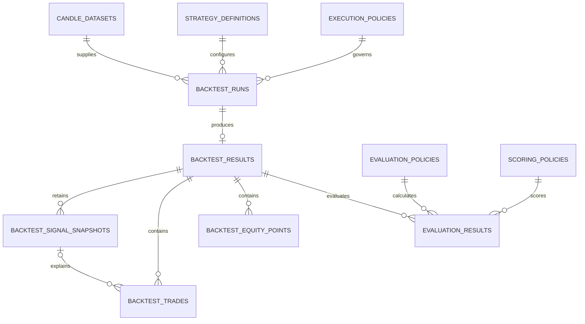

# Database Review: Backtest and Evaluation

**Feature**: 004 Deterministic Backtest and Evaluation
**Reviewed against**: Feature 004 `spec.md`, `data-model.md`, OpenAPI contract, and Feature 001 persistence merged into `main` at `4f89e0f` (source commit `a583c1e`)
**Review date**: 2026-08-14
**Decision**: Schema direction is sound. Feature 004 temporarily follows Feature 001 by requiring a `COMPLETE` dataset to contain at least one Candle; the migration must still wait for the remaining integration points listed in [Integration decisions](#integration-decisions).

## 1. Current database baseline

Feature 001 defines the PostgreSQL foundation now merged into `main`:

| Table | Purpose | Important constraints |
|---|---|---|
| `candles` | Immutable provider Candle records | Unique provider/pair/timeframe/open time; positive OHLC; non-negative volume; historical Candles must be closed |
| `candle_datasets` | Versioned, checksummed dataset identity and build lifecycle | Unique request key and selection/range; explicit status checks; build lease fields |
| `candle_dataset_members` | Stable ordered membership of Candles in a dataset | Primary key `(dataset_id, position)`; one Candle per dataset; non-negative position |

The baseline uses UUID identifiers, timezone-aware timestamps, SHA-256 strings,
and `NUMERIC(38,18)` for market values. Feature 004 should preserve those
conventions. Its SQLAlchemy mappings must import the shared `Base` from
`crypto_lab.infrastructure.persistence.models`; it must not create a second
declarative metadata registry.

The integrated Feature 001 Alembic head is `0001_historical_market_data`. This
is the current baseline, not a safe future `down_revision`: the actual head
must be checked after Features 001 and 003 are merged.

## 2. Proposed Feature 004 schema

| Table | Cardinality and role | Main identity |
|---|---|---|
| `execution_policies` | Immutable, versioned simulation rules | `(policy_id, version)` or UUID plus unique logical version |
| `backtest_runs` | Requested/running/completed/failed lifecycle | UUID `id`; unique `job_id` |
| `backtest_results` | One immutable result for a completed run | UUID `id`; unique `run_id`, `job_id`, and input identity as specified |
| `backtest_signal_snapshots` | Exact consumed Strategy Signals | `(backtest_result_id, sequence)` and `(backtest_result_id, source_signal_id)` |
| `backtest_trades` | Ordered closed simulated Trades | `(backtest_result_id, sequence)` |
| `backtest_equity_points` | One close-valued point per input Candle | `(backtest_result_id, position)` |
| `evaluation_policies` | Immutable metric formula/null semantics | Logical policy ID and version |
| `scoring_policies` | Immutable bounds, weights, eligibility, tie-breaks | Logical policy ID and version |
| `evaluation_results` | Metrics and score for one exact result/policy set | Unique source result plus both policy versions |

Recommended relationship overview:



`STRATEGY_DEFINITIONS` is a logical dependency until Feature 003's physical
schema is present. Do not add an unverified foreign key or duplicate Feature
003's table in Feature 004.

## 3. Persistence recommendations

### Types and checks

- Use PostgreSQL UUID and timezone-aware timestamps consistently.
- Use `NUMERIC(38,18)` for money, price, quantity, rate, return, and metric
  values. Never store a float, NaN, or infinity.
- Require `initial_capital > 0`, `fee_rate >= 0`, `slippage_rate >= 0`, child
  counts `>= 0`, and `start_time < end_time`.
- Add explicit checks for lifecycle enums, `history_state`, `trade_state`,
  long-only side, and close reason.
- Require SHA-256 fingerprint/checksum columns to contain 64 characters.
- Keep audit timestamps outside content fingerprints.

### Foreign keys and deletion

- `backtest_runs.dataset_id -> candle_datasets.id` should use `RESTRICT`.
- Add the Strategy Definition foreign key only after the owning migration is
  known; use `RESTRICT` to protect provenance.
- Policy references should point to immutable versioned rows and use
  `RESTRICT`.
- Result children may technically use `CASCADE`, but the public application
  must not delete completed business results. Prefer database permissions and
  repository APIs that make completed rows append-only.
- A Trade's entry/exit Signal references should target the local immutable
  signal snapshot, not a mutable or external Strategy Signal row.

### Uniqueness and idempotency

- Enforce unique `backtest_runs.job_id` and `backtest_results.job_id`.
- Enforce one result per completed run.
- Enforce the two Signal snapshot uniqueness rules from the data model.
- Enforce one Trade per result/sequence and one Equity Point per
  result/position.
- Enforce one Evaluation Result per backtest result, evaluation policy
  identity/version, and scoring policy identity/version.
- Store canonical input/content fingerprints and fail closed if a reused job
  identity carries different content.

### Query indexes

At minimum, include indexes supporting:

- `backtest_runs(dataset_id, status)` and `backtest_runs(job_id)`;
- `backtest_results(run_id)` and `backtest_results(input_fingerprint)`;
- `backtest_signal_snapshots(backtest_result_id, sequence)`;
- `backtest_trades(backtest_result_id, sequence)`;
- `backtest_equity_points(backtest_result_id, position)`;
- `evaluation_results(backtest_result_id)`;
- comparison/filter fields such as dataset, strategy identity/version, pair,
  timeframe, and policy versions where the API actually queries them.

Avoid speculative indexes on every provenance column. Confirm composite index
order from repository queries and `EXPLAIN ANALYZE` during integration tests.

### Policy representation

For the MVP, keep the stable policy identity/version and fingerprint in normal
columns, and store the immutable rule document in PostgreSQL `JSONB`. Validate
that document at the domain boundary before persistence. This prevents a large
set of premature child tables while retaining the exact historical formula,
bounds, weights, null semantics, and tie-break rules. Frequently filtered
identity/version fields must not exist only inside JSON.

## 4. Integration decisions

### B1 — Empty COMPLETE dataset alignment (temporarily resolved)

Feature 001 currently enforces this condition for a `COMPLETE` dataset:

```sql
candle_count > 0
```

Feature 004 temporarily adopts the same rule: a dataset marked `COMPLETE` with
`candle_count = 0` is rejected before simulation. This avoids changing the
Feature 001 migration during initial integration. The team may revisit whether
empty immutable datasets should be supported later; doing so requires a
coordinated contract and migration change across both features.

### B2 — Alembic revision ancestry (high)

Do not commit `20260813_004_create_backtest_evaluation.py` with a guessed
`down_revision`. Feature 003 may add another migration from the Feature 001
head, creating multiple heads. After integration, generate Feature 004 from
the actual single head, or add an explicit Alembic merge revision first.

### B3 — Strategy Definition foreign key (medium)

The Feature 003 Strategy Definition contract exists, but its final physical
table and key shape are not present on this branch. Keep the source skeleton
independent for now. Add and test the database foreign key only after Feature
003 is merged.

### B4 — SQLAlchemy metadata discovery (medium)

Alembic's environment must import `backtest_models` and `evaluation_models` so
their tables join the shared metadata. Merely creating the modules is
insufficient for autogeneration or migration verification.

### B5 — Storage amplification (medium)

Each result can contain up to 10,000 Equity Points plus Signal and Trade rows.
Rows remain the simplest auditable MVP representation, but all list endpoints
must be bounded and paginated. Measure storage and the required p95 reads
before considering compression, partitions, or time-series extensions.

## 5. Migration sequence after blockers are resolved

1. Verify the merged Feature 001 migration `0001_historical_market_data` runs.
2. Merge Feature 003 and verify the Strategy Definition table/key.
3. Confirm Feature 004 validation rejects `COMPLETE` datasets with zero Candles.
4. Confirm Alembic has one current head.
5. Implement shared-`Base` mappings and import them into Alembic metadata.
6. Generate/review the Feature 004 migration; do not rely on autogeneration
   alone for checks, unique constraints, JSONB, or deletion behavior.
7. Run upgrade/downgrade and constraint tests against real PostgreSQL.
8. Run idempotency, append-only, pagination, and concurrent
   create-or-resolve integration tests.

## 6. Review conclusion

The nine-table Feature 004 shape is appropriate for deterministic simulation,
auditability, and downstream Feature 005 consumption. The code skeleton can be
built now. Database model implementation should start only after B2 and B3
are resolved; the migration itself should be the final persistence step after
the integrated Alembic head is known.
