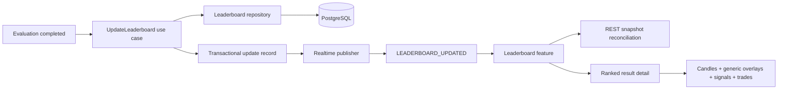

# Implementation Plan: Leaderboard and Trade Visualization

**Branch**: `005-leaderboard-visualization` | **Date**: 2026-08-13 | **Spec**: [spec.md](spec.md)

**Input**: Feature specification from `/specs/005-leaderboard-visualization/spec.md`

## Summary

Build the TV5 vertical slice as a generic leaderboard projection plus ranked-result detail view. The backend consumes immutable `EvaluationResult` records, applies their versioned `ScoringPolicy`, maintains an idempotent Top-K projection, exposes bounded REST snapshots/detail data, and publishes versioned `LEADERBOARD_UPDATED` events. The React feature renders the sortable/filterable leaderboard and composes the existing Candle chart with strategy-neutral overlay, Signal, Entry, and Exit primitives. Trade detail and all displayed results retain immutable provenance.

## Technical Context

**Language/Version**: Python 3.12; TypeScript 5 on Node.js active LTS

**Primary Dependencies**: FastAPI, Pydantic, SQLAlchemy 2, Alembic; React 19, Vite, TanStack Query, TradingView Lightweight Charts, Tailwind CSS

**Storage**: PostgreSQL 16 for immutable Evaluation Results and persisted current/historical Leaderboard projection metadata; no Redis dependency for ranking correctness

**Testing**: pytest/pytest-asyncio with real PostgreSQL via Testcontainers or Docker Compose; Vitest + React Testing Library; Playwright E2E; k6 for snapshot and event propagation targets

**Target Platform**: Linux containers for API; evergreen desktop/mobile web browsers for the dashboard

**Project Type**: Monorepo web application with modular-monolith backend and separate React frontend

**Performance Goals**: p95 leaderboard reads <=300 ms and p95 qualifying update visible <=1 second after backend ingestion under documented demo load

**Constraints**: deterministic Top-K; idempotent duplicate handling; no NaN/infinite ranking input; snapshot/event reconciliation; bounded pagination/ranges; markers distinguishable without color; frontend contains no ranking, evaluation, or strategy-name business logic

**Scale/Scope**: configurable K (default 10); projection identity includes K and ranking metric; page size default 25/max 200; leaderboard updates throughout search workloads modeled up to 100,000 candidates; one selected ranked-result visualization at a time

## Constitution Check

*GATE: Passed before Phase 0 research and re-checked after Phase 1 design.*

| Gate | Result | Design evidence |
|------|--------|-----------------|
| SRS traceability and canonical terminology | PASS | Spec maps `LV-US-01..03`, `EV-FR-03..06`, §3.9 and §6.6; artifacts use `EvaluationResult`, `ScoringPolicy`, and `LeaderboardEntry`. |
| Simplicity / approved stack | PASS | Modular-monolith module and existing PostgreSQL/REST/WebSocket stack; no new service, queue, cache, or dependency. |
| Layered architecture | PASS | Framework-independent ranking policy; application use cases own orchestration; repository persists; API/WebSocket handlers map contracts only. |
| Versioned, reproducible ranking | PASS | Entries reference immutable evaluation and policy versions; deterministic tie key is contractually ordered. |
| Idempotent atomicity | PASS | Unique evaluation/policy identity and transactional projection-version increment prevent duplicates or torn ranks. |
| Frontend boundary and strict typing | PASS | UI consumes generated/runtime-validated REST/event DTOs and generic overlay primitives; no score calculation or concrete Strategy branches. |
| API/versioning/pagination | PASS | `/api/v1/**`, `/ws/v1/**`, response envelope, page metadata, stable uppercase event type. |
| Integration testing over mocks | PASS | Contract/integration tasks use real PostgreSQL; WebSocket duplicate/recovery and E2E drill-down are required. |
| Observability | PASS | `request_id`, `run_id`, `job_id`, strategy identity and projection version propagate; update latency/current Top-1 metrics specified. |
| Security / analysis-only output | PASS | Top-K plus Buy/Sell and Entry/Exit visualization only; no exchange order boundary; leaderboard and detail views carry a visible non-investment-advice disclaimer and no guaranteed-profit claim. |

**Post-design re-check**: PASS. Data model, contracts, and quickstart preserve every gate. No complexity exception or ADR is required.

## Architecture and Data Flow



1. The Evaluation boundary invokes `UpdateLeaderboard` after durable `EvaluationResult` persistence. Ranking never reads a concrete Strategy implementation.
2. The use case locks the `(scope, scoring_policy_id, scoring_policy_version, rank_metric, k)` projection, validates finite/eligible inputs, recomputes the bounded ordering using the policy's deterministic key, and atomically persists entries plus a monotonically increasing `projection_version` only when visible state changes.
3. A durable update record is published after commit. Duplicate evaluation delivery is harmless because `(evaluation_result_id, scoring_policy_version)` is unique and an unchanged projection creates no new event.
4. WebSocket clients accept only a newer `projectionVersion`. On gaps or reconnect, they invalidate/refetch the REST snapshot; the REST snapshot is always authoritative.
5. Ranked-result detail queries join immutable provenance and page Trades separately from bounded Candle/overlay/Signal ranges. Strategies provide generic overlay descriptors; the UI never switches on strategy name.

## Phase 0: Research

Completed in [research.md](research.md). Decisions cover projection persistence, transactional idempotency, snapshot-plus-event realtime delivery, ranking/tie semantics, generic overlay contracts, query boundaries, and precision/time handling. No `NEEDS CLARIFICATION` remains.

## Phase 1: Design and Contracts

- [data-model.md](data-model.md) defines aggregate identities, constraints, state/projection transitions, indices, and DTO mappings.
- [contracts/openapi.yaml](contracts/openapi.yaml) defines Top-K snapshot, ranked-result detail, trade pagination, query validation, envelopes, and errors.
- [contracts/leaderboard-events.md](contracts/leaderboard-events.md) defines the versioned `LEADERBOARD_UPDATED` stream, ordering, deduplication, gap recovery, and subscription behavior.
- [contracts/chart-overlays.md](contracts/chart-overlays.md) defines provider-neutral overlay/marker semantics and accessibility rules.
- [quickstart.md](quickstart.md) provides runnable, independent acceptance scenarios for all three canonical stories.

## Project Structure

### Documentation (this feature)

```text
specs/005-leaderboard-visualization/
├── spec.md
├── plan.md
├── research.md
├── data-model.md
├── quickstart.md
├── contracts/
│   ├── openapi.yaml
│   ├── leaderboard-events.md
│   └── chart-overlays.md
├── checklists/
│   ├── requirements.md
│   └── leaderboard-visualization.md
└── tasks.md
```

### Source Code (repository root)

```text
backend/
├── src/crypto_lab/
│   ├── domain/leaderboard/
│   │   ├── entry.py
│   │   ├── policy.py
│   │   └── ranking.py
│   ├── application/leaderboard/
│   │   ├── ports.py
│   │   ├── update_leaderboard.py
│   │   ├── publish_leaderboard_updates.py
│   │   ├── query_leaderboard.py
│   │   └── get_ranked_result.py
│   ├── infrastructure/persistence/
│   │   ├── leaderboard_models.py
│   │   └── repositories/leaderboard_repository.py
│   ├── api/
│   │   ├── leaderboard_dependencies.py
│   │   ├── routes/leaderboards.py
│   │   ├── schemas/leaderboards.py
│   │   └── websocket/leaderboard_channel.py
│   └── main.py
├── migrations/versions/<revision>_add_leaderboard_projection.py
└── tests/
    ├── unit/leaderboard/
    ├── contract/test_leaderboard_api.py
    └── integration/test_leaderboard_projection.py

frontend/
├── src/
│   ├── features/leaderboard/
│   │   ├── api/leaderboardApi.ts
│   │   ├── components/LeaderboardTable.tsx
│   │   ├── components/LeaderboardStatus.tsx
│   │   ├── components/RankedResultDetail.tsx
│   │   ├── components/TradeTable.tsx
│   │   ├── components/StrategyOverlayLayer.tsx
│   │   ├── components/TradeSignalMarkers.tsx
│   │   ├── hooks/useLeaderboardUpdates.ts
│   │   ├── schemas.ts
│   │   └── types.ts
│   ├── features/market-chart/components/CandlestickChart.tsx
│   └── app/routes/leaderboard.tsx
└── tests/leaderboard/

tests/
├── e2e/leaderboard-visualization.spec.ts
└── load/leaderboard.js
```

**Structure Decision**: Use the constitution's web-application skeleton. Ranking is framework-independent domain code, orchestration is application code, persistence is an adapter, and HTTP/WebSocket files are thin boundaries. Feature-owned marker and overlay UI stays under `features/leaderboard`; the existing market-chart component exposes generic extension inputs without importing leaderboard behavior. Promotion to `shared/charts` waits for reuse by a second feature.

## Verification Strategy

- Pure unit tests prove eligibility, metric direction, deterministic ties, K boundaries, and unchanged projection detection.
- Contract tests validate OpenAPI envelopes, enum serialization, pagination, precision, timestamps, and event schemas.
- PostgreSQL integration tests prove migration upgrade/downgrade, transaction atomicity, concurrency serialization, unique identities, duplicate/out-of-order delivery, and snapshot recovery.
- Frontend tests prove runtime contract rejection, sort/filter/page state, stable interactive IDs, version reconciliation, stale/reconnecting feedback, keyboard interaction, non-color marker identity, and simulated-analysis/disclaimer text.
- E2E tests prove the three story-level independent tests and provenance drill-down.
- k6 measures p95 snapshot and update propagation targets under documented demo load.

## Complexity Tracking

No constitution violations or added-complexity exceptions.
