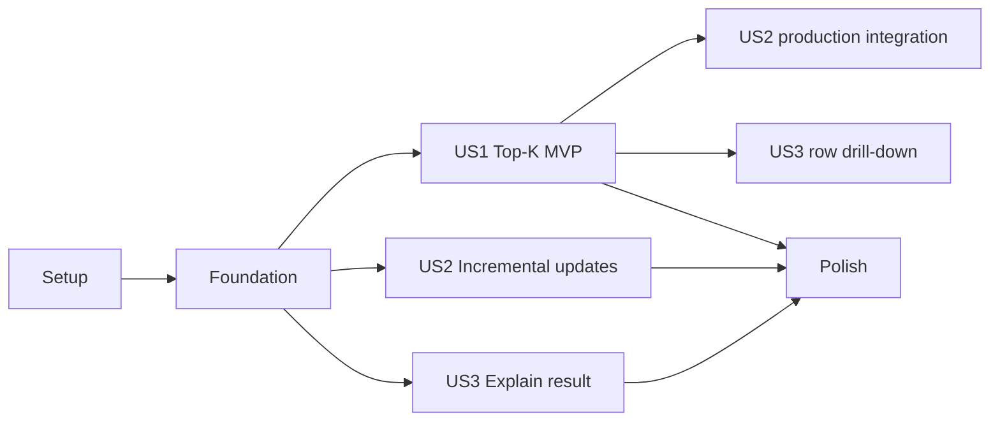

# Tasks: Leaderboard and Trade Visualization

**Input**: Design documents from `/specs/005-leaderboard-visualization/`

**Prerequisites**: `plan.md`, `spec.md`, `research.md`, `data-model.md`, `contracts/`, `quickstart.md`

**Tests**: Required by FR-019 and the constitution. Write story tests first and verify they fail for the expected missing behavior before implementation.

**Organization**: Tasks are grouped by local story labels preserving canonical SRS mappings: `[US1]` = `LV-US-01`, `[US2]` = `LV-US-02`, `[US3]` = `LV-US-03`.

## Format: `[ID] [P?] [Story] Description`

- **[P]**: Parallelizable because it touches different files and has no dependency on an incomplete task in its phase.
- **[Story]**: Maps work to one independently testable user story.
- Every task names an exact target file.

## Phase 1: Setup (Shared Infrastructure)

**Purpose**: Establish feature folders, deterministic fixtures, and contract tooling without adding a service.

- [X] T001 Create backend leaderboard package initializers in `backend/src/crypto_lab/domain/leaderboard/__init__.py` and `backend/src/crypto_lab/application/leaderboard/__init__.py`
- [ ] T002 [P] Create the frontend feature barrel and minimal route shell in `frontend/src/features/leaderboard/index.ts` and `frontend/src/app/routes/leaderboard.tsx`
- [ ] T003 [P] Add the deterministic 12-result, tie, no-trade, and partial-marker TV5 fixture in `backend/tests/fixtures/leaderboard.py`
- [ ] T004 [P] Configure OpenAPI-derived leaderboard type generation and runtime contract validation entry in `frontend/package.json` and `frontend/src/features/leaderboard/schemas.ts`

---

## Phase 2: Foundational (Blocking Prerequisites)

**Purpose**: Create cross-story identities, ports, persistence schema, DTOs, and observability.

**CRITICAL**: No user story implementation begins until this phase is complete.

- [ ] T005 Define `ScoringPolicyRef`, complete `LeaderboardScope` identity (comparison scope, ranking metric, K), `ProjectionVersion`, decimal, UTC, and eligibility value objects in `backend/src/crypto_lab/domain/leaderboard/policy.py`
- [ ] T006 [P] Define framework-independent `LeaderboardEntry` and projection invariants in `backend/src/crypto_lab/domain/leaderboard/entry.py`
- [ ] T007 [P] Define typed repository, Evaluation Result reader, ranked-result reader, and update-publisher ports in `backend/src/crypto_lab/application/leaderboard/ports.py`
- [ ] T008 [P] Add Pydantic request, response, and event DTOs aligned to TV5 contracts in `backend/src/crypto_lab/api/schemas/leaderboards.py`
- [X] T009 Add `leaderboards`, `leaderboard_entries`, and durable update-record SQLAlchemy mappings and constraints in `backend/src/crypto_lab/infrastructure/persistence/leaderboard_models.py`
- [X] T010 Create immutable Alembic upgrade/downgrade for leaderboard projection tables, constraints, and indices in `backend/migrations/versions/20260813_005_add_leaderboard_projection.py`
- [ ] T011 Implement transactional repository primitives, projection locking, bounded queries, and durable update records in `backend/src/crypto_lab/infrastructure/persistence/repositories/leaderboard_repository.py`
- [ ] T012 [P] Add structured leaderboard log context and current Top-1/update-latency metrics in `backend/src/crypto_lab/infrastructure/observability/leaderboard.py`
- [ ] T013 Define repository, reader, publisher, and use-case dependency providers without route imports or business logic in `backend/src/crypto_lab/api/leaderboard_dependencies.py`

**Checkpoint**: Shared types compile, migration round-trips against PostgreSQL, and boundaries can be constructed.

---

## Phase 3: User Story 1 - View Top-K Strategies (Priority: P1) - MVP

**Canonical story**: `LV-US-01`

**Goal**: Produce a deterministic, configurable, queryable Top-K snapshot with required metrics and immutable provenance summary.

**Independent Test**: Load 12 compatible evaluations for K=10, including a tie and no-trade result, then verify exact stable ordering, complete row context, and bounded sort/filter/page behavior.

### Tests for User Story 1

- [ ] T014 [P] [US1] Write failing unit tests for eligibility, metric direction, deterministic ties, fewer-than-K, displacement, contiguous ranks, and isolation of different K/ranking-metric identities in `backend/tests/unit/leaderboard/test_ranking.py`
- [ ] T015 [P] [US1] Write failing REST contract tests for envelopes, row projection versions, metric direction/unit metadata, validation, metric/context filtering, presentation sorting, and pagination in `backend/tests/contract/test_leaderboard_api.py`
- [ ] T016 [P] [US1] Write failing PostgreSQL integration tests for complete projection-identity constraints, concurrent qualifiers, atomic update records, and migration round-trip in `backend/tests/integration/test_leaderboard_projection.py`
- [ ] T017 [P] [US1] Write failing component tests for metric direction/unit labels, stable control IDs, simulated-analysis disclaimer, accessibility, empty/error states, filters, sorting, and pagination in `frontend/tests/leaderboard/LeaderboardTable.test.tsx`

### Implementation for User Story 1

- [ ] T018 [US1] Implement the total deterministic ranking comparator and bounded Top-K transition in `backend/src/crypto_lab/domain/leaderboard/ranking.py`
- [ ] T019 [US1] Implement compatible Evaluation Result validation and transactional snapshot/update-record orchestration without duplicating upstream evaluations or scores in `backend/src/crypto_lab/application/leaderboard/update_leaderboard.py`
- [ ] T020 [US1] Implement authoritative snapshot/filter/sort/page query orchestration in `backend/src/crypto_lab/application/leaderboard/query_leaderboard.py`
- [ ] T021 [US1] Implement and register `/api/v1/leaderboards` mapping, complete projection identity, metric filters/metadata, validation, envelopes, and domain error codes in `backend/src/crypto_lab/api/routes/leaderboards.py` and `backend/src/crypto_lab/main.py`
- [ ] T022 [P] [US1] Implement typed REST client queries and decimal/date mapping in `frontend/src/features/leaderboard/api/leaderboardApi.ts`
- [ ] T023 [P] [US1] Define contract-derived Leaderboard Entry, metric direction, filters, pagination, and view-state types in `frontend/src/features/leaderboard/types.ts`
- [ ] T024 [US1] Implement accessible Top-K rows, metrics/directions/units, provenance summary, sort/filter/page controls, explicit states, and stable IDs for every interactive control in `frontend/src/features/leaderboard/components/LeaderboardTable.tsx`
- [ ] T025 [US1] Compose the independently usable leaderboard route with `table-leaderboard`, simulated-analysis labelling, and a visible non-investment-advice disclaimer in `frontend/src/app/routes/leaderboard.tsx`

**Checkpoint**: `LV-US-01` passes independently with no WebSocket or visualization requirement.

---

## Phase 4: User Story 2 - Receive Incremental Leaderboard Updates (Priority: P2)

**Canonical story**: `LV-US-02`

**Goal**: Publish and reconcile qualifying changes without refresh while tolerating duplicate, out-of-order, missed, and interrupted delivery.

**Independent Test**: Keep a snapshot open, deliver one qualifying evaluation twice plus an older event, then disconnect/reconnect and verify one transition, no version regression, explicit status, and authoritative recovery.

### Tests for User Story 2

- [ ] T026 [P] [US2] Write failing event contract tests for complete subscription identity, v1 envelope, correlation fields, compact changed set, and invalid versions in `backend/tests/contract/test_leaderboard_events.py`
- [ ] T027 [P] [US2] Extend failing PostgreSQL coverage for Evaluation-completion invocation, duplicate delivery, unchanged projections, transactional update records, claim/retry publication, and publish status in `backend/tests/integration/test_leaderboard_projection.py`
- [ ] T028 [P] [US2] Write failing hook/component tests for duplicate, older, gap, reconnect, stale, and recovered snapshot states in `frontend/tests/leaderboard/useLeaderboardUpdates.test.tsx`

### Implementation for User Story 2

- [ ] T029 [US2] Wire the durable Evaluation-completion boundary to `UpdateLeaderboard` and implement a retry-safe dispatcher that claims committed update records, publishes them, and records publication status in `backend/src/crypto_lab/application/leaderboard/publish_leaderboard_updates.py` and `backend/src/crypto_lab/main.py`
- [ ] T030 [US2] Implement `/ws/v1/leaderboards` subscription validation and versioned event delivery in `backend/src/crypto_lab/api/websocket/leaderboard_channel.py`
- [ ] T031 [US2] Register the leaderboard WebSocket channel and sanitized connection/error logging in `backend/src/crypto_lab/main.py`
- [ ] T032 [US2] Implement event ID/projection-version deduplication, gap invalidation, bounded reconnect, and snapshot refetch in `frontend/src/features/leaderboard/hooks/useLeaderboardUpdates.ts`
- [ ] T033 [P] [US2] Implement `CONNECTING`, `LIVE`, `RECONNECTING`, and `STALE` status with latest update/run context in `frontend/src/features/leaderboard/components/LeaderboardStatus.tsx`
- [ ] T034 [US2] Integrate live reconciliation and status without replacing the last valid snapshot in `frontend/src/features/leaderboard/components/LeaderboardTable.tsx`

**Checkpoint**: `LV-US-02` passes with a seeded snapshot and one event source even if visualization is absent.

---

## Phase 5: User Story 3 - Visualize Signals and Simulated Trades (Priority: P3)

**Canonical story**: `LV-US-03`

**Goal**: Explain a ranked result through exact context, generic overlays, timestamp/price-aligned markers, pageable Trades, and immutable provenance.

**Independent Test**: Open a prepared ranked result without starting a backtest; verify marker alignment/accessibility, Trade #3 highlighting, no-trade state, partial marker handling, and full provenance.

### Tests for User Story 3

- [ ] T035 [P] [US3] Write failing REST contract tests for ranked detail, bounded visualization, Trade pagination, decimal precision, UTC, and partial availability in `backend/tests/contract/test_ranked_result_api.py`
- [ ] T036 [P] [US3] Write failing integration tests for provenance joins, range bounds, unaligned markers, and no-trade behavior in `backend/tests/integration/test_ranked_result_detail.py`
- [ ] T037 [P] [US3] Write failing component tests for generic overlays, non-color marker identity, nullable unaligned coordinates, stable control/row IDs, keyboard Trade selection, overlap, no-trade, partial states, and the analysis disclaimer in `frontend/tests/leaderboard/RankedResultDetail.test.tsx`
- [ ] T038 [P] [US3] Write failing browser acceptance flow for Top-1 drill-down, Trade #3 highlighting, provenance, simulated-analysis labelling, and non-investment-advice text in `tests/e2e/leaderboard-visualization.spec.ts`

### Implementation for User Story 3

- [ ] T039 [US3] Implement ranked-result provenance, availability, bounded Candle/overlay/Signal, and pageable Trade queries in `backend/src/crypto_lab/application/leaderboard/get_ranked_result.py`
- [ ] T040 [US3] Implement ranked detail, visualization-range, and Trade-page REST endpoints in `backend/src/crypto_lab/api/routes/leaderboards.py`
- [ ] T041 [P] [US3] Extend typed queries and runtime validation for ranked detail, visualization, and Trades in `frontend/src/features/leaderboard/api/leaderboardApi.ts` and `frontend/src/features/leaderboard/schemas.ts`
- [ ] T042 [P] [US3] Implement generic `LINE`, `BAND`, and `ZONE` rendering without Strategy-name branches in `frontend/src/features/leaderboard/components/StrategyOverlayLayer.tsx`
- [ ] T043 [P] [US3] Implement accessible Buy/Sell/Hold/Entry/Exit label-shape markers, stable Hold-control/marker IDs, overlap handling, and nullable-coordinate unaligned reporting in `frontend/src/features/leaderboard/components/TradeSignalMarkers.tsx`
- [ ] T044 [P] [US3] Implement sortable/pageable keyboard-accessible Trade rows, stable row/control IDs, and selection state in `frontend/src/features/leaderboard/components/TradeTable.tsx`
- [ ] T045 [US3] Compose exact Market Pair/Timeframe/range chart context, overlays, markers, availability states, provenance panel, simulated-analysis label, and non-investment-advice disclaimer in `frontend/src/features/leaderboard/components/RankedResultDetail.tsx`
- [ ] T046 [US3] Connect row drill-down and selected Trade Entry/Exit highlighting through generic extension inputs on the existing Candle chart without importing leaderboard behavior in `frontend/src/features/market-chart/components/CandlestickChart.tsx`

**Checkpoint**: All three canonical TV5 stories pass independently and together.

---

## Phase 6: Polish & Cross-Cutting Concerns

**Purpose**: Close non-functional, traceability, architecture-fitness, and demo gates.

- [ ] T047 [P] Add k6 snapshot and update-propagation checks with documented demo-load thresholds in `tests/load/leaderboard.js`
- [ ] T048 [P] Add test-only unknown Strategy/overlay fixtures proving no concrete-name branch in backend mapping or frontend rendering in `backend/tests/contract/test_leaderboard_extensibility.py` and `frontend/tests/leaderboard/RankedResultDetail.test.tsx`
- [ ] T049 Implement sanitized audit events and verify correlation propagation for ranking changes, reconnects, and failures in `backend/src/crypto_lab/infrastructure/observability/leaderboard.py` and `backend/tests/integration/test_leaderboard_observability.py`
- [ ] T050 Add executable contract-sync coverage for generated TypeScript, runtime schemas, REST responses, and WebSocket events against `specs/005-leaderboard-visualization/contracts/openapi.yaml` and `specs/005-leaderboard-visualization/contracts/leaderboard-events.md` in `backend/tests/contract/test_leaderboard_contract_sync.py`
- [ ] T051 Execute every scenario and record measured outcomes/checksum IDs in `specs/005-leaderboard-visualization/quickstart.md`
- [ ] T052 Update feature architecture, API/event flow, and demo navigation in `README.md` and `docs/TECH_STACK_SKELETON_SPECKIT_FLOW.md`

---

## Dependencies & Execution Order

### Phase Dependencies

- **Setup** starts immediately; **Foundation** depends on Setup and blocks stories.
- **US1** starts after Foundation and is the MVP.
- **US2** starts after Foundation with seeded projections; T029/T034 integrate after US1 T019/T024.
- **US3** starts after Foundation with a prepared entry; T046 integrates after US1 route/table T025.
- **Polish** follows desired stories; T050/T051 require all three.

### User Story Dependency Graph



### Within Each User Story

1. Write tests and verify expected failure.
2. Implement domain/application behavior before transport/UI composition.
3. Keep handlers thin and frontend ranking-free.
4. Complete the story checkpoint before claiming it demonstrable.

### Parallel Opportunities

- Setup T002-T004; Foundation T006-T008/T012; each story's initial test tasks.
- US1 client/types T022-T023 can run with backend ranking work.
- US2 status T033 can run with backend event work.
- US3 T042-T044 can run against frozen contracts.
- US2/US3 can use fixtures while US1 proceeds; only final integrations wait for US1.

## Parallel Examples

### User Story 1

```text
T014: backend/tests/unit/leaderboard/test_ranking.py
T015: backend/tests/contract/test_leaderboard_api.py
T017: frontend/tests/leaderboard/LeaderboardTable.test.tsx
```

### User Story 2

```text
T026: backend/tests/contract/test_leaderboard_events.py
T028: frontend/tests/leaderboard/useLeaderboardUpdates.test.tsx
T033: frontend/src/features/leaderboard/components/LeaderboardStatus.tsx
```

### User Story 3

```text
T035: backend/tests/contract/test_ranked_result_api.py
T037: frontend/tests/leaderboard/RankedResultDetail.test.tsx
T042: frontend/src/features/leaderboard/components/StrategyOverlayLayer.tsx
T043: frontend/src/features/leaderboard/components/TradeSignalMarkers.tsx
T044: frontend/src/features/leaderboard/components/TradeTable.tsx
```

## Requirements Coverage

| Requirement set | Primary tasks |
|-----------------|---------------|
| FR-001–FR-006 / SC-001–SC-003 (`LV-US-01`) | T005, T014–T025, T047 |
| FR-007–FR-010 / SC-004–SC-005 (`LV-US-02`) | T019, T026–T034, T047, T049 |
| FR-011–FR-016 / SC-006–SC-009 (`LV-US-03`) | T035–T046 |
| FR-017 extensibility | T042, T048 |
| FR-018 / SC-010 simulated-only boundary and disclaimer | T017, T025, T035, T037–T038, T045 |
| FR-019 automated acceptance coverage | T014–T017, T026–T028, T035–T038, T047–T051 |

## Implementation Strategy

### MVP First

1. Complete Setup and Foundation.
2. Implement US1 only.
3. Run its unit, contract, PostgreSQL integration, and component tests.
4. Demonstrate deterministic Top-K before realtime or visualization.

### Incremental Delivery

1. US1 delivers current Top-K and comparison context.
2. US2 adds no-refresh updates and recovery without changing ranking semantics.
3. US3 adds chart/trade explanation without changing Evaluation or Backtest behavior.
4. Polish verifies performance, replaceability, observability, contract sync, and the demo.

## Notes

- No task implements live orders, financial metric calculation, Signal generation, Backtest simulation, or search control.
- Decimal/time precision and all provenance/projection versions are contract obligations.
- Stop after `$speckit-analyze` for this assignment; do not execute these tasks in the spec/plan PR.
